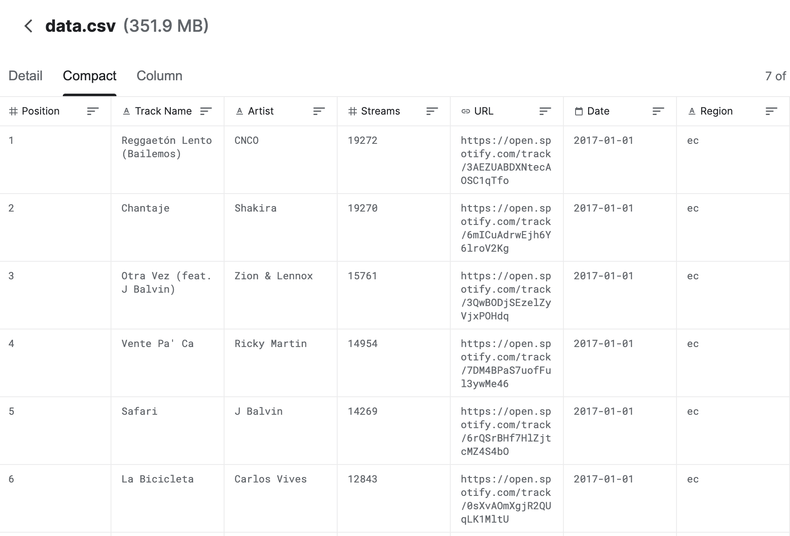
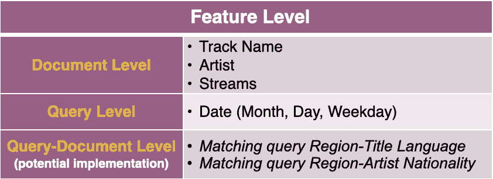
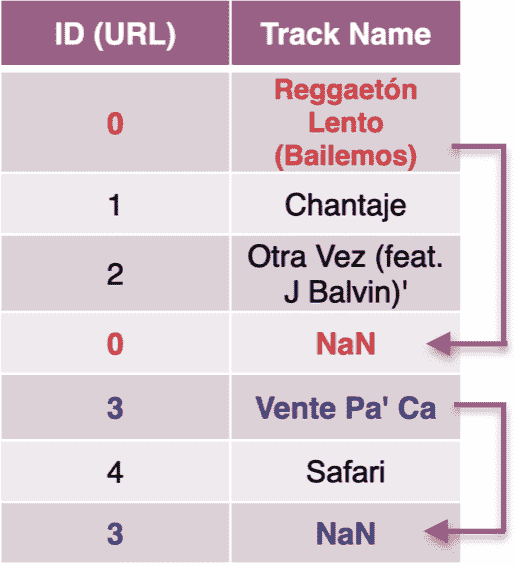
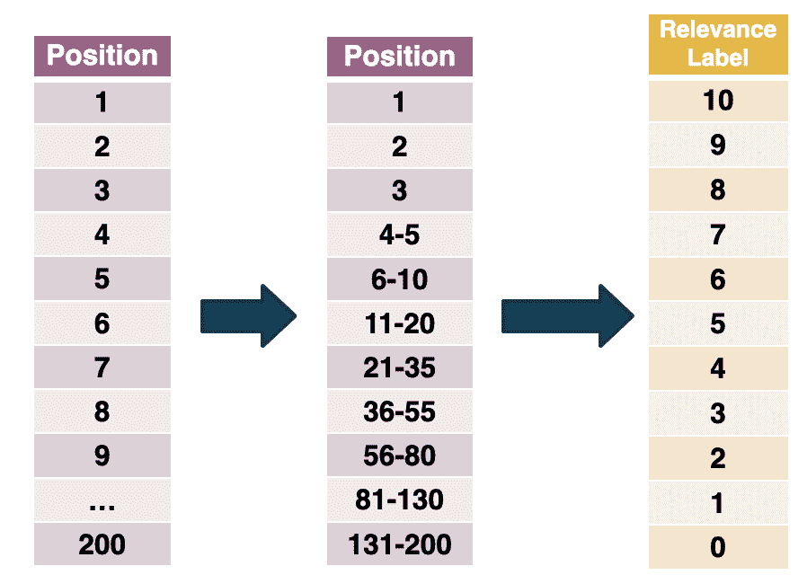
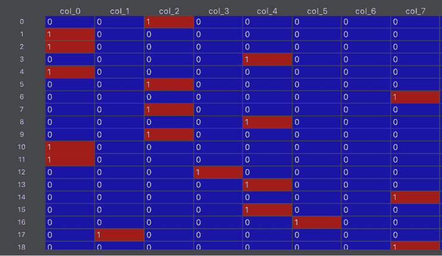
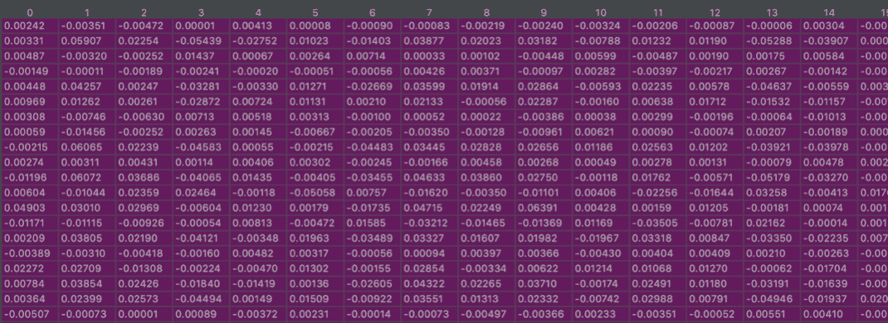
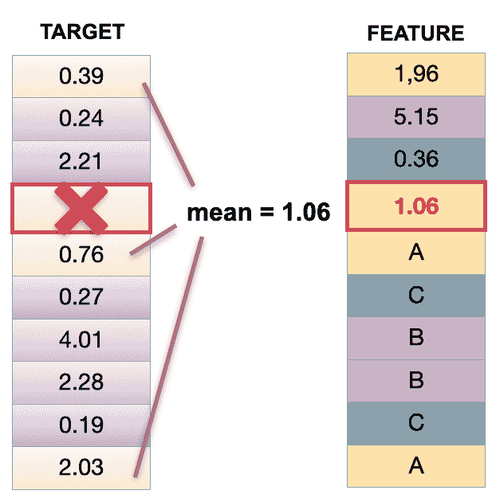
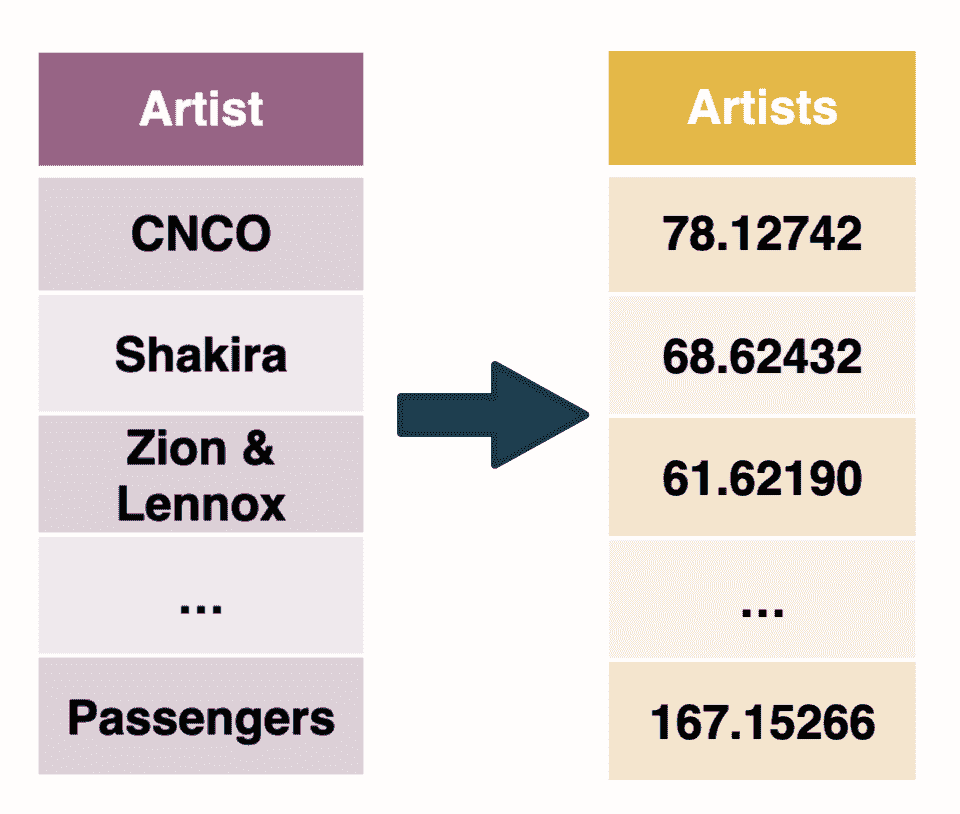
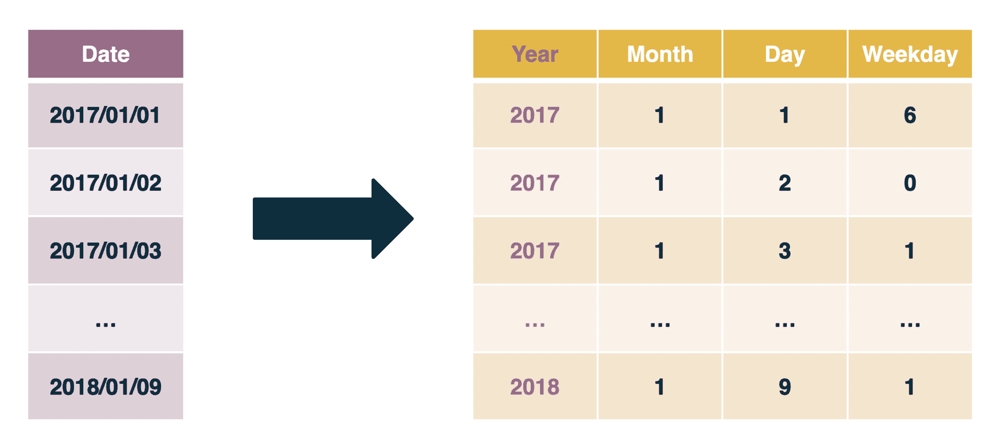
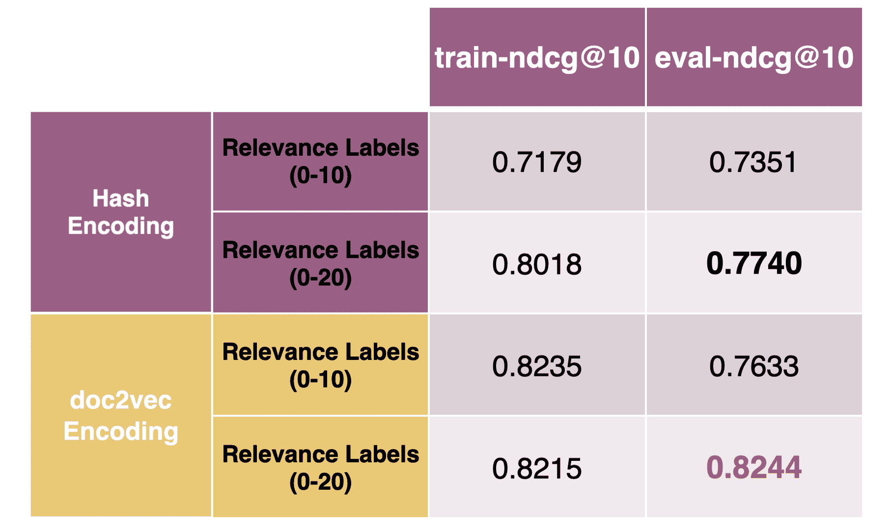

# 一个关于每日歌曲排序问题的学习排序项目

> 原文：<https://web.archive.org/web/sease.io/2020/12/a-learning-to-rank-project-on-a-daily-song-ranking-problem.html>

## 介绍

排名数据自然会出现在各种各样的情况下，尤其是在现代数据处理应用中(搜索引擎、推荐系统)。因此，在现实世界中，理解如何适应特定数据集并设计管道来解决排名问题至关重要。

这篇博客旨在说明如何设置和构建一个从可用数据开始的**学习排名** (LTR)系统，创建和操作训练集和测试集，然后使用开源库训练一个排名模型。

T3T5

LTR 是机器学习在*信息检索*中的应用，其中训练数据由定义为**查询-文档对**的项目列表组成，相关等级与之相关联。应用 LRT 的关键挑战是根据给定的查询得出这些项目的最优排序。

###### 问题陈述

这个内部项目始于 9 月份举行的 Sease 公司会议，是机器学习多学科黑客马拉松的一部分。Sease 的黑客马拉松的目标是将 Spotify 的全球每日歌曲排名数据集[【8】](https://web.archive.org/web/20220929234148/https://www.kaggle.com/edumucelli/spotifys-worldwide-daily-song-ranking)用于 LTR 任务。

该数据集是关于 Spotify 用户在 53 个国家收听最多的 200 首歌曲的每日排名；它的时间跨度为 2017 年 1 月 1 日至 2018 年 1 月 9 日，包含超过 3 百万行、6629 位艺术家和 18598 首歌曲，总计数为 150 亿个流计数。下图显示了所有可用的数据集要素。挑战是修改 Spotify 数据集的结构，它最初不是为 LTR 任务创建的，以便获得具有估计相关性判断的查询-文档对。

## 我们的方法

在探索数据集的过程中，我们开始集思广益，理解哪些特征可能会或可能不会影响文档(歌曲)的相关性。我们从区分功能级别开始这个阶段:

*   *   **单据级**:描述单据的一个属性，其值只取决于单据实例；
    *   **查询级别**:描述查询的一个属性，其值只取决于查询实例；
    *   **查询依赖**:描述了查询与文档相关的一个属性，其值依赖于查询和文档实例。

下表详细列出了各项功能。

###### 让我们建立一个学习排序实验

学习排名将机器学习与搜索引擎联系起来。在我们的假设场景中，我们假设 Spotify 的搜索引擎中部署了一个经过训练的排名模型，其中:

*   *   **文档**是歌曲、
    *   **查询**是对地区/国家之一的搜索，
    *   根据图表上的位置来估计**相关性评级**，
    *   **特征向量**由所有其他 N 个给定特征组成。

【T8

Spotify 的搜索引擎在用户发出查询时输入“地区”(国家)，然后用传统的 IR 推断出该查询的最佳结果，并将它们传递给重新排名模型。重新排序模型将在将最佳结果返回给用户之前对它们进行重新排序。换句话说，该模型能够基于歌曲与查询的相关性返回歌曲的重新排序(即，在我们的情况下，与该国家最相关的歌曲)。

###### 数据预处理

数据预处理是流水线中最重要的步骤；它是一种数据挖掘技术，用于将原始数据转换为算法可以解释和解析的有用且合适的格式。

我们的数据预处理管道从数据清理阶段开始。
**数据清洗**是确保数据正确、一致、可用的过程，去除和操纵我们收集的真实世界数据中那些不相关和缺失的部分。我们在 Spotify 数据集中应用了这一技术，检查其完整性，在曲目名称和艺术家特征中发现了总共 657 个 NaN(不是数字)。
由于歌曲和相关艺术家在我们的数据集中重复出现(在不同日期的歌曲排行榜上)，并且每个歌曲艺术家对都由 ID 唯一标识(即编码为枚举类型的 URL 功能)，所以字典的创建帮助我们管理和填充这些缺失的值。字典由一组键值对组成；我们使用歌曲的单义 ID 作为键，曲目名称作为值。每当我们在曲目名称中发现一个丢失的值时，我们在字典键中检查相同的歌曲艺术家 ID，并用相应的字典值填充丢失的值。用同样的方法填充 Artist 列中包含缺失值的所有行。

此外，**要素工程**对于准备适当的输入数据集、选择最重要的要素、转换它们和/或从现有要素创建新要素至关重要。特别是，分类特征通常存储为文本值，需要用数字编码，因为大多数机器学习算法无法处理它们。因此，对于如何处理这个问题没有唯一的答案，我们面临的挑战是找出如何将这些文本属性转换成合适的数值。

让我们来详细了解一下这些特性的结构，以及我们决定用来解决这个问题的方法:

*   *   **位置:宋在排行榜上的位置——相关度**

此功能用于评估相关性评级，即我们的目标变量。使用位置值作为相关性标签是不合适的，它们的取值范围实际上是从 1 到 200，而且可能太宽，会误导模型。
因此，我们决定使用一种称为**数据宁滨**的量化形式对位置值进行分组，这是一种用于将数字分组为更少“箱”的数据预处理技术。我们测试了两种不同的变化，从 0 到 10 的相关性标签和从 0 到 20 的相关性标签，然后检查模型性能如何变化。在做宁滨数据时，我们试图在最相关的歌曲(那些在图表最高位置的歌曲)的分组中保持更好的粒度。下图是数据宁滨的一个示例。这里我们在所谓的排名栏中生成从 0 到 10 的相关性标签。

*   *   **曲目名称:歌曲名称-文档级特征**

我们决定使用两种不同的方法来编码这个变量:**哈希编码和 doc 2 vec**；然后基于模型的输出对这两种技术进行了比较。

**特征散列**将分类特征轨迹名称中的每个类别映射到预定范围内的整数。为了实现这个方法，我们使用了**[【1】](https://web.archive.org/web/20220929234148/https://contrib.scikit-learn.org/category_encoders/hashing.html)库。
我们指定要编码的列、特征向量的维数(默认情况下等于 8)和要应用的散列函数(默认情况下为' **md5** '算法)作为函数的主要参数。在编码之后，轨道名称特征已经被从 col_0 到 col _ 7[索引 0 到 7]的 8 个新的附加列所取代，这些列包含二进制值 1 或 0。**

 **

**Doc2Vec** 是一种无监督算法，将文档/句子表示为向量[【2】](https://web.archive.org/web/20220929234148/https://radimrehurek.com/gensim/models/doc2vec.html)。它改编自 Word2Vec，这是自然语言处理中最流行的技术之一，应用于整个文档，而不是单个单词。它使用深度学习和基于神经网络的技术来计算语料库中每个文档/句子的特征向量。Doc2Vec 的逻辑是，单词的含义也依赖于它出现的文档；为此，我们需要为每个句子(或段落)指定一个**标签**(即唯一的文档 id，名为*段落 ID* )。

###### **主要步骤**

*   *   预处理“轨道名称”特征字符串，转换成小写，仅保留字母数字和空格，并删除标点符号；
    *   将每个句子(歌名)替换为其单词列表；
    *   将这些句子转换成一个训练语料库 **TaggedDocument** ，由两部分组成:单词列表和相关标签。为了简单起见，我们只使用歌曲标题的索引作为标签，给每个句子分配一个唯一的整数 id。

*   *   创建*词汇表*，这是从训练语料库中提取的所有独特单词的列表
    *   将带标签的文档作为输入传递给 **Doc2Vec 函数**。该函数中指定的其他参数有:
        *   **dm** :定义训练算法(默认 dm =1，为 ***分布式内存版本的段落向量(PV-DM***))；
        *   **vector_size** :定义特征向量的维数(默认为 100)；
        *   **min_count** :忽略所有总频率低于设定值的单词。
    *   使用 docvecs 属性[*model . doc vecs . doc tag _ syn 0*]获取训练期间看到的“文档标签”的所有训练向量。曲目名称功能已被 100 个新的附加编码列所取代，如下图所示。

此外，我们假设这个变量也可以用来提取歌曲的语言，这可以用作一个附加的特征。有几个库可以处理这项任务；我们尝试了 *langdetect* 和 *guess_language-spirit* ，这两个 Python 库没有限制，但是准确性很差。另外，像 *TextBlob* 和 *Googletrans* 这样的库具有很高的准确性，但日常请求有限，因为它们使用谷歌的 API 来检测语言。此外，我们不得不说，歌曲的名称往往太短，以至于无法进行良好的语言评估。此外，它可以不包含字母，而仅包含数字和/或符号。如果一首歌的歌名是‘百分百’，那是什么语言？说不出来吧？在这种情况下，我们应该添加一个 try/except 代码块来捕获并正确处理这种情况。

*   *   **艺人:歌手或组合名称—文档级特征**

T13T15

由于艺术家是一个具有许多级别的分类变量，因此可以使用**留一技术**[【3】](https://web.archive.org/web/20220929234148/https://contrib.scikit-learn.org/category_encoders/leaveoneout.html)对其进行编码；它非常类似于目标编码，即使用与该级别相关的目标变量值的平均值替换分类值的过程，但在这种情况下，在计算平均值时，它会排除当前行的目标值(见下图)。

 

另一种方法可能是使用 **One-Hot 编码技术**，用于将分类值转换为一维数值向量。结果向量由 N 个元素组成，每个元素对应于分类特征的一个级别。除了指定当前类别的元素上的单个(热)1 之外，vector 将全部为 0。这种方法只是根据分类特征中唯一值的数量(N)创建附加(二进制)特征。很明显，对于包含 6629 个级别(即 6629 个艺术家)的变量，这种技术不是一个很好的选择，因为向数据集添加了大量的维度，这会导致并行性和多重共线性的问题。

*   *   **流:流的数量-文档级特征**

它可以保持原样，因为已经是数字了。

*   *   **网址:歌曲的 Spotify 网址**

URL 功能被编码为枚举类型(ID ),并用于数据预处理部分(处理缺失值),但随后被从训练集数据中移除。当我们考虑文档级的特性时，我们需要理解一个特性，不管查询是什么，是否会对文档的相关性产生影响。在我们的例子中，因为一个唯一的 URL 对应于一个唯一的歌曲-艺术家对，所以这个数据已经由曲目名称和艺术家表示，并且它不会向查询-文档对的重要性估计添加任何额外的有用信息。

*   *   **日期:图表日期—查询级功能**

【T12

日期可以分成多列，分别描述日、月和年，并用于提取工作日等附加特征(0 到 6 表示周一到周日)。尤其是月份和星期几，对于理解事件的周期性和季节性非常有用(例如夏天或圣诞节歌曲)。

*   *   **地区:国家代码-查询**

我们选择这个特性作为(搜索引擎的)查询，并通过 *pandas **factorize()** 函数*[【4】](https://web.archive.org/web/20220929234148/https://pandas.pydata.org/pandas-docs/stable/reference/api/pandas.factorize.html)操纵它，该函数将每个字符串与一个整数唯一地链接起来

###### 模特培训

当数据集准备就绪且结构良好时，必须执行训练测试分割程序。机器学习算法使用训练集来训练模型，而测试数据集被保留并用于评估模型的性能。在我们的实验中，我们将 80%的数据集放在训练集中，其余 20%放在测试集中。我们已经决定使用一个最广泛使用的开源库来实现 LTR，这个库叫做**XGBoost**[【5】](https://web.archive.org/web/20220929234148/https://github.com/dmlc/xgboost)，它是一个优化的分布式梯度增强库，旨在高效、灵活和可移植。
它在 Python 或其他编程语言可用的梯度推进框架下实现机器学习算法。它支持成对方式和列表方式。

然后，我们将相关性标签列、查询列和训练向量分离为三个不同的组件，以创建 **XGBoost 矩阵**，这是用 XGBoost 训练模型所需的结构。

有了训练集，我们使用 MART 方法训练模型，MART 方法是λrank 和 MART 算法的组合。
如果查看 XGBoost 文档[【6】](https://web.archive.org/web/20220929234148/https://xgboost.readthedocs.io/en/latest/)可以看到有三种排名方法；它们都使用 LambdaMART 算法，但目标函数不同。我们选择了' **rank:ndcg** '来执行列表排序，它直接查看整个文档列表(针对每个查询)，并尝试为它提供最佳排序。

为了测量模型的输出，我们使用了一个称为**归一化贴现累积收益(NDCG)** 的指标，即 DCG 的归一化变量。当使用多级相关性时，这种度量通常是优选的。 **DCG** 旨在评估该模型是否能够在搜索结果列表的最高位置返回最相关的文档，在最低位置返回最不相关的文档(降序)。为了解释这个指标，我们只想知道我们离最大可实现的 DCG 有多近。将 DCG 值除以可能的最佳得分(理想的 DCG)，我们获得 0 到 1 之间的归一化值，其中 1 表示可能的最佳排名。

特别是，我们使用了一个 **ndcg@10** ，其中“@10”表示该指标仅针对搜索结果列表中的前 10 个项目/歌曲进行评估。然后，最终的评估度量是所有查询的平均值:可以对所有查询的 NDCG 值进行平均，以获得搜索引擎的排名算法在许多查询上的平均性能的度量。

###### 常见错误

当我们创建训练集和测试集时，我们必须确保:

*   *   我们使用的是一组真实的样本；
    *   对于每个查询，我们在训练集和测试集中有这些样本的平衡。

特别是，我们必须注意两种可能导致 NDCG 平均指数飙升的情况:

*   *   **每个查询组一个样本**:例如，如果对于给定的查询只有一个项目/歌曲，则 NDCG 将是 1(完美的),并且不管型号如何，平均值将以误导的方式增加；
    *   **一个相关性标签用于查询组**中的所有样本:例如，如果给定查询的所有歌曲具有相同的相关性(在图表上的相同位置)。

【T6

幸运的是，我们没有这种情况，否则，最好删除这些查询。

###### 结果

我们在下表中总结了训练模型后获得的 ndcg@10 值。实际上，我们创建了 4 个模型，使用不同的编码技术(用于曲目名称特征)和不同的方法对位置值进行分组以生成相关性标签。我们应用 doc2vec 编码并使用从 0 到 20 的相关性标签的模型实现了最高的 ndcg@10 值，因此具有最佳性能。

## 最终考虑

数据预处理和特征工程是至关重要的，也是使 LTR 项目适应真实场景的最重要的步骤。

如果我们有歌词可用，语言检测会更容易；将该语言作为一个额外的特性添加进来，对于提高模型的性能是很有用的。我们还可以使用这个特性创建一个查询文档级的特性(依赖于查询),并检查国家(代表我们的查询)和歌曲语言之间的相关性。

模型之间的性能差异微乎其微，在线评估模型(我们在我们的[在线测试](https://web.archive.org/web/20220929234148/https://sease.io/2020/04/the-importance-of-online-testing-in-learning-to-rank-part-1.html)博客帖子中解释了如何做到这一点)以查看它们是否真的像它们看起来那样非常相似，或者离线评估是否无法识别这种差异，这将是非常有趣的。

## 未来作品

*   *   在将我们的数据集采样到前 20 首歌曲图表(而不是 200 首)之后，如果我们从歌曲位置值估计相关性标签，会发生什么？

*   *   此外，如果我们直接使用流计数(降序)对结果进行排序，可能会发生什么变化？我们会在搜索结果列表中得到相同的顺序吗(因此最大 NDCG)？！

*   *   我们还将库**SHAP**[【7】](https://web.archive.org/web/20220929234148/https://github.com/slundberg/shap)的使用添加到我们的待办事项列表中，以解释模型行为，特别是每个特性如何影响模型的输出(你可以通过我们的[树 SHAP](https://web.archive.org/web/20220929234148/https://sease.io/2020/07/explaining-learning-to-rank-models-with-tree-shap.html) 博客帖子了解如何做到这一点！).

我们将在以后的博客中讨论这些话题。

###### 更多链接，了解我们在第六届伦敦信息检索会议上对该项目的讨论:

幻灯片:[https://www2 . slide share . net/SeaseLtd/a-learning-to-rank-project-on-a-daily-song-ranking-problem](https://web.archive.org/web/20220929234148/https://www2.slideshare.net/SeaseLtd/a-learning-to-rank-project-on-a-daily-song-ranking-problem)

// our service

## 不要脸的塞给我们培训和服务！

我提到过我们做[学习排名](https://web.archive.org/web/20220929234148/https://sease.io/learning-to-rank-training)和[搜索相关性](https://web.archive.org/web/20220929234148/https://sease.io/training/search-relevance-training/search-relevance-training-solr)培训吗？
我们也提供这些主题的咨询，[如果你想让你的搜索引擎更上一层楼，请联系](https://web.archive.org/web/20220929234148/https://sease.io/contacts)！

// STAY ALWAYS UP TO DATE

## 订阅我们的时事通讯

你喜欢这篇关于每日歌曲排名问题的学习排名项目的文章吗？不要忘记订阅我们的时事通讯，以便随时了解信息检索世界的最新动态！**