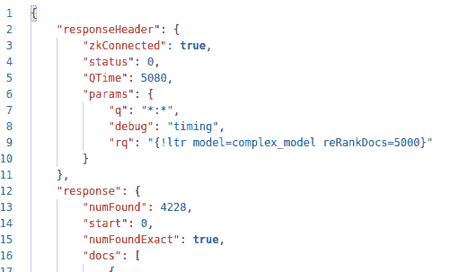
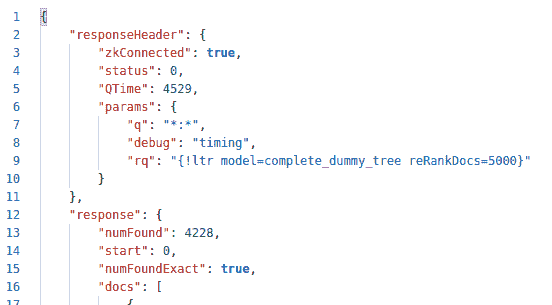
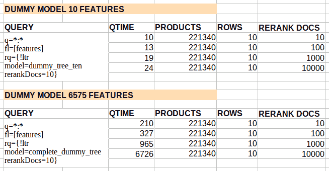

# Apache Solr 学习排序特征提取和 qTime

> 原文：<https://web.archive.org/web/sease.io/2022/01/apache-solr-learning-to-rank-feature-extraction-and-qtime.html>

大家好！在这篇博文中，我将向您介绍如何测量不同组件的计时，这些组件参与了通过 qTime 参数对查询执行时间进行排序的学习。

先简单介绍一下关于在 Apache Solr 中学习排名！

## 介绍

*contrib* *ltr* 是关于在 Apache Solr 中学习模型排序的重新排序。

###### 重新排序允许您运行一个简单的匹配文档查询，然后使用另一个更复杂的查询的分数重新排序前 N 个文档。

[https://solr.apache.org/guide/8_10/learning-to-rank.html](https://web.archive.org/web/20221202233445/https://solr.apache.org/guide/8_10/learning-to-rank.html)

在我们的例子中，复杂查询将是一个 **LTR** 查询。

重新排序过程包括**第一查询**(第一阶段检索)和对 top-k 的重新排序查询(使用“ltr”查询解析器的**查询**)。
当使用学习排序来重新排序时，两个元素开始起作用:**特征提取**和**重新评分**(其中我们应用模型来计算搜索结果分数)。

因此，LTR-query 需要特性定义( **feature.json)** 和**训练模型**。

###### 功能存储

要素存储是一种数据结构(保存在文件中),它描述了模型使用的一组要素:它们的名称、它们的类以及它们的相关参数。这需要与模型一起上传，以便在 Apache Solr[【1】](https://web.archive.org/web/20221202233445/https://solr.apache.org/guide/8_7/learning-to-rank.html#uploading-features)中使用 LTR 查询。

###### 特征是一个值，一个数字，它代表被评分的文档或被评分的文档的查询的一些数量或质量。

[https://Solr . Apache . org/guide/8 _ 10/learning-to-rank . html #功能](https://web.archive.org/web/20221202233445/https://solr.apache.org/guide/8_10/learning-to-rank.html#feature)

Solr 中有几种不同类型的特性可以使用，如果你好奇可以看看文档[【2】](https://web.archive.org/web/20221202233445/https://solr.apache.org/guide/8_10/learning-to-rank.html#feature-engineering)。

模型的特征可以通过两种方式在两个不同的阶段提取:

*   *   在重新分级阶段(使用 LTR 模型时)
    *   当在结果中向用户返回特征向量时，使用*字段列表*查询参数( *fl* )。

当我们通过 *fl* 参数提取特征时，我们在内部使用一个名为**特征转换器**[【4】](https://web.archive.org/web/20221202233445/https://solr.apache.org/guide/8_10/transforming-result-documents.html#transforming-result-documents)的 Solr 组件。

对于 LTR，转换器被称为*LTRFeatureLoggerTransformerFactory*，并且它可以在 *fl* 查询字段内被称为:

```
fl=id,[features store=yourFeatureStore]
```

在这种情况下，*搜索结果中的每个文档都将返回特征库* < yourFeatureStore >中的所有特征。

###### 模型

此外，模型需要训练，然后从 Solr 外部上传[【5】](https://web.archive.org/web/20221202233445/https://solr.apache.org/guide/8_10/learning-to-rank.html#uploading-a-model)。

排名模型计算用于对文档重新排名的分数。
不考虑任何特定的算法或实现，排名模型的计算可以使用三种类型的输入[【6】](https://web.archive.org/web/20221202233445/https://solr.apache.org/guide/8_10/learning-to-rank.html#ranking-model):

*   *   算法类型
    *   表示查询-文档对的特征
    *   算法实现

同样在这种情况下，根据你的需要有几种型号，你可以在[【7】](https://web.archive.org/web/20221202233445/https://solr.apache.org/guide/8_10/learning-to-rank.html#feature-selection-and-model-training)的文档中查阅。

## 学习对查询性能进行分级

假设我们运行一个 LTR 查询，并想要测量返回结果所需的时间，具体来说，我们想要分离出**特征提取**和**模型重新评分**所需的时间。

T48

我们如何衡量它们？

###### QTIME

qTime 是 Solr 输出元素，表示 Solr 处理请求和找到结果所需的时间。
因此，查询的 qTime 是 Solr 处理查询所需的时间(没有网络延迟)。

qTime 包括:

1.  1.  匹配阶段
    2.  排名阶段
    3.  重新排序阶段
    4.  刻面
    5.  拼写检查
    6.  其他搜索组件

**qTime 不覆盖**:

1.  1.  编写 JSON 响应所需的时间
    2.  检索要在响应中呈现的存储字段/文档值所需的时间
    3.  处理*字段列表(fl)* 参数中请求的变压器所需的时间

【T2

我们的目标是在这段时间内了解重新排序需要多少时间，特征提取需要多少时间。

###### 问题:如何衡量特征提取所需要的时间？

特征提取是在重新排序阶段执行的，但是 Apache Solr 并不明确测量所用的时间。鉴于这一事实，在搜索结果上执行以显示特征向量的特征转换器在提取特征向量时做了类似的工作，有人可以考虑发送调用特征转换器(*f1*)的最小查询来隔离和计算特征提取所需的时间。
然而，**执行变压器所需的时间不包括在 qTime** 中，因此这种方法不能用于我们的目的。

###### 第一次尝试

我们用来解决这个问题的第一个方法是考虑 HTTP 响应时间来计算特征提取的影响。
我们执行了一个小查询，比如:

```
https://localhost:8983/solr/solr_collection/select?debug=timing&q=*:*&fl=[features 
store=our_ltr_store]
```

并查看了 HTTP 响应时间。
即使我们从 HTTP 响应时间中移除 qTime 来隔离特征提取，也会出现另一个问题:
HTTP 响应时间还包含构建响应 JSON 所需的时间，因此， *fl* 中请求的特征数量越多，创建响应所需的时间就越长。

所以我们无法成功分离特征提取时间。

###### 第二次尝试

我们使用的第二种方法基于**虚拟模型**。这是我们能创建的最简单的模型，因此这个模型总是给每个搜索结果分配相同的常量值:10。
下面是模型:

```
{
   "store": "our_ltr_store",
   "class" : "org.apache.solr.ltr.model.MultipleAdditiveTreesModel",
   "name" : "our_ltr_model",
   "features": [
    {
        "name": "feature_1"
    },
    ...
    {
        "name": "feature_n"
    }
    ],
   "params" : {
       "trees" : [
           {
               "weight" : "1",
               "root" : {
                   "value" : "10"
               }
           }
       ]
   }
}
```

使用这个模型，我们可以看到，模型 rescore 所需的时间是最小的，并且大部分时间实际上用于特征提取。

T45

下面是一个带有重新排序的查询 Q 的示例:
–针对 6575 个特征进行特征提取
–一个复杂模型使用 6575 个特征对每个搜索结果进行重新排序
Q time = 5080 毫秒



下面是一个带有重新排序的相同查询 Q 的示例:
–针对 6575 个特征进行特征提取
–虚拟模型对每个搜索结果进行重新排序，常数分数为 10
QTime = 4529ms



**正如我们所见，两种方法的时间相似。如果大部分时间是由于重新排序，我们应该看到 qTime 大大减少，但事实并非如此。**

这个虚拟模型的使用允许我们**估计特征提取所花费的时间。**

为模型重新分级提取更多或更少的特征时会发生什么？

我们可以注意到两种行为:

1.  1.  Apache Solr 为模型提取的特性越多，执行查询所需的时间**就越多**
    2.  **我们想要重新排序的文档数量越多，执行查询所需的时间就越长。**我们想要重新排序的文档数量越多，我们执行特征提取和评分的次数就越多(每个文档一次)。

这听起来可能是显而易见的，但是让我们用虚拟模型方法来验证:
*第一个行为*反映在使用具有很少特征的虚拟模型(qTime = 10)对 10 个文档执行重新排序(rerank docs = 10)所需的 qTime 和使用具有许多特征的虚拟模型(qTime = 210)对 10 个文档执行重新排序所需的 qTime。
*第二种行为*反映为用具有许多特征的虚拟模型(qTime = 210)对 10 个文档(rerank docs = 10)执行重新排序所需的 qTime 和用相同虚拟模型对 10000 个文档执行重新排序所需的 q time(q time = 6726)。



## 摘要

在这篇博文中，我们看到:

1.  1.  介绍如何在 Apache Solr 中对查询工作进行排序。
    2.  哪些组件参与 LTR 查询:特性、模型。
    3.  什么是 qTime，为什么它不能为我们提供查询使用模型所需的特征提取时间的信息。

对于最后一点，我们已经看到 qTime 没有考虑 fl transformer 参数提取特征所需的时间。因此，如果我们想知道需要多长时间，我们需要从 rq 部分估计时间(不幸的是，您不能仅仅使用 transformer 来估计时间)。
这可以使用虚拟模型来完成，虚拟模型减少了除特征提取之外的所有其他查询部分所需的时间。
从对虚拟模型的测试中，我们可以看到大部分时间都花在了特征提取上。

在查询时间[【8】](https://web.archive.org/web/20221202233445/https://issues.apache.org/jira/browse/SOLR-15778)时，一个吉拉问题被打开以集成调试 Solr 选项中的特征提取定时。

// our service

## 不要脸的塞给我们培训和服务！

我提到过我们做[学习排名](https://web.archive.org/web/20221202233445/https://sease.io/learning-to-rank-training)和 [Apache Solr 初学者](https://web.archive.org/web/20221202233445/https://sease.io/training/apache-solr-training/apache-solr-beginner-training)培训吗？
我们还提供关于这些主题的咨询，[如果您想让您的搜索引擎更上一层楼，请联系](https://web.archive.org/web/20221202233445/https://sease.io/contacts)！

// STAY ALWAYS UP TO DATE

## 订阅我们的时事通讯

你喜欢这篇关于 Apache Solr 学习排列特征提取和 qTime 的文章吗？不要忘记订阅我们的时事通讯，以便随时了解信息检索世界的最新动态！