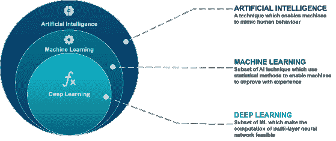
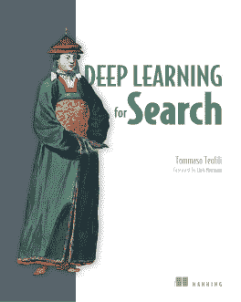

# 人工智能在搜索中的应用:简介

> 原文：<https://web.archive.org/web/sease.io/2021/07/artificial-intelligence-applied-to-search-introduction.html>

这项调查的主要目的是探索在开源世界中应用于搜索的人工智能的艺术状态。我们从**介绍**开始，解释人工智能在信息检索中的意义以及它如何改进搜索系统。第二集探索了所有的工具 **Apache Lucene** 在你的搜索应用中实现这些奇迹。
在第三集里，我们停留在 Apache Software Foundation 的世界里，转到 **Apache Solr** ，探索我们能实现什么以及如何实现。
在本系列的最后一集，我们将讨论 **Elasticsearch** ，评估当前的开发状态、官方可用的功能以及第三方插件提供的新增功能。
那么，事不宜迟，我们开始吧！

## 人工智能对搜索有何影响？

**人工智能** ( **AI** )是由[机器](https://web.archive.org/web/20221209140135/https://en.wikipedia.org/wiki/Machine)展示的[智能](https://web.archive.org/web/20221209140135/https://en.wikipedia.org/wiki/Intelligence)，不像人类和[动物](https://web.archive.org/web/20221209140135/https://en.wikipedia.org/wiki/Animal_cognition)展示的**自然智能** [，涉及意识和情感性。](https://web.archive.org/web/20221209140135/https://en.wikipedia.org/wiki/Human_intelligence)

[维基百科](https://web.archive.org/web/20221209140135/https://en.wikipedia.org/wiki/Artificial_intelligence)

由于计算能力在最近几年强劲而稳定地发展，人工智能最近出现了复苏，现在它被用于许多领域，包括软件工程和信息检索(管理搜索引擎和类似系统的科学)。作为一个复杂和通用的主题，人工智能存在许多子领域，每个子领域都处理不同的技术考虑、目标和使用的工具。
我们将特别关注机器学习:

**机器学习** ( **ML** )是对计算机[算法](https://web.archive.org/web/20221209140135/https://en.wikipedia.org/wiki/Algorithm)的研究，通过经验和数据的使用自动改进。它被视为[人工智能](https://web.archive.org/web/20221209140135/https://en.wikipedia.org/wiki/Artificial_intelligence)的一部分。机器学习算法基于样本数据建立一个模型，称为“[训练数据](https://web.archive.org/web/20221209140135/https://en.wikipedia.org/wiki/Training_data)”，以便在没有明确编程的情况下进行预测或决策。

[维基百科](https://web.archive.org/web/20221209140135/https://en.wikipedia.org/wiki/Machine_learning)

那么 AI 和机器学习可能帮助解决搜索中的哪些问题呢？
其实很多，我们来看一些例子:

–**自然语言处理** - >为了更好地理解和模拟用户信息需求和信息集，针对特定信息段的文本分割
–**图像/视频识别** - >为了提取特征和搜索多媒体信息集
–**知识表示** - >为了构建更好的数据结构和搜索算法(例如基于向量的算法)，为了识别含义、同义词以及术语和概念之间的关系，拼写检查
–

 **为了解决这些问题并为您的搜索引擎带来有趣的新功能，**深度学习**来拯救您:**  ****深度学习**(也被称为**深度结构化学习**)是基于[人工神经网络](https://web.archive.org/web/20221209140135/https://en.wikipedia.org/wiki/Artificial_neural_networks)和[表示学习](https://web.archive.org/web/20221209140135/https://en.wikipedia.org/wiki/Representation_learning)的[机器学习](https://web.archive.org/web/20221209140135/https://en.wikipedia.org/wiki/Machine_learning)方法的更广泛家族的一部分。学习可以是[有监督](https://web.archive.org/web/20221209140135/https://en.wikipedia.org/wiki/Supervised_learning)、[半监督](https://web.archive.org/web/20221209140135/https://en.wikipedia.org/wiki/Semi-supervised_learning)或[无监督](https://web.archive.org/web/20221209140135/https://en.wikipedia.org/wiki/Unsupervised_learning)。
深度学习架构如[深度神经网络](https://web.archive.org/web/20221209140135/https://en.wikipedia.org/wiki/Deep_learning#Deep_neural_networks)、[深度信念网络](https://web.archive.org/web/20221209140135/https://en.wikipedia.org/wiki/Deep_belief_network)、[图形神经网络](https://web.archive.org/web/20221209140135/https://en.wikipedia.org/w/index.php?title=Graph_neural_network&action=edit&redlink=1)、[递归神经网络](https://web.archive.org/web/20221209140135/https://en.wikipedia.org/wiki/Recurrent_neural_networks)、[卷积神经网络](https://web.archive.org/web/20221209140135/https://en.wikipedia.org/wiki/Convolutional_neural_networks)已经应用于[计算机视觉](https://web.archive.org/web/20221209140135/https://en.wikipedia.org/wiki/Computer_vision)、[语音识别](https://web.archive.org/web/20221209140135/https://en.wikipedia.org/wiki/Speech_recognition)、[自然语言处理](https://web.archive.org/web/20221209140135/https://en.wikipedia.org/wiki/Natural_language_processing)、[机器翻译](https://web.archive.org/web/20221209140135/https://en.wikipedia.org/wiki/Machine_translation)、[生物信息学](https://web.archive.org/web/20221209140135/https://en.wikipedia.org/wiki/Bioinformatics)[等领域](https://web.archive.org/web/20221209140135/https://en.wikipedia.org/wiki/Bioinformatics)

[维基百科](https://web.archive.org/web/20221209140135/https://en.wikipedia.org/wiki/Deep_learning)

应用**深度学习**技术解决搜索问题通常被称为**神经搜索**(从**神经信息检索**学术领域衍生出来的一个行业)。
我们不会探索神经网络如何工作的细节，也不会探索我们通过这种多方面的技术可以实现的所有可能性，所以让我们专注于深度学习对搜索的贡献:

*   *   **更好的文本表示**:从[单词袋](https://web.archive.org/web/20221209140135/https://en.wikipedia.org/wiki/Bag-of-words_model)模型(其中术语是字符序列)转移到多维数字(矢量化)方法，能够将术语建模为彼此链接的语义信息单元，具有含义[【1】](https://web.archive.org/web/20221209140135/https://en.wikipedia.org/wiki/Word_embedding)
    *   **文本生成**:语言建模技术蓬勃发展，并成为主流新闻，这要归功于在生成文本方面的杰出成果，这些文本几乎与人工生成的文本无法区分[【2】](https://web.archive.org/web/20221209140135/https://www.techradar.com/news/china-outstrips-gpt-3-with-even-more-ambitious-ai-language-model)[【3】](https://web.archive.org/web/20221209140135/https://medium.com/dataseries/six-times-bigger-than-gpt-3-inside-googles-trillion-parameter-switch-transformer-model-6f7a93c6aae)[【4】](https://web.archive.org/web/20221209140135/https://www.theguardian.com/commentisfree/2020/sep/08/robot-wrote-this-article-gpt-3)
        生成文本在许多信息检索领域都很有用:查询自动完成、查询拼写检查、文档摘要、 搜索结果可解释性(总结文档有助于满足用户信息需求的信息)…
        这一领域的改进可能会带来全新类型的信息检索系统，这些系统的行为就像人类专家一样:系统不仅会返回一系列文档来满足您的信息需求，还会合成一个由支持证据(文档)支持的全面的自然语言响应。
    *   **更好的图像/视频表示**:从图像和视频中提取语义特征(比如涉及的对象和实体，而不仅仅是像素和颜色相关的信息)。[【5】](https://web.archive.org/web/20221209140135/https://towardsdatascience.com/deep-learning-based-reverse-image-search-for-industrial-applications-33ba4b0d32c4)
        使用大型预训练模型，针对您的用例进行微调(可能使用迁移学习技术)，有助于构建高级多媒体检索的基础，减少持续监督的元数据标记工作。
    *   **学习排序**:目前绝大多数搜索引擎从信息语料库中识别出一组候选文档(*匹配*，并按相关性排序，以满足用户信息需求(**排序**)。
        首先在排序列表中提供最有用的结果是最基本的:利用深度学习，可以从过去的交互/判断中训练高级相关性排序模型，以对给定查询的文档进行排序(两者都表示为数字向量)[【6】](https://web.archive.org/web/20221209140135/https://en.wikipedia.org/wiki/Learning_to_rank)
    *   更好的机器翻译:拥有一台能够像人类专家一样翻译语言的计算机一直是一个挑战。深度学习成功取代了基于规则的系统和基于统计短语的方法等方法。[【7】](https://web.archive.org/web/20221209140135/https://en.wikipedia.org/wiki/Neural_machine_translation)[【8】](https://web.archive.org/web/20221209140135/https://arxiv.org/pdf/2002.07526.pdf)
        这为多语言搜索带来了巨大的好处:你可以用一种语言进行查询，并更高效地找到许多不同语言的文档。[【9】](https://web.archive.org/web/20221209140135/https://www.amazon.science/publications/query-transformation-for-multi-lingual-product-search)

从这个介绍中，我们注意到许多深度学习对搜索的贡献需要在我们的搜索引擎中支持多维数字向量。那么，如何用目前可用的开源技术实现这样的奇迹呢？
官方支持什么？哪里需要第三方插件？本系列的下一集将从这个角度探索 Apache Lucene！敬请期待！

[3][https://medium . com/data series/six-times-big-than-GPT-3-inside-Googles-万亿参数-开关-变压器-模型-6f7a93c6aae](https://web.archive.org/web/20221209140135/https://medium.com/dataseries/six-times-bigger-than-gpt-3-inside-googles-trillion-parameter-switch-transformer-model-6f7a93c6aae) ，[https://arxiv.org/pdf/2101.03961.pdf](https://web.archive.org/web/20221209140135/https://arxiv.org/pdf/2101.03961.pdf)，

 // deep learning in search

### 如果你喜欢这篇文章，你可能会对托马索·特奥菲利的这本书感兴趣

// our service

## 不要脸的塞给我们培训和服务！

我有没有提到我们在搜索培训中做[学习排名](https://web.archive.org/web/20221209140135/https://sease.io/learning-to-rank-training)和[人工智能？
我们也提供这些主题的咨询，](https://web.archive.org/web/20221209140135/https://sease.io/artificial-intelligence-in-search-training)[如果你想用人工智能的力量把你的搜索引擎带到一个新的水平，请联系](https://web.archive.org/web/20221209140135/https://sease.io/contacts)！

// STAY ALWAYS UP TO DATE

## 订阅我们的时事通讯

你喜欢这个关于人工智能应用于搜索的帖子吗？不要忘记订阅我们的时事通讯，以便随时了解信息检索世界的最新动态！**