# 用 Apache JMeter 测试 Apache Solr 性能

> 原文：<https://web.archive.org/web/sease.io/2023/02/benchmark-apache-solr-performance-with-apache-jmeter.html>

如果您熟悉 Apache Solr，但不知道如何创建 Solr 性能测试，那么您就找对了地方。

这篇博文展示了如何使用 JMeter 工具创建 Solr 基准。目的不是要具体详细地介绍 JMeter，所以我们不会描述所有的 JMeter 特性，而只是想让您大致了解如何以 Apache Solr 为目标，使用 Jmeter 设置性能测试。

我们将通过提交几个查询来对 Apache Solr 查询时功能进行压力测试，其中(特定字段的)查询术语每次都会发生变化，以模拟真实用户向服务器发送多个请求。

## 什么是性能测试

性能测试是检查系统(网站、应用、服务器、数据库、网络等)行为的测试的通称。)以及它在正常和极端条件下的表现。

它被认为是任何软件应用程序的关键阶段，以便验证和确认其性能和质量保证。

性能测试是各种测试类型的超集，例如:

每个测试都可以用来分析各种因素，例如速度、响应时间、加载时间和可伸缩性，以便识别瓶颈或错误，并决定如何优化您的应用程序。

## 什么是 Apache JMeter

JMeter 是一个开源工具，由 Apache Software Foundation 提供，能够进行所有类型的性能测试，包括负载和压力测试。它是一个 100%纯 Java 应用程序，因此在安装了 Java 的每个操作系统上运行它应该没有问题。

###### JMeter 特性:


*   开源(免费)
*   易于安装和直观的 GUI ( *图形用户界面)*
*   能够分析和测量各种服务/不同服务器类型的性能
*   完整的多线程框架(即几个独立的线程组可以同时执行)
*   能够支持多协议和多测试策略
*   巨大的测试能力
*   测试结果可以以不同的格式显示和保存

***注意**:这个示例程序展示了如何使用 Mac OS* 安装 Jmeter 和配置性能测试。

###### 安装 Apache JMeter

***先决条件*** : `Java 8+ for Apache JMeter 5.5`

*   从 [Apache JMeter 网站](https://web.archive.org/web/20230325173909/https://jmeter.apache.org/download_jmeter.cgi)下载 JMeter 的最新版本
*   验证下载文件的完整性，包括 *sha512* 和 *PGP* 键:

```
**SHA**
*1) Click on [sha512](https://web.archive.org/web/20230325173909/https://downloads.apache.org/jmeter/binaries/apache-jmeter-5.5.zip.sha512)*
 *2) Open the Terminal from /Applications/Utility/ and enter:*
**openssl sha512 /path/to/file/apache-jmeter-5.5.zip** 
*3) Verify that the output from the previous command matches the SHA key obtained in step 1*

***PGP***
*1) Download the PGP key:*
**wget -q https://downloads.apache.org/jmeter/binaries/apache-jmeter-5.5.zip.asc**

*2) Verify the downloaded file against the key:*
**gpg --verify /path/to/key/apache-jmeter-5.5.zip.asc /path/to/file/apache-jmeter-5.5.zip**

*3) If you get the error message "No public key" (C4923F9ABFB2F1A06F08E88BAC214CAA0612B399), it means that it is unknown on your local machine, so you need to import it from the PGP servers, e.g:*
**gpg --keyserver pgpkeys.mit.edu --recv-key C4923F9ABFB2F1A06F08E88BAC214CAA0612B399**

*Once imported, you should be able to repeat step 2 successfully*
```

*   将 zip 文件解压缩到您想要使用它的位置
*   从/bin 文件夹中打开终端，输入以下命令用 GUI 打开 JMeter:

```
./jmeter.sh
```

现在您应该能够看到 GUI 控制台，并开始配置您的*测试计划*。

## 使用 JMeter 进行 Solr 性能测试

在这篇博文中，我们展示了一个使用 JMeter 进行 Apache Solr 性能分析的非常简单的例子。

我们想测试 Solr 搜索请求，并通过生成虚拟用户点击服务器来衡量性能，就好像他们是发送多个请求的真实用户一样。

JMeter 允许您通过创建几个 Solr 查询(请求)来重现这种类型的测试，其中(特定字段的)查询术语每次都会发生变化。通过这种方式，我们能够测试和评估单个请求和整体上的许多不同的指标。

要重现这个测试，您应该有一个在端口 8983 上本地运行的 Solr 和一个应该在其上执行查询的集合。

事实上，对于这个实际的例子，我们已经创建了一个名为 *wiki_ita* 的集合，其中我们已经用意大利语索引了数千个维基百科文档，并且我们已经测试了 Solr，对“*文本*字段进行了几次查询。

## 测试配置示例

**测试计划**是 JMeter 的根元素，可以由几个元素组成，设计用于特定的目的，允许您定义变量和默认参数。

在这种情况下，我们设置了一个最小的测试，只包含一个线程组、一个采样器、监听器和配置元素；如果你好奇，你可以在这里找到元素的完整列表。

测试计划中包含的一切都是按照一个定义的顺序运行的。

以下是配置该示例测试的主要步骤:

#### 1.添加线程组

*右击测试计划→添加→线程(用户)→线程组*

这是所有测试的入口点，设置“线程属性”来指定您希望请求如何运行是很重要的:

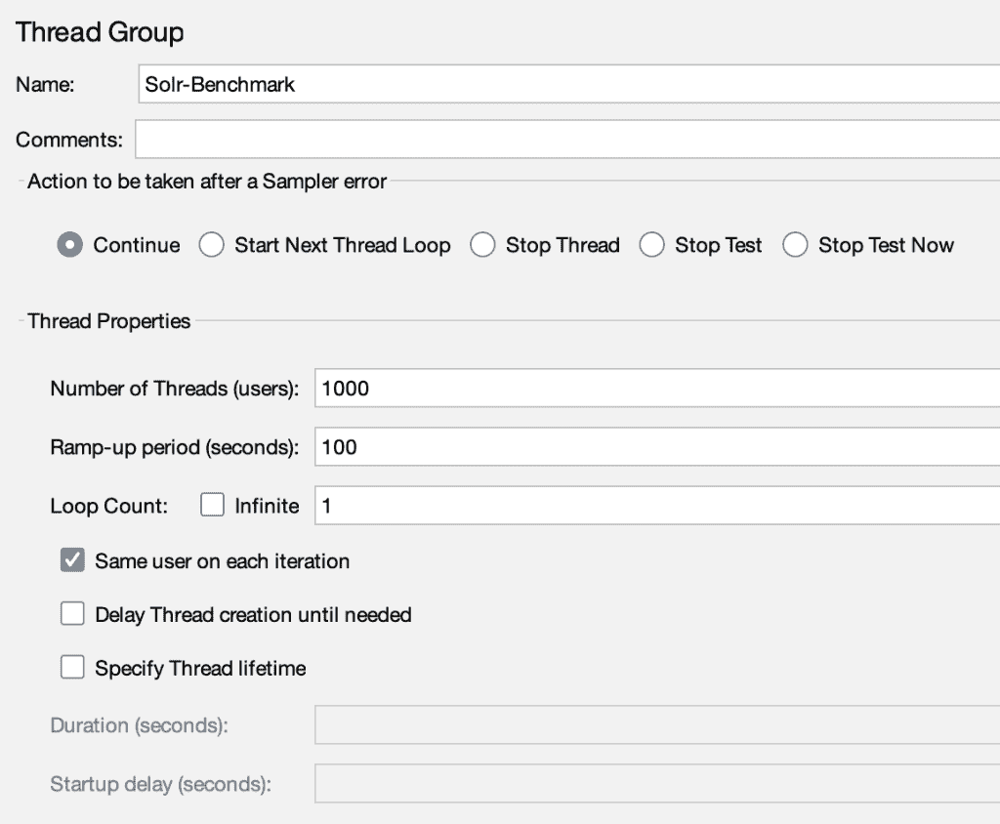

特别是，您应该定义:

***线程(用户)数*** :连接到服务器的线程/用户数

在我们的例子中，我们设置了 1000:这个值等于 CSV 文件中的术语数，我们很快就会看到。

***【秒】*** :用于确定 JMeter 运行所有线程需要多长时间，从而告诉 JMeter 如何分配线程的开始(它们之间的延迟)。

正如你可以从[文档](https://web.archive.org/web/20230325173909/https://jmeter.apache.org/usermanual/test_plan.html#thread_group)中读到的，你可以“*从**斜升=线程数**开始，并根据需要向上或向下调整*”。

如果您有 1000 个线程和 1000 秒的加速时间，这意味着 JMeter 需要 1000 秒来运行所有 1000 个线程，并且每个线程将在前一个线程开始后 1 (1000/1000)秒开始。

如果您想同时执行多个请求，可以将上升周期设置为 100 秒，如本例所示，这样 JMeter 每秒增加 10 个用户。

***循环计数* :** 测试执行的次数(针对用户数)。

在这种情况下，我们保留默认值 1。

您还可以设置在出现错误时要采取的操作，或者您可以决定安排您的测试，指定持续时间或开始和结束时间。

#### 2.添加配置元素

配置项用于配置发送到服务器的请求，允许我们设置默认值和声明变量，这些变量稍后会被采样器使用。它们在开始时执行，然后在实际请求之前执行。

###### HTTP 请求默认值

*右击线程组→添加→配置元素→ HTTP 请求默认值*

当您需要向同一台服务器发送多个请求(相同类型)时，它用于定义默认参数，如主机名和服务器端口。

建议使用它，因为它使 Jmeter 易于维护，避免了重复，并减少了服务器名称或 IP 随时间变化时出错的机会:

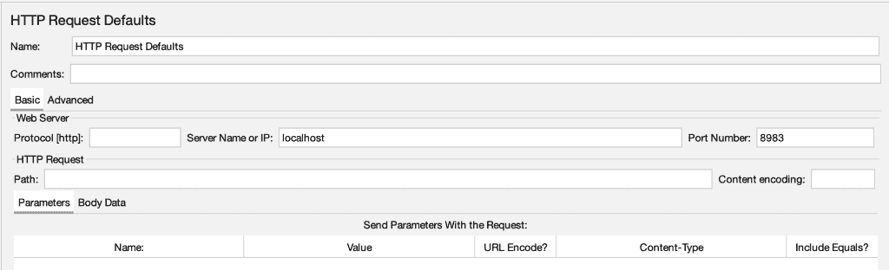

对于这个测试，使用的协议是默认的`HTTP`，服务器名是`localhost`，端口号是`8983`。

[用户手册](https://web.archive.org/web/20230325173909/https://jmeter.apache.org/usermanual/component_reference.html#HTTP_Request_Defaults)

###### CSV 数据集配置

*右击线程组→添加→配置元素→ CSV 数据集配置*

如果需要使用外部数据进行测试，JMeter 提供了一个名为 ***CSV 数据集配置*** 的配置元素，能够使用仅以. CSV 文件格式存储的数据。它读取文件的每一行，并将其拆分为变量:

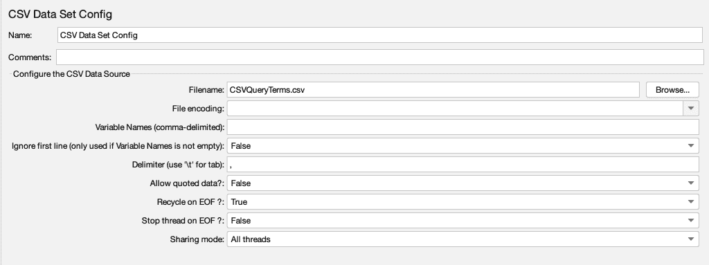

在我们的例子中，我们创建了一个包含 1000 个术语的 CSV 文件( *CSVQueryTerms.csv* )。看起来是这样的:

```
**term**
computer
relax
stress
shopping
brand
ticket
web
team
...
...
match
```

我们的目标是使用文件中的每个术语作为测试的查询术语。

在配置部分，您需要配置几个必填字段来运行测试:

***Filename*** 定义了要读取的文件的名称(如果该文件不在“测试计划”的目录中，请提供完整路径)。jmx 文件))。

***变量名*** ，定义了用逗号分隔的变量名列表；在我们的例子中，我们可以将这个字段留空，因为 JMeter 支持 CSV 标题行，文件的第一行被读取并解释为列名列表。因此，JMeter 将把第一行( *term* )作为变量名，并从第二行读取数据。

我们在其他字段中保留了默认值。

*共享模式*等于*所有线程*意味着文件只打开一次，每个线程会使用文件的不同行。

您可以在 [JMeter 用户手册](https://web.archive.org/web/20230325173909/https://jmeter.apache.org/usermanual/component_reference.html#CSV_Data_Set_Config)中了解更多关于该配置元素的信息。

#### 3.添加控制器(采样器| HTTP 请求)

采样器(一种 JMeter 控制器)是用于向服务器发送请求并获得其响应的组件。在我们的例子中，我们使用了 HTTP 请求采样器。

*右击线程组→添加→采样器→ HTTP 请求*

我们的目的是创建对 Solr 服务器的请求，如下所示:

```
http://localhost:8983/solr/COLLECTION_NAME/select?
q=FIELD_NAME:QUERY_TERM&fl=id,title,text&debug=all 
```

因此，在这个配置部分，您可以输入请求的所有细节:

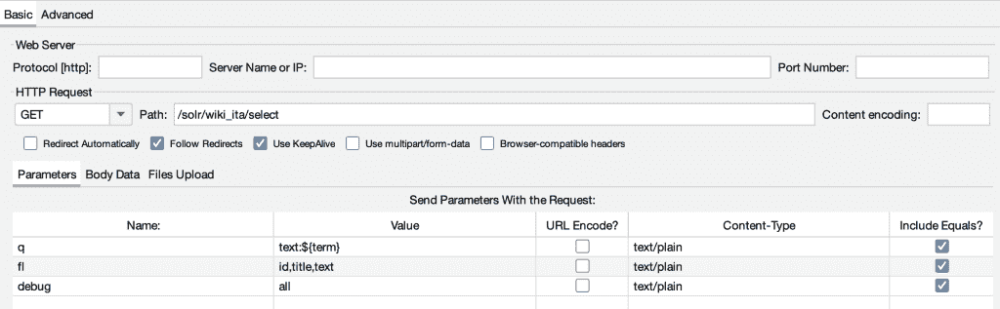

在我们的例子中，服务器名称和端口号为空，因为它们已经在 HTTP 请求默认值配置元素中设置好了。

选择的方法是 GET，我们输入了路径:`/solr/wiki_ita/select`

然后您可以添加请求参数，为了简单起见，我们只使用:

*   *   **问:text:${term}** (主查询参数)

*   *   **fl: id，title，text** (仅选择查询响应中指定的字段列表)

*   *   **debug: all** (返回关于请求的所有可用调试信息:查询、计时、评分结果)

您可以立即看到，通过将变量名添加到定义查询的查询解析器参数中( *q* ，我们将能够使用从 CSV 文件中提取的值:

```
field_name:${variable_name}
```

因此，JMeter 将创建以下 URL 请求:

```
e.g. first line of the CSV file  
http://localhost:8983/solr/wiki_ita/select?q=text:computer&fl;=id,title,text&debug;=all
```

#### 4.添加侦听器

*右键单击线程组→添加→监听器→查看结果树|在表中查看结果|等等。*

最后，为了查看和总结测试结果，您需要添加一个或多个[监听器](https://web.archive.org/web/20230325173909/https://jmeter.apache.org/usermanual/listeners)。

监听器是显示样本结果的组件，因此是 JMeter 测试计划中最重要的部分。有各种侦听器以不同的形式显示结果，比如表、树、图和日志文件；你可以针对你的具体情况选择最适合的，最有趣的。

在本例中，我们选择了:

###### 查看结果树

使用这个侦听器的优点是您可以检查请求和响应。

它按照 JMeter 脚本生成的顺序显示所有样本(成功或失败)和所有相关的断言。

对于每个请求(在我们的例子中是 1000 个 HTTP 请求),它提供了:

**采样器结果**:

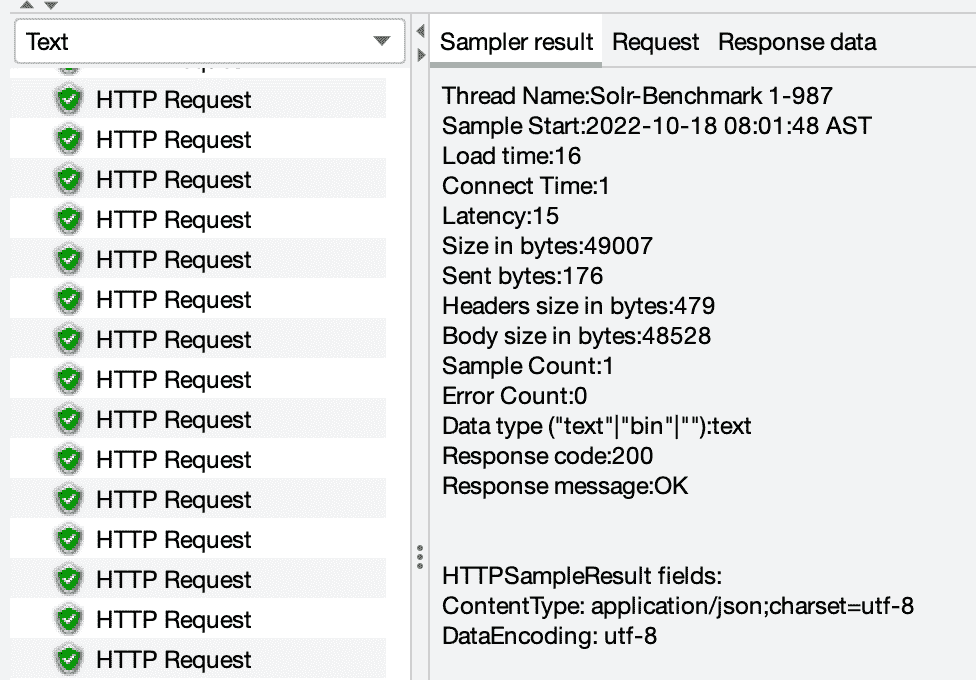

它包含关于加载时间、延迟和字节大小的一般响应信息。

**请求**(正文和标题):

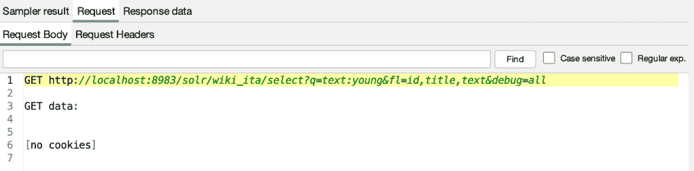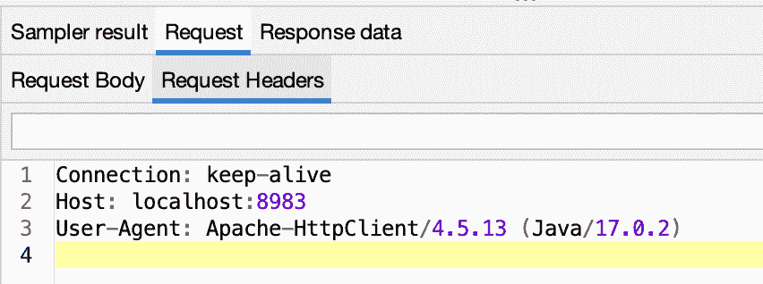

我们可以检查每个请求的 *q* 参数的术语是否用从 CSV 数据集配置中使用的 CSV 文件中提取的值进行了更新，例如:

```
GET http://localhost:8983/solr/wiki_ita/select?q=**young**&fl=id,title,text&debug=all
GET http://localhost:8983/solr/wiki_ita/select?q=text:**computer**&fl=id,title,text&debug=all
GET http://localhost:8983/solr/wiki_ita/select?q=text:**relax**&fl=id,title,text&debug=all
...
```

**响应数据**(正文和标题):

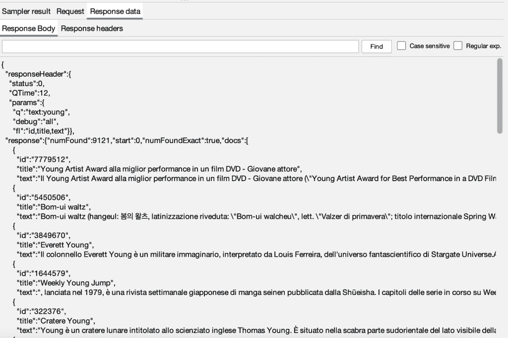

下面是 Solr 在响应查询时返回给客户机的完整结果集；默认情况下，它一次返回 10 个文档。

响应可以以不同的格式显示，如文本、Regexp 测试器、边界提取器测试器、CSS/JQuery 测试器、Xpath 测试器、JSON 路径测试器、HTML、HTML 源格式、HTML(下载资源)、文档、JSON、XML、浏览器。

###### 总结报告

它是一个表格格式的监听器，为测试中的每个 HTTP 请求采样器创建一行，在我们的例子中，只有一行:

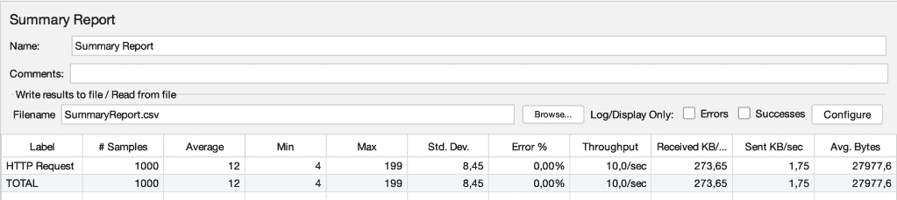

它总结了测试期间发送到服务器的请求总数的不同性能测试指标(即 1000):

*   **样本**:发送的请求数
*   **平均**:平均响应时间
*   **Min** :最小响应时间(毫秒)
*   **最大**:最大响应时间(毫秒)
*   **Std。戴夫。**:显示偏离平均响应时间值的异常情况。越少越好
*   **错误%** :失败请求的百分比
*   **吞吐量**:你的服务器每秒处理多少请求(越大越好)
*   **接收**–**发送 KB/秒**:客户端每秒接收多少 KB–发送给服务器
*   **平均字节数**:平均响应大小

    该监听器类似于“聚合报告”，但消耗的内存较少，因为它不提供百分点值。

###### 查看表格中的结果

如果您需要类似于查看结果树但以表格形式显示的内容，您可以使用这个监听器:

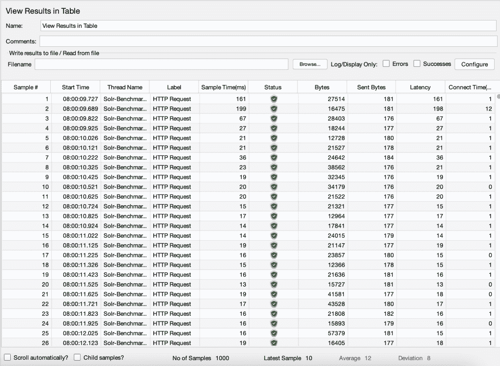

对于每个样本，它提供有关执行结果、时间相关数据(延迟、连接时间、样本时间)和字节的信息。

但是，不建议将其用于负载测试，只能用于功能测试，因为会消耗大量的 CPU/内存。

JMeter 还提供图形分析，例如添加“图形结果”或“响应时间图”监听器。

#### 5.运行测试并查看结果

当一切都配置好了，您需要在运行测试之前保存 JMeter 测试(通过点击绿色的 play 按钮)。

###### JMeter 到底会怎么做？

对于每个用户(即 CSV 文件的每一项)，它将:
–创建一个请求
–将其发送到服务器
–接收并处理服务器响应
–生成不同格式的测试结果，以便测试人员可以对其进行分析

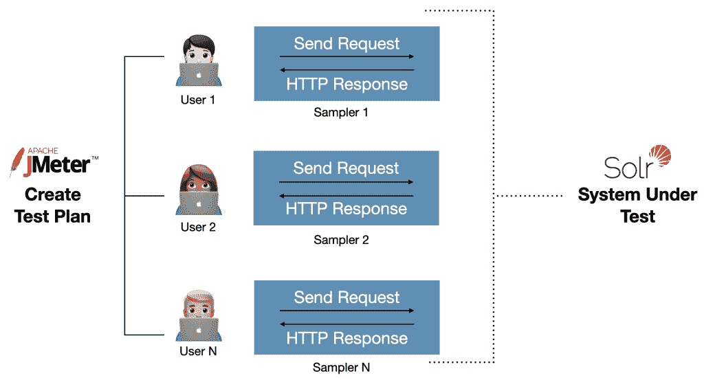

***注意:***

您可以使用 GUI 来设置和测试您的“测试计划”，但是对于巨大的请求量，建议使用 [CLI(命令行界面)模式](https://web.archive.org/web/20230325173909/https://jmeter.apache.org/usermanual/get-started.html#non_gui)来实际运行它。

因此，最好在没有任何侦听器的情况下运行测试；随后，可以使用 GUI 打开生成的结果文件，并将其导入到任何所需的侦听器中。

Jmeter 的另一个优点是能够将结果写入文件，并以不同的格式保存。

## 最终考虑

我希望这个实际的例子能够帮助您理解如何使用 JMeter 工具创建 Solr 基准。

性能测试的一个替代工具是 [SolrMeter](https://web.archive.org/web/20230325173909/https://github.com/tflobbe/solrmeter) ，它是专门为 Solr 创建的，但是这个项目不再维护，可能会有一些 bug，这就是为什么最好使用 JMeter(或者其他工具)。

根据您的情况和模式，尝试修改这个实际的例子。

当运行性能测试时，确保您真正想要测试什么，并确保您使用的查询集实际上代表了您的领域，以及您如何使用 Solr 来获得相关的性能分析。

// our service

## 还在纠结 Solr 性能测试？

如果你在 Solr 性能测试上有困难，不要担心——我们会帮助你的！
我们的团队提供 **专家服务和培训** 来帮助您优化 Solr 搜索引擎，充分利用您的系统。立即联系我们，了解更多信息！

[Send us an e-mail](https://web.archive.org/web/20230325173909/mailto:info@sease.io)// STAY ALWAYS UP TO DATE

## 订阅我们的时事通讯

你喜欢这篇关于用 Apache JMeter 测试 Apache Solr 性能的文章吗？不要忘记订阅我们的时事通讯，以便在信息检索世界中保持最新状态！