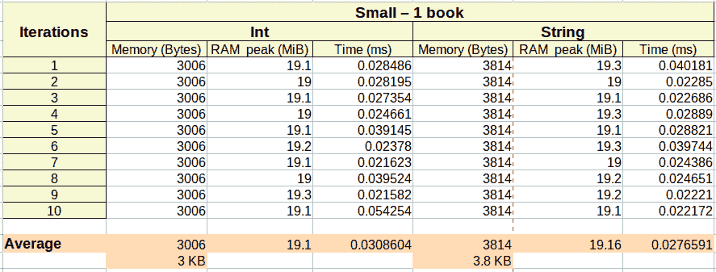
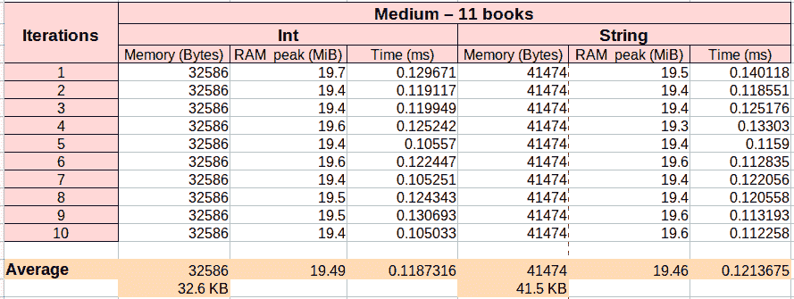
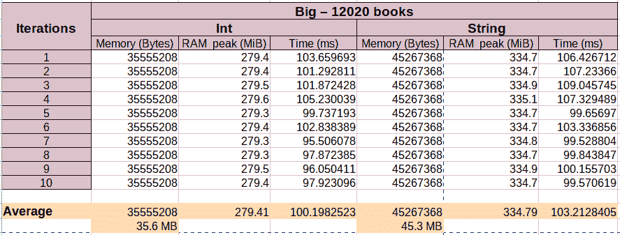
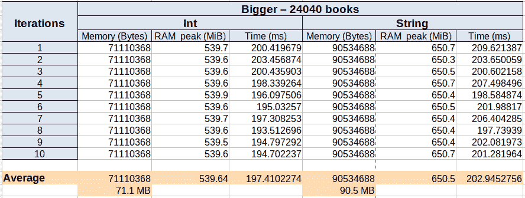

# 高效管理 JSON 和 Pandas 中的数字 id

> 原文：<https://web.archive.org/web/sease.io/2022/03/efficiently-manage-numeric-ids-in-json-and-pandas.html>

在操作数据时，处理 ids 是很常见的。它们对于明确地识别物体非常有用。通常，它们被表示为一系列数字。

假设现在管理一个包含几个对象的 JSON 文件，并假设这些对象由一组作为键值对的特性来表示。一些特性使用数字标识，如 *objectId* 和 *objectCategoriesId* 。

下面是我们的 JSON 对象的一个例子，其中对象代表一本书:

```
{
"bookId":**"527054"**,
"author":"Dan Brown",
"title":"The Da Vinci Code",
"numberPages":300,
"publishingYear":2003,
"totalReviews":3514,
"avgReviews":4.5,
"price":20,
"bookCategories":[**"237"**, **"451"**, **"110"**, **"745"**]
"bookDiscount":0,
"bookSales":1048
}
```

在处理大量数据(许多这样的对象)时，自然会出现一个问题:使用哪种数据类型来管理 ids 更好？

我们确实知道，所选择的数据类型会对管理这些数据的管道的性能产生很大的影响。

如果我们看一下 id 的含义，存储它们最正确的方式应该是作为字符串。
id 的确不是用数学运算和排序来表示实数，而是通常表示现实世界对象的标签。
然而，众所周知，字符串存储在内存中以及及时处理的代价很高。因此，使用整数是为了提高性能。

## 将 id 作为字符串处理和存储需要多少努力？将 id 作为整数管理的收益有多大？

我做了一些实验来衡量这两种类型的 ids 管理之间的差异。

首先，我创建了一个包含单个 JSON 对象的输入文件，其中每个 id 特性都作为字符串传递。然后，我创建了一个相同的输入文件，唯一的区别是 id 特性的值作为整数传递。

我执行相同的管道(处理这些数据)两次，先输入字符串文件，然后输入整数版本。

然后我从记忆和时间两方面比较了这两个实验。

###### 用线串

在第一个实验中，我使用了一个输入文件，其中 id 特性作为字符串传递。以下是内容示例:

```
{
"bookId":**"527054"**,
"author":"Dan Brown",
"title":"The Da Vinci Code",
"numberPages":300,
"publishingYear":2003,
"totalReviews":3514,
"avgReviews":4.5,
"price":20,
"bookCategoriesIds":[**"237"**, **"451"**, **"110"**, **"745"**]
"bookDiscount":0,
"bookSales":1048
}
```

在这个文件中，有一个元素代表一本书。这个元素有两个 id 特性: *bookId* 和 *bookCategoriesIds* 。这是绳子。

###### 整数

在第二个实验中，我使用了一个输入文件，其中 id 特性作为整数传递。以下是内容示例:

```
{
"bookId":**527054**,
"author":"Dan Brown",
"title":"The Da Vinci Code",
"numberPages":300,
"publishingYear":2003,
"totalReviews":3514,
"avgReviews":4.5,
"price":20,
"bookCategories":[**237**, **451**, **110**, **745**]
"bookDiscount":0,
"bookSales":1048
}
```

在这个文件中，我有和以前一样的 book 元素，唯一的不同是我们使用了整数 id。

###### 结果

如前所述，我两次执行了相同的管道。一次使用字符串形式的 id 特征，一次使用整数形式的 id 特征。

我从输入文件中的单个 JSON 对象开始，重复管道 10 次，以平均所有迭代的性能。

然后，我再次重复相同的评估，增加输入文件中 JSON 对象的数量。

这是第一次分析的结果。在这里，我使用一个 JSON 对象，并将管道重复 10 次。在表的左边，结果使用整数 id，在右边，结果使用字符串 id。




这里我们可以看到，相对于整数，使用字符串需要更多的磁盘内存，而两种策略中所需的 RAM 和总时间非常相似。

对包含 11 本书的 JSON 文件进行了相同的处理:




这里我们可以看到，使用字符串相对于整数需要更多的磁盘内存和时间，而 RAM 在两种策略中仍然非常相似。

T17

又是 12020 本书:



这里我们可以看到性能差距开始变大。整数在内存和时间消耗上都开始变好。

最后是 24040 本书:



前面的结果在这里得到了证实，相对于字符串，整数具有更好的性能。

## 摘要

从前面的表中收集平均结果。以下是整数的结果:

| 书籍数量 | 记忆 | RAM 峰值 MiB | 时间毫秒 |
| --- | --- | --- | --- |
| 1 | 3.0 KB | 19.10 | 0.031 |
| 11 | 32.6 KB | 19.49 | 0.119 |
| 12020 | 35.6 兆字节 | 279.41 | 100.198 |
| 24040 | **71.1 MB** | **539.64** | **197.410** |

这里是字符串:

| 书籍数量 | 记忆 | RAM 峰值 MiB | 时间毫秒 |
| --- | --- | --- | --- |
| 1 | 3.8 KB | 19.16 | 0.028 |
| 11 | 41.5 KB | 19.46 | 0.121 |
| 12020 | 45.3 兆字节 | 334.79 | 103.213 |
| 24040 | **90.5 MB** | **650.50** | **202.945** |

从最贵的阐述可以看出，无论是从内存还是时间上，使用整数都是比较好的。

T53

最后要注意的是，在解析 JSON 时使用数字作为 id 并不是万能的，它也有自己的困难，特别是在输入时:确保知道 id 的边界，这样才能选择正确的数字类型(float、integer、long……)。在处理数字 id 时，也要确保你没有对它们进行排序或进行不必要的数学运算(它们使用数字字符，但它们毕竟不是数字！)

// our service

## 不要脸的塞给我们培训和服务！

我提到过我们在搜索培训中做[学习排名](https://web.archive.org/web/20220930004448/https://sease.io/learning-to-rank-training)和[人工智能吗？
我们还提供关于这些主题的咨询，](https://web.archive.org/web/20220930004448/https://sease.io/artificial-intelligence-in-search-training)[如果您想借助人工智能的力量将您的搜索引擎提升到一个新的水平，请联系](https://web.archive.org/web/20220930004448/https://sease.io/contacts)！

// STAY ALWAYS UP TO DATE

## 订阅我们的时事通讯

你喜欢这篇关于在 JSON 和 Pandas 中有效管理数字 id 的文章吗？不要忘记订阅我们的时事通讯，以便随时了解信息检索世界的最新动态！