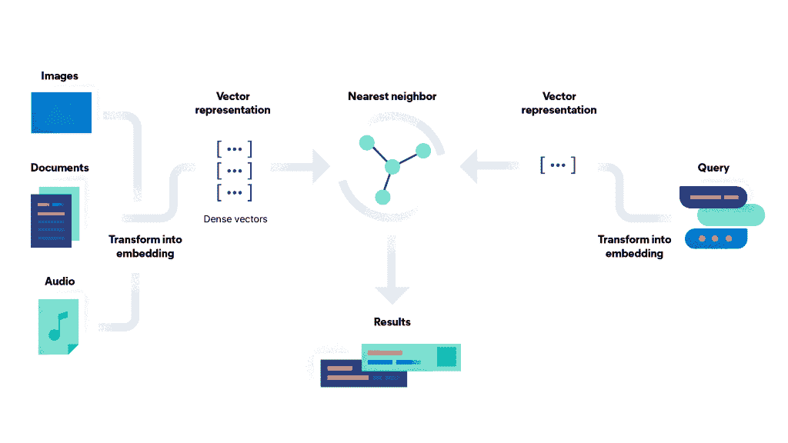
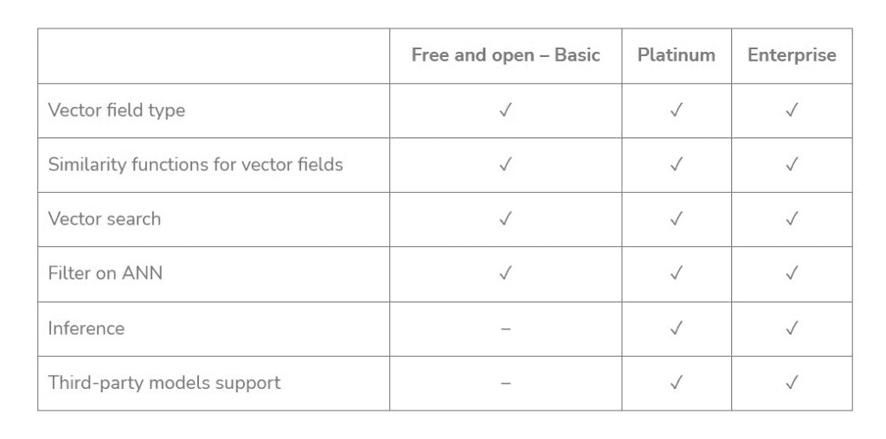

# Elasticsearch 神经搜索教程

> 原文：<https://web.archive.org/web/sease.io/2023/03/elasticsearch-neural-search-tutorial.html>

嗨读者们！在这里，我们将通过新的一集来了解开源技术如何实现文本矢量化和基于向量的搜索(也称为神经搜索，因为使用了深度神经网络来编码文本向量)。
我们已经发表了三篇关于以下内容的博文:

*   [OpenSearch 神经搜索插件教程:索引和搜索](https://web.archive.org/web/20230328112515/https://sease.io/2022/12/opensearch-neural-search-plugin-tutorial.html)
*   [Apache Solr 神经搜索教程:索引和搜索](https://web.archive.org/web/20230328112515/https://sease.io/2023/01/apache-solr-neural-search-tutorial.html)
*   [Vespa 神经搜索教程](https://web.archive.org/web/20230328112515/https://sease.io/2023/02/vespa-neural-search-tutorial.html)

现在轮到 Elasticsearch 了！
这篇博文探讨了如何在 Elasticsearch 中管理矢量搜索，详细描述了端到端教程中已经提供的内容。

## 弹性搜索神经搜索管道

基于向量的搜索和 NLP(自然语言处理)功能可从 2022 年 2 月发布的 Elastic 版本获得。

下面只是一个图表，以方便地显示如何矢量搜索引擎的工作；它包括:

*   **转换**原始实体，如歌曲、图像或一些文本**为数字表示**(矢量嵌入)
*   使用**距离**度量来表示向量之间的相似度
***   **使用近似近邻(ANN)算法在**中搜索**相关数据**(您的查询)**

**

Vector search diagram (Source: [https://www.elastic.co/what-is/vector-search](https://web.archive.org/web/20230328112515/https://www.elastic.co/what-is/vector-search))

像 Apache Solr 一样，Elasticsearch 也在内部使用 *Apache Lucene* 作为其搜索引擎，所以许多底层概念、数据结构和算法同样适用于两者。
即使在这种情况下，基于向量的搜索也是建立在 **Apache Lucene HNSW** (分层可导航小世界图)之上，即 Lucene 9 的原生 ANN(近似最近邻)。

使用 Elasticsearch 实现神经搜索的端到端管道是:

1.  下载 Elasticsearch
2.  外部产生矢量
3.  为矢量搜索创建弹性搜索索引
4.  索引文档
5.  利用向量场的搜索

我们现在将详细描述每个部分，以便您可以轻松地重现本教程。

让我们开始弄脏你的手吧！**  **### 1.下载 Elasticsearch

如前所述，基于向量的搜索与 Elasticsearch 8.0 集成在一起，但在本教程中，我们使用 8.5.3 版本，您可以从以下网址下载:
[https://www . elastic . co/downloads/past-releases # elastic Search](https://web.archive.org/web/20230328112515/https://www.elastic.co/downloads/past-releases#elasticsearch)

*验证下载文件的完整性，包括 SHA 和 ASC 密钥。*

由于 Elasticsearch 是使用 Java 构建的，你需要确保 Java 开发工具包( **JDK** )安装在你的系统中；如果已经安装了 Java，检查其版本，必须是 **17 或更高版本**。

将下载的文件解压到您想要使用的位置，从该文件夹打开终端并在本地运行 Elasticsearch:

```
bin/elasticsearch
```

首次启动 Elasticsearch 时，安全性会自动启用(更多信息[请点击](https://web.archive.org/web/20230328112515/https://www.elastic.co/guide/en/elasticsearch/reference/current/configuring-stack-security.html))。
为了简单起见，在本教程中我们通过在*elasticsearch . yml*(*/elastic search-8 . 5 . 3/config/*)中设置`xpack.security.enabled: false`并重启 elastic search 节点来禁用它。

您可以通过键入:`curl localhost:9200`来验证 Elasticsearch 是否正确运行

我们现在准备使用 Elasticsearch 并与其 REST APIs 进行交互。这可以通过几种工具来实现:

*   命令行(cURL)，如本教程所示
*   Kibana 中的开发工具控制台(下载并注册 Kibana)
*   API 平台，比如 Postman

### 2.外部产生矢量

Elastic 8.0 允许用户使用 PyTorch 中开发的自定义或第三方语言模型直接在 Elasticsearch 中执行推理，但需要白金或企业订阅才能体验完整的机器学习功能。



Elastic Stack subscriptions: [https://www.elastic.co/subscriptions](https://web.archive.org/web/20230328112515/https://www.elastic.co/subscriptions)

如果你想探索这个强大的 NLP 特性，可以看看这篇博文的第二部分[以一种非常简单的方式解释了企业版的所有步骤。](https://web.archive.org/web/20230328112515/https://sease.io/wp-admin/post.php?post=56082&action=edit)

否则，如果您有基本许可证，要运行 kNN 搜索，您必须**将您的数据转换成 Elasticsearch** 的之外的有意义的矢量值*，并将它们作为 *dense_vector* 字段值添加到文档中。*

为了将文本转换成相应的向量，我们使用了一个 Python 项目，你可以很容易地从我们的 [GitHub](https://web.archive.org/web/20230328112515/https://github.com/SeaseLtd/vector-search-elastic-tutorial) 页面中克隆和探索这个项目。

下面是为了从语料库中自动创建矢量嵌入而运行的 python 脚本:

[https://github . com/SeaseLtd/vector-search-elastic-tutorial/blob/main/from _ text _ to _ vectors/batch-sentence-transformers . py](https://web.archive.org/web/20230328112515/https://github.com/SeaseLtd/vector-search-elastic-tutorial/blob/main/from_text_to_vectors/batch-sentence-transformers.py)

```
from sentence_transformers import SentenceTransformer
import torch
import sys
from itertools import islice
import time

BATCH_SIZE = 100
INFO_UPDATE_FACTOR = 1
MODEL_NAME = **'all-MiniLM-L6-v2'**

# Load or create a SentenceTransformer model.
model = SentenceTransformer(MODEL_NAME)
# Get device like 'cuda'/'cpu' that should be used for computation.
if torch.cuda.is_available():
    model = model.to(torch.device("cuda"))
print(model.device)

def batch_encode_to_vectors(input_filename, output_filename):
    # Open the file containing text.
    with open(input_filename, 'r') as documents_file:
        # Open the file in which the vectors will be saved.
        with open(output_filename, 'w+') as out:
            processed = 0
            # Processing 100 documents at a time.
            for n_lines in iter(lambda: tuple(islice(documents_file, BATCH_SIZE)), ()):
                processed += 1
                if processed % INFO_UPDATE_FACTOR == 0:
                    print("Processed {} batch of documents".format(processed))
                # Create sentence embedding
                vectors = encode(n_lines)
                # Write each vector into the output file.
                for v in vectors:
                    out.write(','.join([str(i) for i in v]))
                    out.write('\n')

def encode(documents):
    embeddings = model.encode(documents, show_progress_bar=True)
    print('Vector dimension: ' + str(len(embeddings[0])))
    return embeddings

def main():
    **input_filename = sys.argv[1]
    output_filename = sys.argv[2]**
    initial_time = time.time()
    batch_encode_to_vectors(input_filename, output_filename)
    finish_time = time.time()
    print('Vectors created in {:f} seconds\n'.format(finish_time - initial_time))

if __name__ == "__main__":
    main()
```

我们使用以下命令执行该脚本:

```
python batch-sentence-transformers.py "./example_input/documents_10k.tsv" "./example_output/vector_documents_10k.tsv"
```

RESPONSE

```
Processed 1 batch of documents
Batches: 100%|██████████| 4/4 [00:04<00:00,  1.08s/it]
Vector dimension: 384
...
...
Processed 100 batch of documents
Batches: 100%|██████████| 4/4 [00:02<00:00,  1.35it/s]
Vector dimension: 384
Vectors created in 402.041406 seconds
```

[SentenceTransformers](https://web.archive.org/web/20230328112515/https://www.sbert.net/index.html) 是一个 Python 框架，可以用来计算句子/文本嵌入；它提供了大量针对各种任务调整的[预训练模型](https://web.archive.org/web/20230328112515/https://www.sbert.net/docs/pretrained_models.html)。
在这种情况下，我们使用**[all-MiniLM-L6-v2](https://web.archive.org/web/20230328112515/https://huggingface.co/sentence-transformers/all-MiniLM-L6-v2)**(*BERT*)将句子映射到一个 384 维的密集向量空间。

对于本教程，我们从[MARCO](https://web.archive.org/web/20230328112515/https://microsoft.github.io/msmarco/)女士那里下载了[段落检索集](https://web.archive.org/web/20230328112515/https://microsoft.github.io/msmarco/Datasets.html#:~:text=Collection-,collection.tar.gz,-2.9%20GB)(一个用于深度学习的大规模信息检索数据集的集合)，并索引了大约 10k 个文档。

python 脚本将包含 10k 个文档的文件(即 MS MARCO passage 检索集合的一小部分)作为输入:
**sys . argv[1]=*"/path/to/documents _ 10k . tsv "***
*例如 1 个文档*

```
The presence of communication amid scientific minds was equally important to the success of the Manhattan Project as scientific intellect was. The only cloud hanging over the impressive achievement of the atomic researchers and engineers is what their success truly meant; hundreds of thousands of innocent lives obliterated.
```

它会输出一个包含相应向量的文件:
**sys . argv[2]=*"/path/to/vector _ documents _ 10k . tsv "***
*例如 1 个文档*。

```
0.0367823,0.072423555,0.04770486,0.034890372,0.061810732,0.002282318,0.05258357,0.013747136,...,0.0054274425
```

为了便于阅读，我们通过在响应中插入点来减少向量的长度。

然后，需要手动将获得的嵌入加载到 Elasticsearch 中(我们将在索引文档一节中看到这一点)。

### 3.为矢量搜索创建弹性搜索索引

在安装并启动 Elasticsearch 之后，我们准备好创建一个**索引**，使用*显式映射*，允许我们精确地选择如何定义数据。

下面是创建我们的' ***neural_index*** '的 API:

```
curl http://localhost:9200/neural_index/ -XPUT -H 'Content-Type: application/json' -d '{
"mappings": {
    "properties": {
        **"general_text_vector": {
            "type": "dense_vector",
            "dims": 384,
            "index": true,
            "similarity": "cosine"
        }**,
        "general_text": {
            "type": "text"
        },
        "color": {
            "type": "text"
        }
    }
}}'
```

为了检查索引的创建，下面是返回相关信息的 API:

```
curl -XGET http://localhost:9200/neural_index
```

按照我们的映射中的定义，文档由 3 个简单的字段组成:

1.  **`general_text_vector`** 存储前面章节中看到的 Python 脚本生成的嵌入
2.  文档`**text**`，源字段用文本来转换成矢量
3.  **颜色**，一个额外的字段，仅用于显示过滤器查询行为(我们将在搜索部分看到它)

最后两个字段被定义为*文本*(字段数据类型)，而第一个被定义为*密集向量字段*。

Elasticsearch 目前支持通过`[dense_vector](https://web.archive.org/web/20230328112515/https://www.elastic.co/guide/en/elasticsearch/reference/8.5/dense-vector.html)`字段类型存储向量(浮点值),并使用它们来计算文档得分。
在这种情况下，我们将其定义为:

*   **dims** : (integer)要传入的密集向量的维度，需要等于模型维度。在这种情况下 *384* 。
*   **index** : (boolean)默认为 false，但是您必须启用它`("index":true`来使用 kNN 搜索 API 搜索向量字段。
*   **相似度**:(字符串)向量相似度函数，用于返回前 K 个最相似的向量。在这种情况下，我们选择了*余弦*(而不是*L2 _ 范数*或*点积*)。只有当`index`是`true`时才需要。

我们把 **`index_options`** 留为默认值；此部分配置高级参数，与当前算法(HNSW)密切相关，影响步进时构建图形的方式。
你可以在 Elasticsearch [文档](https://web.archive.org/web/20230328112515/https://www.elastic.co/guide/en/elasticsearch/reference/8.5/dense-vector.html#dense-vector-params)中找到更多关于密集矢量参数的信息。

CURRENT LIMITATION:

*   对于索引向量(`"index":true`)和非索引向量，向量的基数目前被限制为 **1024** 和 2048
*   `dense_vector`类型不支持:
    *   排序或聚合
    *   多值
    *   如果在`nested`映射内，索引向量

### 4.索引文档

一旦我们创建了矢量嵌入和索引，我们就可以推送一些文档了。

这是 *[_bulk](https://web.archive.org/web/20230328112515/https://www.elastic.co/guide/en/elasticsearch/reference/current/docs-bulk.html)* 请求 API，您可以使用它将文档推入到您的神经索引中。
例如，使用一份文件:

```
curl http://localhost:9200/neural_index/**_bulk** -XPOST -H 'Content-Type: application/json' -d '
{"index": {"_id": "0"}}
{**"general_text"**: "The presence of communication amid scientific minds was equally important to the success of the Manhattan Project as scientific intellect was. The only cloud hanging over the impressive achievement of the atomic researchers and engineers is what their success truly meant; hundreds of thousands of innocent lives obliterated.", **"general_text_vector"**: [0.0367823, 0.072423555, ..., 0.0054274425], **"color"**: "black"}'
```

为了便于阅读，我们通过在请求中插入点来减少向量的长度。
[在这里](https://web.archive.org/web/20230328112515/https://github.com/SeaseLtd/vector-search-elastic-tutorial/blob/main/indexing_phase/create_body_for_bulk.py)你可以找到如何自动创建批量 API 请求的主体。

正因为矢量嵌入非常长，对于索引许多文档，我们建议使用另一种方法，即 [elasticsearch](https://web.archive.org/web/20230328112515/https://elasticsearch-py.readthedocs.io/en/v8.5.3/) ，elasticsearch 的官方 Python 客户端。
下面是我们用来一次性索引批量文档的定制 python 脚本:

[https://github . com/SeaseLtd/vector-search-elastic-tutorial/blob/main/indexing _ phase/indexer _ elastic . py](https://web.archive.org/web/20230328112515/https://github.com/SeaseLtd/vector-search-elastic-tutorial/blob/main/indexing_phase/indexer_elastic.py)

```
import sys
import time
import random
from elasticsearch import Elasticsearch
from elasticsearch.helpers import bulk

BATCH_SIZE = 1000

# Elastic configuration.
ELASTIC_ADDRESS = "http://localhost:9200"
INDEX_NAME = "neural_index"

def index_documents(documents_filename, embedding_filename, index_name, client):
    # Open the file containing text.
    with open(documents_filename, "r") as documents_file:
        # Open the file containing vectors.
        with open(embedding_filename, "r") as vectors_file:
            documents = []
            # For each document creates a JSON document including both text and related vector.
            for index, (document, vector_string) in enumerate(zip(documents_file, vectors_file)):

                vector = [float(w) for w in vector_string.split(",")]
                # Generate color value randomly (additional feature to show FILTER query behaviour).
                color = random.choice(['red', 'green', 'white', 'black'])

                doc = {
                    "_id": str(index),
                    "general_text": document,
                    "general_text_vector": vector,
                    "color": color,
                }
                # Append JSON document to a list.
                documents.append(doc)

                # To index batches of documents at a time.
                if index % BATCH_SIZE == 0 and index != 0:
                    # How you'd index data to Elastic.
                    indexing = bulk(client, documents, index=index_name)
                    documents = []
                    print("Success - %s , Failed - %s" % (indexing[0], len(indexing[1])))
            # To index the rest, when 'documents' list < BATCH_SIZE.
            if documents:
                bulk(client, documents, index=index_name)
            print("Finished")

def main():
    document_filename = sys.argv[1]
    embedding_filename = sys.argv[2]

    # Declare a client instance of the Python Elasticsearch library.
    client = Elasticsearch(hosts=[ELASTIC_ADDRESS])

    initial_time = time.time()
    index_documents(document_filename, embedding_filename, INDEX_NAME, client)
    finish_time = time.time()
    print('Documents indexed in {:f} seconds\n'.format(finish_time - initial_time))

if __name__ == "__main__":
    main()
```

我们使用以下命令执行该脚本:

```
python indexer_elastic.py "../from_text_to_vectors/example_input/documents_10k.tsv" "../from_text_to_vectors/example_output/vector_documents_10k.tsv"
```

RESPONSE

```
Success - 1001 , Failed - 0
Success - 1000 , Failed - 0
...
Finished
Documents indexed in 19.828323 seconds
```

python 脚本将接受两个输入文件，一个包含文本，另一个包含相应的向量:
**sys . argv[1]=*"/path/to/documents _ 10k . tsv "***
**sys . argv[2]=*"/path/to/vector _ documents _ 10k . tsv "***

对于这两个文件的每个元素，脚本创建一个 JSON 文档(包括 id、文本、向量和颜色)并将其添加到一个列表中；当列表达到 BATCH_SIZE 集合时，JSON 文档将被推送到 Elasticsearch。
例如 JSON:

```
{**'_id'**: '0', **'general_text'**: 'The presence of communication amid scientific minds was equally important to the success of the Manhattan Project as scientific intellect was. The only cloud hanging over the impressive achievement of the atomic researchers and engineers is what their success truly meant; hundreds of thousands of innocent lives obliterated.\n', **'general_text_vector'**: [0.0367823, 0.072423555, 0.04770486, 0.034890372, 0.061810732, 0.002282318, 0.05258357, 0.013747136, -0.0060595, 0.020382827, 0.022016432, 0.017639274, ..., 0.0054274425], **'color'**: 'black'}
```

在这一步之后，10，000 个文档已经在 Elasticsearch 中被索引，我们已经准备好基于一个查询来检索它们。
要检查文档计数，您可以使用显示集群中每个索引的高级信息的 cat indices API:

```
curl -XGET http://localhost:9200/_cat/indices 
```

运筹学

```
curl -XGET http://localhost:9200/_cat/count/neural_index?v 
```

### 5.利用向量场的搜索

密集向量场可通过以下方式使用:

*   **精确的强力 kNN** :使用 [script_score](https://web.archive.org/web/20230328112515/https://www.elastic.co/guide/en/elasticsearch/reference/8.5/query-dsl-script-score-query.html) 查询
*   **近似 kNN** :使用搜索 API 中的[选项](https://web.archive.org/web/20230328112515/https://www.elastic.co/guide/en/elasticsearch/reference/8.5/search-search.html#search-api-knn)，找到与查询向量最相似的 *k 个*向量

为了进行一些查询，我们从 Marco 女士那里下载了段落检索查询:[queries.tar.gz](https://web.archive.org/web/20230328112515/https://msmarco.blob.core.windows.net/msmarcoranking/queries.tar.gz)

以下示例中报告的查询是:`"what is a bank transit number"`。为了将其转换成矢量，我们运行一个定制的 python 脚本:

```
from sentence_transformers import SentenceTransformer

# The sentence we like to encode.
sentences = ["what is a bank transit number"]

# Load or create a SentenceTransformer model.
model = SentenceTransformer('sentence-transformers/all-MiniLM-L6-v2')

# Compute sentence embeddings.
embeddings = model.encode(sentences)

# Create a list object, comma separated.
vector_embeddings = list(embeddings)
print(vector_embeddings)
```

让我们用下面的命令执行这个脚本:

```
python single-sentence-transformers.py 
```

输出是一个浮点数组:

```
[array(**[-9.01364535e-03, -7.26634488e-02, -1.73818860e-02, ..., ..., -1.16323479e-01]**,dtype=float32)]
```

现在，您可以复制并使用在 kNN 查询中获得的向量。
以下是 Elasticsearch 中神经搜索查询的几个例子:

#### 精确 kNN

运行包含向量函数的 *script_score* 查询，可以计算查询向量与索引中每个向量的相似性，由 *script_score* 排序。

REQUEST

```
curl http://localhost:9200/neural_index/_search -XPOST -H 'Content-Type: application/json' -d '{
"query": {
    "script_score": {
        "query" : {
            "match_all": {}
        },
        "script": {
            "source": "cosineSimilarity(params.queryVector, '\''general_text_vector'\'') + 1.0",
            "params": {
                "queryVector": [-9.01364535e-03, -7.26634488e-02, ..., -1.16323479e-01]
            }
        }
    }
}}'
```

在这种情况下，我们使用了一个`match_all`查询来匹配所有文档，但是除非您使用非常小的索引，否则这个查询不是真正可伸缩的，并且会显著增加搜索延迟。
如果您想对大型数据集使用该查询，建议在 *script_score* 中指定一个过滤查询，以限制传递给 vector 函数的匹配文档的数量。

#### 近似 kNN

为什么近似？因为 Elasticsearch 使用一种近似的方法进行 kNN 搜索，(即 HNSW)，牺牲了结果精度来提高搜索速度和降低计算复杂度(特别是在大数据集上)；因此，搜索结果可能不总是真正的 k 个邻居。

REQUEST

```
curl http://localhost:9200/neural_index/_search -XPOST -H 'Content-Type: application/json' -d '{
**"knn": {
    "field": "general_text_vector",
    "query_vector": [-9.01364535e-03, -7.26634488e-02, ..., -1.16323479e-01],
    "k": 3,
    "num_candidates": 10
},**
"_source": [
    "general_text",
    "color"
]}'
```

ANN(近似最近邻)集成到了`_search` API 中，在请求体中增加了`knn`选项。`knn`对象的定义属性有:

*   **字段**:(字符串)存储矢量嵌入的字段
*   **query _ vector**:(floats 数组)方括号内表示查询的 floats 值列表；必须具有向量场的相同维数(即 384)
*   **k** : (integer)要检索的最近邻的个数；必须小于`num_candidates`
*   **num_candidates** :(整数)每个分片要考虑的近似最近邻候选的数量(<= 10000)；增加这个数字可以提高准确性，但是会降低搜索速度

RESPONSE

```
{
    ...,
    "hits": {
       ** "total"**: {
	    **"value": 3,**
	    "relation": "eq"
	},
	"max_score": 0.69120896,
	"hits": [{
	    "_index": "neural_index",
	    "_id": "**7686**",
	    "_score": 0.69120896,
	    "_source": {
	        "color": "green",
		"general_text": "A. A federal tax identification number ... of business.\n"
	    }
	}, {
	    "_index": "neural_index",
	    "_id": "**7691**",
	    "_score": 0.6840044,
	    "_source": {
	        "color": "white",
		"general_text": "A. A federal tax identification number ... by the IRS.\n"
	    }
	}, {
	    "_index": "neural_index",
	    "_id": "**7692**",
	    "_score": 0.6787193,
	    "_source": {
	        "color": "white",
		"general_text": "Let’s start at the beginning. A tax ID number ... for a person.\n"
	    }
	}]
    }
}
```

设置了 *topK=3* 之后，我们得到了查询“*什么是银行转帐号*”的最佳三个文档。

该搜索为每个碎片计算`num_candidates`向量与查询向量的相似性(确定文档[_ 分数](https://web.archive.org/web/20230328112515/https://www.elastic.co/guide/en/elasticsearch/reference/8.5/search-search.html#search-api-response-body-score))，从每个碎片中选择`k`个最相似的结果，并最终合并(来自每个碎片的)结果，返回全局前 k 个最近邻居。

#### 近似 kNN +预滤波

Elasticsearch 从 8.2 版本开始支持预过滤。

以下请求执行由`color`字段过滤的近似 kNN 搜索:

REQUEST

```
curl http://localhost:9200/neural_index/_search -XPOST -H 'Content-Type: application/json' -d '{
**"knn"**: {
    "field": "general_text_vector",
    "query_vector": [-9.01364535e-03, -7.26634488e-02, ..., -1.16323479e-01],
    "k": 3,
    "num_candidates": 10,
    **"filter": {
        "term": {
            "color": "white"
        }
    }**
},
"fields": ["color"],
"_source": false
}'
```

RESPONSE

```
{
    ...,
    "hits": {
       ** "total"**: {
	   ** "value": 3,**
	    "relation": "eq"
	},
	"max_score": 0.6840044,
	"hits": [{
	    "_index": "neural_index",
	    "_id": "**7691**",
	    "_score": 0.6840044,
	    "fields": {
	        "color": ["**white**"]
	    }
	}, {
	    "_index": "neural_index",
	    "_id": "**7692**",
	    "_score": 0.6787193,
	    "fields": {
	        "color": ["**white**"]
	    }
	}, {
	    "_index": "neural_index",
	    "_id": "**7685**",
	    "_score": 0.6716478,
	    "fields": {
	        "color": ["**white**"]
	    }
	}]
    }
}
```

设置 *topK=3* 后，我们得到了查询“什么是银行转帐号”**的三个最佳文档，颜色为“白色”。**

该查询确保返回`k`匹配的文档，因为过滤查询是在近似 kNN 搜索期间而不是之后应用的**。**

#### 近似 kNN +其他特性

从 8.4 版本开始，也可以执行混合搜索。

在这个请求中，`knn`选项和`query`都通过一个析取来组合。

REQUEST

```
curl http://localhost:9200/neural_index/_search -XPOST -H 'Content-Type: application/json' -d '{
**"query"**: {
    "match": {
        "general_text": {
            "query": "federal"
        }
    }
},
**"knn"**: {
    "field": "general_text_vector",
    "query_vector": [-9.01364535e-03, -7.26634488e-02, ..., -1.16323479e-01],
    "k": 3,
    "num_candidates": 10
},
"size": 5,
"_source": [
    "general_text"
]
}'
```

RESPONSE

```
{
    ...,
    "hits": {
        **"total"**: {
	    **"value": 143,**
	    "relation": "eq"
	},
	"max_score": 7.4108567,
	"hits": [{
	    "_index": "neural_index",
	    "_id": "7555",
	    "_score": 7.4108567,
	    "_source": {
	        "general_text": "Filed under: OPM Disability Process | Tagged: appeal deadlines during the fers disability process, average time frame for fers disability retirement, civil service disability, **federal** disability law blog, **federal** disability process timelines, **federal** disability retirement application and process, **federal** disabled employees and the patience needed, ...\n"
	    }
	}, {
	    "_index": "neural_index",
	    "_id": "8014",
	    "_score": 7.395675,
	    "_source": {
	        "general_text": "**Federal** law (5 U.S.C. 6103) establishes the public holidays listed in these pages for **Federal** employees. Please note that most **Federal** employees work on a Monday through Friday schedule.\n"
	    }
	}, {
	    "_index": "neural_index",
	    "_id": "2659",
	    "_score": 7.235115,
	    "_source": {
	        "general_text": "The authority of the **Federal** Reserve Banks to issue notes comes from the **Federal** Reserve Act of 1913\. Legally, they are liabilities of the **Federal** Reserve Banks and obligations of the United States government.\n"
	    }
	}, {
	    "_index": "neural_index",
	    "_id": "3337",
	    "_score": 7.1420827,
	    "_source": {
	        "general_text": "**Federal** Employee Retirement System - FERS. DEFINITION of '**Federal** Employee Retirement System - FERS'. A system that became effective in 1987 and replaced the Civil Service Retirement System (CSRS) as the primary retirement plan for U.S. **federal** civilian employees.\n"
	    }
	}, {
	    "_index": "neural_index",
	    "_id": "580",
	    "_score": 7.111601,
	    "_source": {
	        "general_text": "**Federal** Laws vs. State Laws. **Federal** laws, or statutes, are created by the United States Congress to safeguard the citizens of this country. Some criminal acts are **federal** offenses only and must be prosecuted in U.S. District Court.\n"
	    }
	}]
    }
}
```

此搜索:

*   从每个碎片收集 knn `num_candidates` (10)个结果
*   寻找全局顶部`k=3`向量匹配
*   将它们与来自`match`查询(`=federal`)的匹配相结合
*   最终返回 5 个得分最高的结果(即使总共有 143 次点击)

分数通过将`knn`和`query`分数相加计算得出，也可以指定一个提升值，为每个分数赋予不同的权重。

`knn`选项也可与 [`aggregations`](https://web.archive.org/web/20230328112515/https://www.elastic.co/guide/en/elasticsearch/reference/current/search-aggregations.html) 一起使用，即在第一个`k`最近的文档上计算聚合，而不是在所有匹配搜索的文档上计算聚合。

## 摘要

我们希望这篇教程能帮助你理解如何在 Elasticsearch 中使用基于向量的搜索。

仍然有一些工作可以做，例如支持多值和改进重新排序以及与 BERT 和 transformers 的集成。
事实上，这是一个 [GitHub 开放问题](https://web.archive.org/web/20230328112515/https://github.com/elastic/elasticsearch/issues/84324)，他们正在进行所有的人工神经网络搜索改进(新功能、增强、性能改进等)..).

如果你对密集向量的弹性基准很好奇，你可以在这里找到一些发表的结果[。](https://web.archive.org/web/20230328112515/https://elasticsearch-benchmarks.elastic.co/#tracks/dense_vector/nightly/default/30d)

// references

密集矢量场类型:[https://www . elastic . co/guide/en/elastic Search/reference/8.5/dense-Vector . html](https://web.archive.org/web/20230328112515/https://www.elastic.co/guide/en/elasticsearch/reference/8.5/dense-vector.html)
kNN 搜索:[https://www . elastic . co/guide/en/elastic Search/reference/current/kNN-Search . html](https://web.archive.org/web/20230328112515/https://www.elastic.co/guide/en/elasticsearch/reference/current/knn-search.html)
**博文:**
–[文本相似性搜索与矢量场](https://web.archive.org/web/20230328112515/https://www.elastic.co/blog/text-similarity-search-with-vectors-in-elasticsearch)
–[介绍近似最近](https://web.archive.org/web/20230328112515/https://www.elastic.co/blog/introducing-approximate-nearest-neighbor-search-in-elasticsearch-8-0)

// our service

## 还在努力实现对 Elasticsearch 的神经搜索吗？

如果你正在纠结于这篇 elasticsearch 神经搜索教程，不要担心——我们会帮助你的！
我们的团队提供 **专家服务和培训** 来帮助您优化您的 Elasticsearch 搜索引擎并充分利用您的系统。立即联系我们，了解更多信息！

[Send us an e-mail](https://web.archive.org/web/20230328112515/mailto:info@sease.io)**