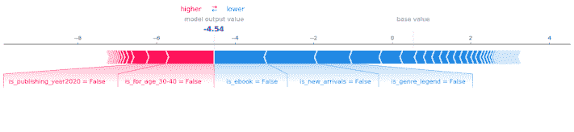
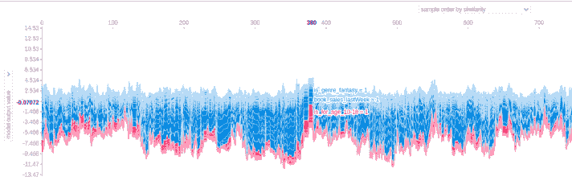
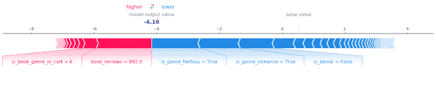

# 解释如何用树形图对模型进行排序

> 原文：<https://web.archive.org/web/sease.io/2020/07/explaining-learning-to-rank-models-with-tree-shap.html>

## 介绍

机器学习模型的一个常见问题是它们的**可解释性**和**可解释性**。
我们创建一个数据集，我们训练一个模型来完成一项任务，然后我们想了解**模型如何**获得这些结果。这通常很难理解，尤其是对于非常复杂的模型。

在这篇博文中，我想介绍一个非常有用的库，叫做 SHAP。特别是，我将写下它的惊人的工具，我将向你解释如何在一个学习排名的场景中解释结果。

###### 树 SHAP 给出了模型行为的解释，特别是每个特征如何影响模型的输出。

**树 SHAP** 是一种为基于树的机器学习模型计算 SHAP 值的算法。
**【SHAP(SHapley Additive explaints)**是一种博弈论方法，用来解释任何机器学习模型的输出。它使用博弈论的经典 Shapley 值及其相关扩展[1]，[，[2]，](https://web.archive.org/web/20220930001359/https://github.com/slundberg/shap)将最优信用分配与本地解释联系起来。

SHAP 树允许我们解释模型的行为，特别是每个特征如何影响模型的输出。这里，每个输出/预测被视为每个单独特征的贡献的总和。

它提供了几个工具，以便深入检查模型预测，特别是通过详细的绘图。
这些情节给了我们一个[【4】](https://web.archive.org/web/20220930001359/https://towardsdatascience.com/explain-your-model-with-the-shap-values-bc36aac4de3d):

*   *   **全局可解释性**:通过概要情节。这些反映了模型中特性的**一般行为，并让我们了解哪些特性对最终输出影响最大以及影响有多大。**
    *   **局部可解释性**:通过力/依赖性图。这些显示了**单一模型预测**中特性的具体行为，使我们能够了解它们对最终输出的所有单一影响。
    *   **它可以用于几个机器学习模型** : SHAP 提供了几个解释器，涵盖了大部分的机器学习方法。这些是类的集合，其中每个类代表一个特定机器学习算法的解释器。解释器是允许我们理解模型行为的对象。

## 情节

树 SHAP 为我们提供了几种不同类型的情节，每一个突出了模型的一个特定方面。可用的图有:

*   *   *概要图*
    *   *力图*
    *   *依赖情节*
    *   *决定剧情*

这些图是在计算 SHAP 值之后生成的。这些值测量**如何**和**如何** **每个特征如何**影响模型。
特别是，它们是通过一种查看每个特征的边际贡献的方法来计算的。这种方法所做的是，评估一个特征的影响，看看在特征移除之后模型的输出是如何变化的。为了评估这种变化，它对其他特征[1]、[、[4]、T20 的所有可能排序的预测结果进行平均。](https://web.archive.org/web/20220930001359/https://towardsdatascience.com/explain-your-model-with-the-shap-values-bc36aac4de3d)

###### 解释

假设处于**学习排名场景**。

我们必须在电子商务网站中管理图书目录。每本书都有许多不同的特征，比如出版年份、目标年龄、流派、作者等等。用户可以访问网站，通过对书籍特征的一些过滤器选择进行查询，然后检查获得的搜索结果页面。
为了训练我们的模型，我们收集了用户与网站产品的所有**交互**(例如，浏览、点击、加入购物车、销售..)并创建一个由 **<查询、文档>对**组成的数据集(例如，所选的过滤器和所查看/点击/销售的产品特征/…)。

【T29

我们得到类似这样的结果，其中 *s_feature* 表示从网站过滤器中选择的特性，而 *book_feature* 表示用户与之交互的产品的特性:

| 相互作用 | s _ 流派 | s _ 价格 _ 范围 | 书籍 _ 流派 | 图书 _ 作者 | 图书 _ 价格 |
| --- | --- | --- | --- | --- | --- |
| 互动 _1 | 惊悚片 | [15-20] | 惊悚片 | 褐色的 | 18 |
| 互动 _2 | 秘密 | [5-10] | 秘密 | 克里斯蒂 | 8 |
| 互动 _3 | 幻想 | [10-15] | 幻想 | 阿西莫夫 | 15 |

为了使用它们，需要操纵这些特征。
特别是分类特征需要编码。我们使用 one-hot 编码来实现这一点，它为每个分类特征的每个值创建一列。通过这种方式，我们将为*流派*列获得类似这样的内容:

| 相互作用 | 是 _ 流派 _ 惊悚 | 是 _ 流派 _ 神秘 | 是 _ 流派 _ 幻想 |
| --- | --- | --- | --- |
| 互动 _1 | 真实的 | 错误的 | 错误的 |
| 互动 _2 | 错误的 | 真实的 | 错误的 |
| 互动 _3 | 错误的 | 错误的 | 真实的 |

现在我们准备解释树 SHAP 情节。

###### 汇总图

我要分析的第一个剧情是**概要**剧情**剧情**。
这可以给我们关于模型可解释性的全局信息。

从下图中我们可以看到，该情节代表了:

*   *   **y 轴**上模型最重要的特征按降序排列(最重要的在顶部)。
    *   **x 轴**上的 SHAP 值。
    *   带有**颜色的特征值**。高值用红色表示，低值用蓝色表示。
    *   此外，这里每个**点**代表一个预测结果。

从这个例子我们可以看出:

*   *   评论总数越多，对相关性的积极影响就越大
    *   审查平均分越高，对相关性的积极影响就越大
    *   如果是一本电子书，它在大多数情况下更相关
    *   如果这本书的类型是幻想，它对相关性有负面影响

还有一些特性，它们的值没有明确的行为，例如图书销售、图书价格和出版年份。
从该图中，我们还可以看到每个特征对 x 轴 SHAP 值模型的影响程度。

另一种类型的摘要图是**栏**图:

这代表另一个相同的概念，使用在 **x 轴**上的平均值(|SHAP 值|)的条形图表示。

###### 力图

我要分析的第二个剧情是**力剧情**。

这个情节允许我们把**交代**给一个**单个**模型**预测**模型**。
假设进行如下互动:**

| 互动 | is _ 发布 _ 年份 _2020 | 年龄为 40 岁 | is_ **电子书** | is_ **新到者** |
| --- | --- | --- | --- | --- |
| 互动 _4 | 错误的 | 错误的 | 错误的 | 错误的 |

相应的情节将是:

从这个情节我们可以看出:

1.  1.  **型号** **输出** **值** : -4.54
    2.  **基础** **值**:这是在我们不知道当前输出[1]的任何特性的情况下预测的值。
    3.  每个特性的**影响输出的**。

特别是，我们可以看到一些红色和蓝色的箭头与每个功能相关联。
每个箭头显示:

*   *   **特征如何影响模型:箭头越大，影响越大。**
    *   **特征如何影响模型:红色箭头增加模型输出值，而蓝色箭头减少模型输出值。**

在我们展示的情节中，这本书在 2020 年尚未出版，并且没有[30-50]的目标年龄范围，这一事实对产出产生了积极影响，而不是电子书，不是新上市的书籍，也没有传奇流派，这一事实产生了负面影响。

因为我们正在讨论学习排序，所以模型输出代表了这本书的 SHAP 分数。回答特定查询的所有书籍的分数用于对产品进行排名。因此，如果我们的模型预测:

| 相互作用 | 询问 | 书 | **SHAP 得分(模型输出)** |
| --- | --- | --- | --- |
| 互动 _5 | 雌三醇环戊醚 | 第一本书 | -2.91 |
| 互动 _6 | 雌三醇环戊醚 | 第二本书 | -4.54 |
| 互动 _7 | 雌三醇环戊醚 | 第三本书 | -1.85 |

对于查询 *q1* ，我们将得到**排名**:

1.  1.  第三册(-1.85)
    2.  book_1 (-2.91)
    3.  第二册(-4.54)

因为-4.54 < -2.91 < -1.85 .

An interesting aspect of this plot emerges from the comparison of the outputs for a specific query.
查看每本书在查询中是如何评分的，我们可以检测产品之间在特性值方面的差异。

如果我们想要先前预测的全局表示，我们可以使用力图的变体:

在这里，我们可以看到之前所做的预测(每次交互一个)垂直放置(旋转 90 度)并并排放置。

###### 依赖图

另一个对局部可解释性有用的图是**依赖图**。
该图将选择的特征与另一个特征进行比较，并显示这两个特征是否有**交互** **效果**。

作为第一个例子，我在这里报告了一个在经典的 UCI 成人收入数据集(这是一个预测人们在 90 年代是否超过 50k 的分类任务)[【5】](https://web.archive.org/web/20220930001359/https://slundberg.github.io/shap/notebooks/plots/dependence_plot.html)上训练的模型的年龄和教育数量之间的相关性图。

Figure from [[5]](https://web.archive.org/web/20220930001359/https://slundberg.github.io/shap/notebooks/plots/dependence_plot.html)

这里每个**点**对应一个预测。在 **x 轴**中，我们有*年龄*，而在 **y 轴**中，我们有预测的 SHAP 值(知道该特征的值对该样本预测的模型输出的改变程度)。
**颜色**代表*教育编号*，因此我们可以看到特定的年龄和特定的教育编号对输出的影响是积极的还是消极的。从图中我们可以推断，20 岁受教育程度高的人比 20 岁受教育程度低的人不太可能挣 5 万多，而 50 岁受教育程度高的人比 50 岁受教育程度低的人更有可能挣 5 万多。这表明教育程度和年龄之间存在交互作用[【5】](https://web.archive.org/web/20220930001359/https://slundberg.github.io/shap/notebooks/plots/dependence_plot.html)。

T17

从我们的图书场景中可以看到，这种关系并不总是出现在功能之间，对于功能 *book_price* 和 *is_genre_fantasy* :

###### 决策图

我想介绍的最后一个情节是**决定情节**。

该图显示了在决策过程中预测是如何变化的。在 **y 轴**中，我们按照重要性对特征进行了排序，就像概要图一样。在 **x 轴**中，我们有模型的输出。

从图的底部向顶部移动，每个要素的 SHAP 值将添加到模型的基础值中。这显示了每个特征如何影响整体预测[【5】](https://web.archive.org/web/20220930001359/https://slundberg.github.io/shap/notebooks/plots/dependence_plot.html)。

这里每一行代表一个预测，所以假设考虑这个:

如果我们只画对应线，我们将有:

这里，每个特性的值在括号中报告。
从图中我们可以看到*为 _for_age_40-50* 为假，*为 _author_Asimov* 为真，*为 _publishing_year_2020* 为真，*为 _book_genre_in_cart* 6 和 *book_reviews* 992 对模型产生正面影响，而其他特性则产生负面影响。

###### 赞成的意见

我想在这篇文章中强调的是这个工具的有用性。
树 SHAP 让我们:

*   *   解读**模型**如何通过力和决策剧情使**成为**具体的** **决策**。**
    *   **比较**属于打印所有相关力图的公共查询的**预测**。因此要进行查询分析。
    *   通过概要图了解特征的**相对** **重要性**。
    *   查看**中**的值对于**每个** **特征** **如何影响**模型，如果积极或消极，通过摘要情节。
    *   了解我们是否有反映我们场景的训练集和模型。
    *   分析我们是否正确地存储了所使用的交互，或者是否有任何异常。
    *   根据重要性确定哪些功能需要优先改进。

###### 意识到

使用该工具时，我们必须注意几件事:

1.  1.  特征的**重要性**的**度量**是将交互的整体作为一个独特的集合来执行的。交互不被认为是按查询分组的。因此，我们不能直接看到每个查询中的特性的重要性，但是我们必须推断之前与相同查询的所有交互，然后只对它们执行绘图。
    2.  模型的**输出**不是关联标签。输出只是该查询的产品相关性的度量，但它是从库中生成的值，并不反映我们在训练/测试中使用的相关性标签。尽管如此，如果我们看产品之间的相对相关性，分数代表相同的概念。对于查询 1，得分为 2 的产品相对于同一查询的得分为 0 的另一产品更相关。
    3.  从我们上一点所说的，我们必须注意我们如何解释分数。负值并不直接意味着文档不相关。在同一个查询中，我们总是要考虑它与其他产品的关系。

## 未来作品

我们还在待办事项列表中添加了 Solr 中 TreeSHAP 库的集成。
由于 Solr 允许使用学习分级模型对文档进行重新分级，因此直接分析平台内部的模型行为可能非常有用。

你可以在这里找到第一个公开的 jira 问题:

*   *   [https://github.com/slundberg/shap/issues/127](https://web.archive.org/web/20220930001359/https://github.com/slundberg/shap/issues/127)
    *   [https://github.com/slundberg/shap/pull/129](https://web.archive.org/web/20220930001359/https://github.com/slundberg/shap/pull/129)

###### 参考资料:

斯科特·m·伦德伯格和李秀英。"解释模型预测的统一方法."*神经信息处理系统的进展*。2017.【1】
为什么树 SHAP[【3】](https://web.archive.org/web/20220930001359/https://towardsdatascience.com/interpretable-machine-learning-with-xgboost-9ec80d148d27)

其他有用的链接:

*   *   决定情节[【6】](https://web.archive.org/web/20220930001359/https://slundberg.github.io/shap/notebooks/plots/decision_plot.html)
    *   全局解释，不是每个查询问题[【7】](https://web.archive.org/web/20220930001359/https://github.com/slundberg/shap/issues/570)

// our service

## 不要脸的塞给我们培训和服务！

我提到过我们做[学习排名](https://web.archive.org/web/20220930001359/https://sease.io/learning-to-rank-training)和 [Apache Solr 初学者](https://web.archive.org/web/20220930001359/https://sease.io/training/apache-solr-training/apache-solr-beginner-training)培训吗？
我们也提供这些话题的咨询，[如果你想让你的搜索引擎更上一层楼，请联系](https://web.archive.org/web/20220930001359/https://sease.io/contacts)！

// STAY ALWAYS UP TO DATE

## 订阅我们的时事通讯

你喜欢这篇关于学习用树的形状排列模型的文章吗？不要忘记订阅我们的时事通讯，以便随时了解信息检索世界的最新动态！