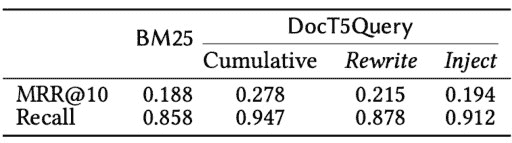
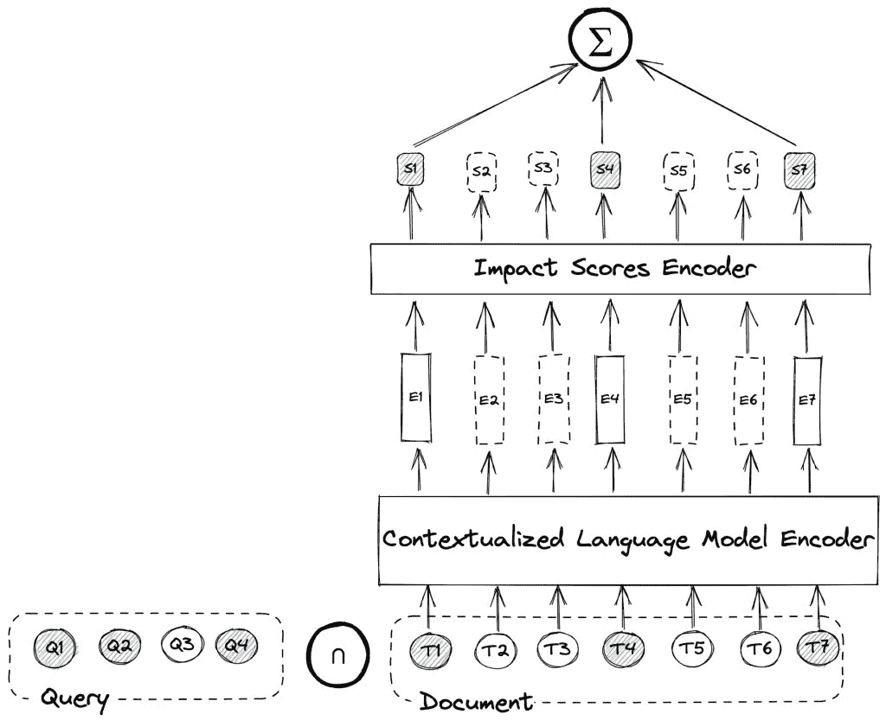
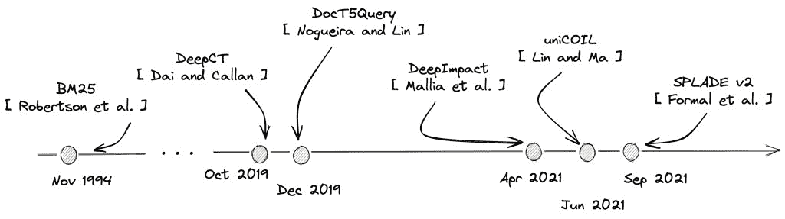
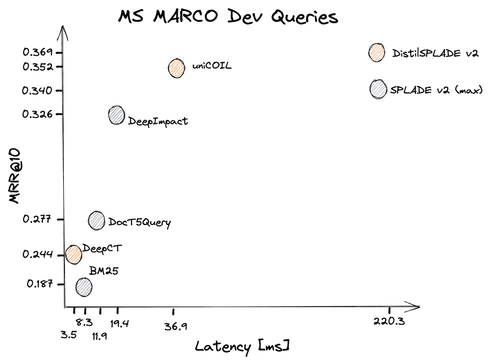
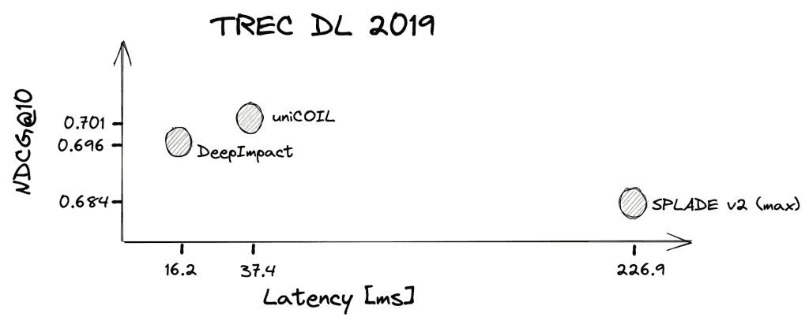

# 神经网络杀死倒排索引了吗？

> 原文：<https://web.archive.org/web/sease.io/2022/04/have-neural-networks-killed-the-inverted-index.html>

在第一篇致力于使用深度学习来提高搜索相关性的博客文章中，我们已经了解了[如何利用 BERT 来执行文档重新排序](https://web.archive.org/web/20220930010934/https://sease.io/2021/12/using-bert-to-improve-search-relevance.html)。不幸的是，那篇博客文章中提出的交叉熵架构仍然太昂贵，无法在大量文档上运行，因此我们仍然需要依靠一种解决方案来执行一定数量的候选项的检索。

T3

在这一集里，我们将谈论 deep impact[【1】](https://web.archive.org/web/20220930010934/https://arxiv.org/pdf/2104.12016.pdf)，这是一种新的文档术语加权方案，适用于使用标准倒排索引的高效检索。

## 动机

正如我们在本系列的前一篇博文中看到的，DocT5Query 是一个[文档扩展](https://web.archive.org/web/20220930010934/https://sease.io/2022/01/tackling-vocabulary-mismatch-with-document-expansion.html)方法，用扩展术语来丰富原始文档集合。这可以被看作是一种双重的方法。通过添加已经是文档一部分的术语，它重写了它们的频率。此外，为了解决词汇不匹配的问题，它将原本不属于文档的新术语注入到段落中。




Different contributions to effectiveness metrics of DocT5Query on the MSMARCO passage ranking collection.

上表总结了 DocT5Query 应用于 MS MARCO passage 排名集合[【2】](https://web.archive.org/web/20220930010934/https://microsoft.github.io/msmarco/Datasets)时的效果，并隔离了两个贡献。正如我们所看到的，注射对回忆有更好的影响。这可以解释为，新注入的术语允许查询匹配更多相关的文档，而重写组件提供了更好的结果排序。

显然，在重写文档术语频率的方式上，重写并不遵循任何特定的策略，但它主要取决于 DocT5Query 方法预测的查询。这激发了 DeepImpact 方法，其中首先利用 DocT5Query 注入新术语，然后学习旧术语和新注入术语的正确影响分数(而不是像 BM25 那样依赖简单的频率)。

## 体系结构

DeepImpact 的整体架构如下图所示。它由一个语境化的语言模型和一个多层感知器(MLP)组成，具有 ReLU 激活，为文档中的每个唯一术语产生单值分数，代表其影响。



查询-文档分数被计算为由与查询中的关键词词汇匹配的文档术语的模型预测的影响分数的总和。

**训练**:使用三元组来训练模型，三元组由每个样本的一个查询、一个相关段落和一个假定的非相关段落组成。对于每一个三元组，通过将每一个文档转换成得分列表，并且只对与匹配查询的文档术语相对应的得分求和，来计算相应的两个文档的两个得分。然后，通过在文档的计算得分上的成对 softmax 交叉熵损失来优化模型。

**索引生成**:在训练阶段之后，DeepImpact 可以利用学习到的术语加权方案来预测文档中每个标记的语义重要性，而无需进行查询。每个文档被表示为一个术语-分数对的列表，它们被转换成一个倒排索引。分数首先被量化，然后被存储作为术语频率的替换。

【T6

**查询处理**:然后可以像往常一样部署和搜索索引以进行有效的查询处理，但是，不是依赖于术语频率来计算 BM25 分数，而是可以通过对每个术语影响贡献求和来计算查询文档分数。

## 时间表

流行的 BM25 排名函数可以追溯到 1994 年，当时它是由 Robertson 等人[【3】](https://web.archive.org/web/20220930010934/https://trec.nist.gov/pubs/trec3/papers/city.ps.gz)首次提出的。由于其多重优势，它是事实上的标准。首先，它不需要任何特定的训练，因为它通过查看术语在文档中的频率相对于它们在文本集合中的总频率来计算相关性。此外，它非常有效，因为计算查询-文档相关性分数可以通过少量的算术运算来完成。

BM25 的统治地位在很长一段时间内都是无可争议的，只是最近，随着深度学习的出现，事情似乎开始发生变化。2019 年 DeepCT 和 DocT5Query 问世。前者也是术语加权方案，但是除了不是非常有效之外，还需要每个单词的基本事实术语权重，不能自动调整用于识别相关文档的下游目标的训练。



DeepImpact 解决了这个问题，因为它依赖于成对交叉熵损失，类似于此处介绍的[微调方法。不是像在 DeepCT 中那样在不考虑术语在文档中的共现的情况下学习独立的术语级得分，或者像在 DocT5Query 中那样依赖于不变的 BM25 得分，DeepImpact 直接优化查询术语影响的总和，以最大化查询的相关和非相关段落之间的得分差异。](https://web.archive.org/web/20220930010934/https://sease.io/2021/12/using-bert-to-improve-search-relevance.html)

在 DeepImpact 发布几个月后，其他的方法被提出，比如 uniCOIL[【4】](https://web.archive.org/web/20220930010934/https://arxiv.org/abs/2106.14807)和 spladev 2[【5】](https://web.archive.org/web/20220930010934/https://arxiv.org/abs/2109.10086)。正如我们将要看到的，这些方法比 DeepImpact 更有效，但它们的模型架构也更复杂。这两种方法不仅使用文档影响来计算相关性分数，还利用了查询词权重。此外，除了文档扩展之外，SPLADEv2 还使用查询扩展，并提出用知识提取来训练模型。


我们可以将 DeepImpact、uniCOIL 和 SPLADEv2 归入同一个类别，我们将其命名为学习术语影响(LTI)框架。

## 结果

下图显示了上述所有方法在 MARCO Dev 女士查询上的比较，我们可以立即看到，LTI 方法远远优于所有以前的方法。SPLADEv2 出现两次，因为一个是用知识提炼训练的模型。考虑到知识提炼可以应用于任何 LTI 方法，为了公平的比较，我们应该在单独的图中查看有和没有知识提炼的结果。




uniCOIL 和 SPLADEv2 都依赖于更复杂的架构，这使它们更有效，但同时也更慢。特别是，SPLADEv2 比 DeepImpact 慢十倍以上，这对于大规模生产系统来说是一种不可行的方法。

此外，值得一提的是，当这些方法用于一组非常不同的查询(如 TREC DL 2019 查询日志)时，uniCOIL 和 SPLADEv2 获得的质量改善不太明显(甚至不存在)。我们可以看到 SPLADEv2 变得比其他两种方法更差，而 uniCOIL 仅比 DeepImpact 好一点，但速度慢了 2 倍多。

T15T17

这种行为可能源于这样一个事实，即由于 uniCOIL 和 SPLADEv2 是更复杂的模型，它们倾向于过度拟合数据，从而降低了对新数据进行归纳的能力。



## 结论

在这篇博客文章中，我们研究了 DeepImpact，这是一种新的第一阶段检索方法，它利用传统倒排索引和上下文化语言模型的组合来实现高效检索。通过估计语义重要性，DeepImpact 为文档集合的每个标记生成一个单值影响分数。

## 履行

在本节中，我们将看到 DeepImpact 的简化实现。具体来说，我们将看到如何定义模型以及成对训练步骤是什么样子的。

T3

特别是，我们将看到如何定义模型以及如何计算查询文档相关性分数。我们将使用 py torch[【6】](https://web.archive.org/web/20220930010934/https://pytorch.org/)和 hugging face Transformers[【7】](https://web.archive.org/web/20220930010934/https://github.com/huggingface/transformers)。

###### 模型

在下面的代码片段中，我们将定义我们的模型。我们从 transformers 库提供的 BertPreTrainedModel 类中派生出我们的模型。语境化语言模型编码器只是一个 BertModel，而影响分数编码器被定义为两个线性层的序列，其中有 ReLU 激活，中间有一个 dropout 层。

```
from transformers import *

class DeepImpact(BertPreTrainedModel):
    def __init__(self, config):
        super(DeepImpact, self).__init__(config)
        self.bert = BertModel(config)
        self.impact_score_encoder = nn.Sequential(
            nn.Linear(config.hidden_size, config.hidden_size),
            nn.ReLU(),
            nn.Dropout(config.hidden_dropout_prob),
            nn.Linear(config.hidden_size, 1),
            nn.ReLU()
        )
        self.init_weights()
```

###### 影响分数计算

为了计算查询-文档相关性分数，我们需要计算一个 query_mask，它是一个位向量，其位被设置为文档术语与查询匹配的位置。编码文档(由 input_ids、attention_mask 和 token_type_ids 组成)经过 BERT 和影响分数编码器。最后，使用查询掩码过滤为文档中的所有术语生成的分数，以便只对匹配术语的分数求和。

```
def forward(self, input_ids, attention_mask, token_type_ids, query_mask):
    outputs = self.bert.forward(input_ids, attention_mask=attention_mask, 
token_type_ids=token_type_ids)[0]
    doc_scores = self.impact_score_encoder(outputs)
    return (query_mask * doc_scores).sum(dim=1)
```

// our service

## 不要脸的塞给我们培训和服务！

我提到过我们在搜索培训中做[人工智能吗？
我们也提供这方面的咨询，](https://web.archive.org/web/20220930010934/https://sease.io/artificial-intelligence-in-search-training)[如果你想借助人工智能的力量让你的搜索引擎更上一层楼，请联系](https://web.archive.org/web/20220930010934/https://sease.io/contacts)！

// STAY ALWAYS UP TO DATE

## 订阅我们的时事通讯

你喜欢这篇关于神经网络杀死了倒排索引的文章吗？不要忘记订阅我们的时事通讯，以便随时了解信息检索世界的最新动态！