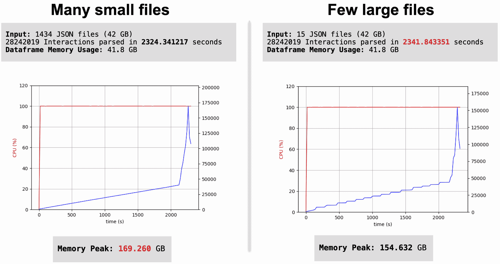
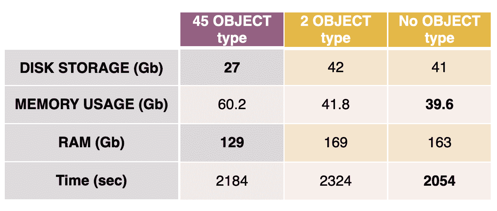

# 如何从 JSON 解析中处理 Pandas 中过多的“对象”

> 原文：<https://web.archive.org/web/sease.io/2022/03/how-to-deal-with-too-many-object-in-pandas-from-json-parsing.html>

正如我们所承诺的那样，这里我们有一个关于管理大型 JSON 的新“插曲”。

如果你还没有读过前两篇博文，我建议补上它们，以便更好地理解我现在要讨论的内容:

[如何高效快速地管理大型 JSON 文件](https://web.archive.org/web/20221223104505/https://sease.io/2021/10/how-to-manage-a-large-json-file-efficiently-and-quickly.html)

[如何高效快速管理大型 JSON:多个文件](https://web.archive.org/web/20221223104505/https://sease.io/2021/11/how-to-manage-large-json-efficiently-and-quickly-multiple-files.html)

从我们在第二篇博文中的实验中，我们注意到数据集包含的原始类型越多，数据解析对时间和内存的影响就越小。我们拥有的*对象* dtype 特性越多，磁盘上的 json 文件和 python 数据框之间的内存差距就越大。

处理大量的分类数据是非常昂贵的，我们需要找到最有效的方法来分析它们。

像往常一样，我们将实验放在现实世界的场景中:*电子商务*。

我们收集用户与网站产品的所有交互，并将它们保存在 JSON 日志中。然后，我们必须用 Python 读取所有这些文件，操纵它们，并创建训练和测试集，以便训练一个学习排序模型。

我们在这里提出的方法是**在收集分类数据的同时对其进行管理，并将其作为数值类型直接存储在 JSON 中。**这样，在解析 JSON 文件时，我们不必担心*对象的* dtype 特性。

## 这怎么可能呢？

这取决于分类特征是什么样的。这里有三种不同的情况:

T31

###### 1)当一个特征(数组)有多个值时

```
"feature_name" : [array]
```

###### 例子

T35

**cartCategories** 是存储购物车中产品的所有类别 id 的功能

```
"cartCategories": [43, 46, 48, 60, 63, 64, 65, 105, 108, 3163, 3456, 3466, 3468, 3476, 3477, 
3478, 4099, 4432, 4456, 4534, 4642, 5269, 5406, 5825, 43, 3456]
```

###### 解决办法

怎么编码？

1) **创建具有固定长度维度的数组**(例如，仅选择前 5 个值):

```
"cartCategories": [43, 3456, 46, 48, 60]
```

2)**‘分解’N 个数值列中的每个数组**(其中 N 是数组的定长维数):

```
"cartCategories_position1" = 43, "cartCategories_position2" = 3456, "cartCategories_position3" 
= 46, "cartCategories_position4" = 48, "cartCategories_position5" = 60
```

###### 2)当可能值的数量限于固定集合时

```
"feature_name" : "value"
```

###### 例子

T3

**用户设备**可能有 3 个不同的值=台式机、手机和平板电脑

```
"userDevice": "desktop"
```

###### 解决办法

怎么编码？

【T8

*   *   **应用一种 *[一键编码](https://web.archive.org/web/20221223104505/https://en.wikipedia.org/wiki/One-hot)*** :

```
"desktop": 1, "mobile": 0, "tablet": 0
```

###### 3)当可能值的数量不限于可承受的集合时

```
"feature_name" : "value"
```

###### 例子

用户标识可能有 N 个不同的值，这取决于网站上注册了多少用户

```
"userID" : "mdn456osnb210mn"
```

###### 解决办法

怎么编码？


当一个分类特征有太多的唯一值时，它被认为拥有高基数。在这种情况下，一键编码被认为不是一个好方法，因为它会导致两个问题:空间消耗和维数灾难。除非您决定只选择特定列中出现最多的前 N 个类别，并对它们应用一次性编码，否则您应该分析最适合您的用例的不同解决方案和技术。

## 我们的场景

在我们的场景中，我们总共有 45 个*对象类型*特性:

*   *   大多数特性都是数组，所以我们使用描述的第一个解决方案来操作它们
    *   3 个特性属于第二种类型，所以我们使用一键编码来处理它们
    *   2 特征具有非常高的基数，如第三种情况所述；
        我们还必须指出，根据输入信息和编码方法的不同，在编码过程中可能会有一些信息丢失，因此我们决定保留它们，保留它们的数据。我们相信转换 45 个特性中的 43 个应该足以提高性能。

在实验中，我们使用了相同的数据集，以便在以下方面将此方法与之前的方法进行比较:

*   *   **json 文件维度**:在新的方法中，因此在操作分类变量之后，每个 json 将包含更多的特性，并且可能变得更大→我们需要确保这种增加是可以容忍的

【T37

*   *   **性能**:解析时的时间和内存

## 比较的结果

使用的数据集是一样的:**半月用户交互数据 → 1434 JSON 文件**

在之前的实验中，我们有 77 个列/特征，包括 45 个*对象*数据类型:

```
dtypes: datetime64[ns](1), float16(23), float64(6), **object(45)**, uint32(1), uint8(1)
memory usage: 60.0 GB
```

在这个实验中，在特性转换之后，我们有 209 列，只有 2 个*对象*d 类型:

```
dtypes: datetime64[ns](1), float16(23), float64(178), int64(3), **object(2)**, uint32(1), uint8(1)
memory usage: 41.8 GB
```

以下是解析许多小文件和一些大文件之间的区别:

**以前的实验**


**当前实验**



###### **新实验观察**

*   *   正如所料，JSON 文件的总大小(磁盘存储)比以前更大——大约增加了 1.5 倍
    *   Python 中数据框元素的内存使用少于磁盘存储，这很好
    *   RAM 消耗峰值大约是磁盘存储的 4 倍(以前是 5 倍多)
    *   解析更多数据只需要多花几分钟

同样，许多小文件比一些大文件在解析时需要更少的时间，但是需要更多的内存，这一事实没有受到影响！

**如果我们移除(或转换)剩下的两个*物体*特征会不会更好？**

【T8

出于好奇，我们放弃了数据集中留下的*对象*特征，并重复了这个实验。同样，在 Python 中，我们在时间和数据框元素的内存使用方面获得了非常好的性能，但在 RAM 消耗方面却没有:



对此，还应补充的是，在建议的方法中，我们将*对象*数据类型转换为大量*浮动 64* 数据类型，因为在操作的特征中存在缺失值。甚至 *float64* 与 float16/32 或整数相比也有很高的内存影响。
我们希望对解析产生较小的峰值内存影响，并以磁盘上较大的初始 JSON 存储为代价来减少时间。
不幸的是，磁盘上的额外开销和额外的功能数量被证明是非常昂贵的(解析时在时间和内存上)，使拥有更小的最终数据帧的优势相形见绌。

## 结论

与我们的预期相反，这种方法并没有带来很大的绝对好处。虽然转换大多数' *object' dtype* 特性会带来一个更小的数据框，但我们需要更多的空间来存储数据，因此需要与之前实验大致相同的时间和内存来整体解析它们。

假设存储越高，解析所需的峰值内存和时间就越长，那么在解析后处理数据帧以减小其大小似乎更好。
这是本次初步研究的结论。

// our service

## 不要脸的塞给我们培训和服务！

我提到过我们在搜索培训中做[学习排名](https://web.archive.org/web/20221223104505/https://sease.io/learning-to-rank-training)和[人工智能吗？如果你想用人工智能的力量让你的搜索引擎更上一层楼，我们也提供这些主题的咨询，](https://web.archive.org/web/20221223104505/https://sease.io/artificial-intelligence-in-search-training)[联系](https://web.archive.org/web/20221223104505/https://sease.io/contacts)！

// STAY ALWAYS UP TO DATE

## 订阅我们的时事通讯

你喜欢这篇关于如何通过 JSON 解析处理 Pandas 中过多“对象”的帖子吗？不要忘记订阅我们的时事通讯，以便随时了解信息检索世界的最新动态！