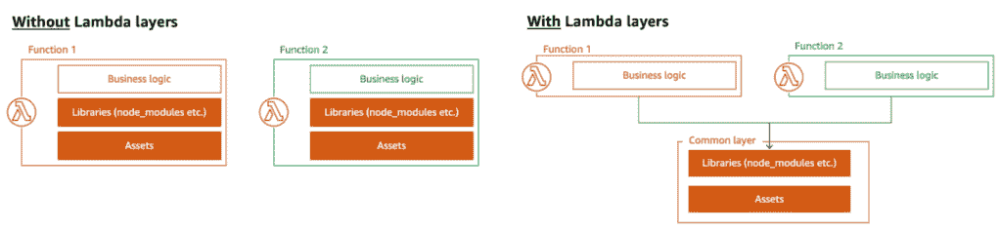
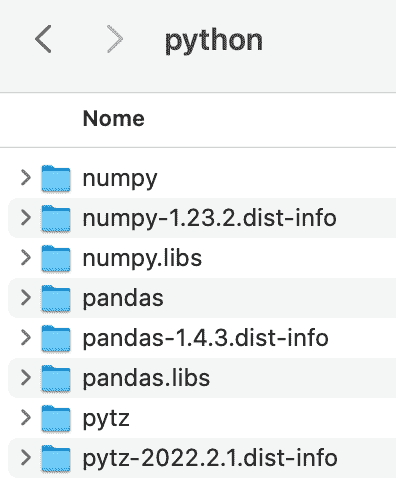
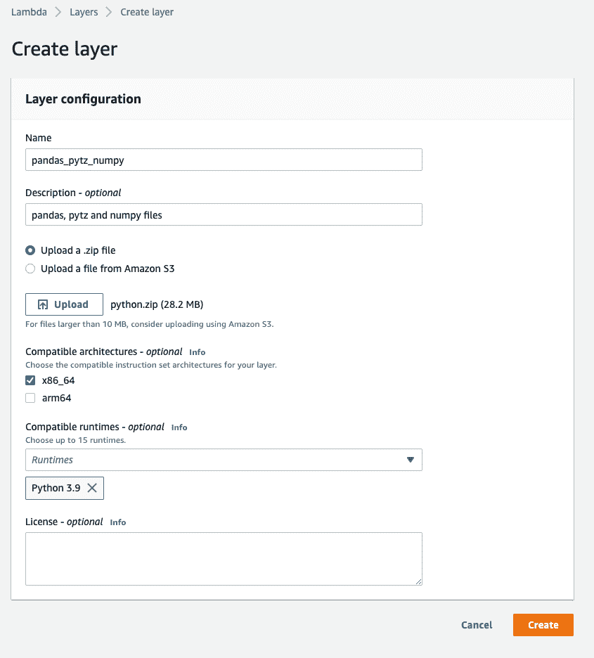
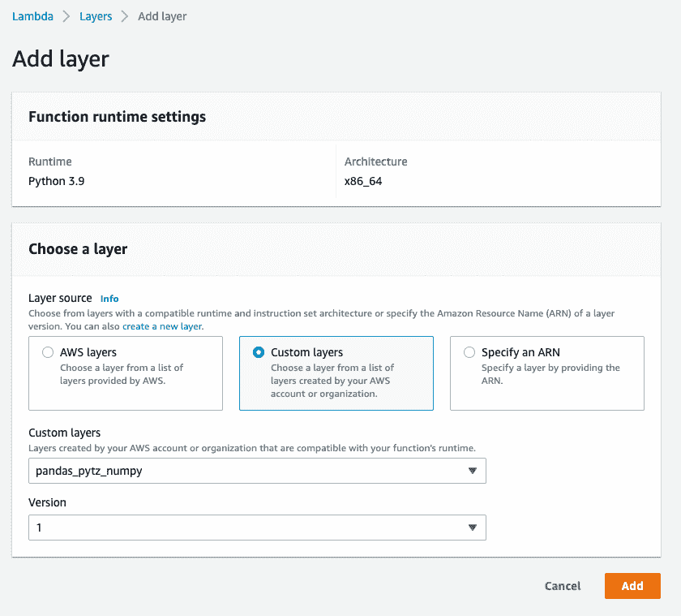

# 如何在 AWS Lambda 中导入熊猫

> 原文：<https://web.archive.org/web/sease.io/2022/11/how-to-import-pandas-in-aws-lambda.html>

AWS Lambda 是最受欢迎的无服务器计算服务之一，它有许多好处。然而，AWS Lambda 的一个缺点是支持的包列表有限，并且大多数 Python 模块在默认情况下不可用。一些第三方包已经嵌入在 AWS Lambda Python 运行时中，但是如果您需要添加其他外部依赖项，可能很难安装和配置它们以便在您的 Lambda 函数中使用。


在这篇博文中，我们想向您展示如何成功地将最常用的 Python 库之一导入 AWS lambda 进行数据分析:**【熊猫】**。

## 什么是 AWS Lambda？

> AWS Lambda 是一种无服务器、事件驱动的计算服务，允许您为几乎任何类型的应用程序或后端服务运行代码，而无需配置或管理服务器。这有时被称为功能即服务(FaaS)。
> 
> AWS 文档

运行在 AWS Lambda 上的代码作为“Lambda 函数”上传，它是无状态的。

AWS Lambda 原生支持不同的语言，如 **Java、Node.js、C#和更多的**。在这篇博文中，我们使用了 **Python** 作为运行时语言。

Lambda 函数可以手动调用，也可以由事件源触发器调用。

## 什么是λ层？

**Lambda 层是一个包含额外代码的档案，比如库、依赖项，甚至是自定义运行时**。

AWS Lambda 已经包含预编译的层，您可以轻松地在 Lambda 函数中添加和使用这些层，否则，安装第三方包的最简单方法就是创建一个新的自定义层。

Lambda 层仅仅是一个. zip 文件，它包含了一系列的包。它可以被定制成包含你需要的所有包，然后可以很容易地被上传并附加到一个或多个感兴趣的 Lambda 函数:



*使用和不使用**λ层的区别**(来自 AWS 文档)*

当您调用 Lambda 时，它会将附加层与函数一起加载，并且该层的内容会被提取到执行环境中的/opt 目录中。

这将有助于降低复杂性，并使跨所有功能管理依赖版本变得更加容易。

## 如何添加外部依赖关系

假设您需要在 AWS Lambda 中运行一个 Python 脚本，其中需要导入*‘pandas’*库。


[pandas](https://web.archive.org/web/20221130075311/https://pandas.pydata.org/) 是一个快速、强大、灵活的开源库，为 Python 编程语言提供了易于使用的数据结构、操作和数据分析工具。

不幸的是，当您运行代码时，您会得到一条错误消息，指出:

```
Response
{
  "errorMessage": "Unable to import module 'lambda_function': No module named 'pandas',
  "errorType": "Runtime.ImportModuleError"
  ...
}
```

Why does this error message come out?

这是因为默认情况下，AWS Lambda Python 环境中没有“pandas”库。


根据所选择的运行时语言，一些包可能会预安装在 Lambda 容器中，但是如果您需要额外的需求，您应该手动添加它们。例如，Python 3.9 运行时包含了“JSON”，但没有包含“pandas”。

让我们看看如何在 AWS Lambda 中导入熊猫。

## 如何在 AWS Lambda 中导入熊猫

我们现在将讲述**如何通过几个步骤成功地** **将熊猫包**导入 AWS lambda 函数。


**注** : *本示例程序展示了如何通过 AWS 控制台为 Lambda 函数安装 pandas 并创建自定义 pandas 层，该 Lambda 函数使用 Python 3.9 运行时，在 x86_64 架构上运行。*

### 创建图层内容(本地)

Step 1: Download files from Python Package Index (PyPI)

Python 包索引，缩写为 [PyPI](https://web.archive.org/web/20221130075311/https://pypi.org/) ，是 Python 的主要软件仓库。我们用它来下载必要的依赖项的 Linux 发行版。

因为我们使用 Python 3.9 运行时和默认架构创建了 lambda 函数，所以我们需要确保下载了具有正确构建的分发类型的 wheels 文件；特别是，我们需要考虑:


*   *Python* *版本*–>cp39
*   *架构*–>x86 _ 64

要操作‘熊猫’，需要再安装两个必需的依赖项:‘NumPy’和‘pytz’；因此，出于我们的目的，我们从 PyPI 下载了这 3 个文件:

1.  **[熊猫](https://web.archive.org/web/20221130075311/https://pypi.org/project/pandas/#files)** :熊猫-1 . 4 . 3-cp39-cp39-many Linux _ 2 _ 17 _ x86 _ 64 . many Linux 2014 _ x86 _ 64 . whl
2.  **[NumPy](https://web.archive.org/web/20221130075311/https://pypi.org/project/numpy/#files)**:NumPy-1 . 23 . 2-cp39-cp39-many Linux _ 2 _ 17 _ x86 _ 64 . many Linux 2014 _ x86 _ 64 . whl
3.  **[pytz](https://web.archive.org/web/20221130075311/https://pypi.org/project/pytz/#files)**:pytz-2022 . 2 . 1-py2 . py3-none-any . whl

Step 2: Unzip wheels files

一旦你把 WHL 文件下载到你的桌面上，你需要解压它们。

一个砂轮锉(。whl)在许多方面类似于 ZIP 文件(。zip)并且是以 Wheel 格式保存的包，Wheel 格式是 Python 发行版使用的默认内置包格式。


你可以使用 *[轮库](https://web.archive.org/web/20221130075311/https://wheel.readthedocs.io/en/stable/reference/wheel_unpack.html)* 来解压。whl 文件。请记住，您必须从下载这些文件的位置直接运行命令，例如“downloads”文件夹:

```
cd downloads
pip install wheel
wheel unpack full-name-of-the-file-you-want-to-unpack.whl
```

在我们的例子中，如上所述，我们下载并解压缩了 3 个 wheel 文件。

**注** : *由于 wheel 是一个 ZIP 文件，所以 unzip 也可以工作(unzip-full-name-of-the-file-you-want-unpack . whl)*

Step 3: Create a new directory named 'python'

```
mkdir python
```

**重要提示:文件夹名称必须完全如此，否则导入失败！**

Step 4: Copy the contents of the wheel files and paste them into the 'python' directory

正如你从下面的截图中看到的，熊猫和 Numpy wheel 文件包含 3 个文件夹，而 Pytz 只有 2 个。我们只是将它们复制并粘贴到“python”文件夹中:

Step 5: Zip 'python' directory

你最后需要做的是压缩“python”文件夹，这样你就可以上传它作为 lambda 层，并在你的 lambda 函数中使用它。

### 创建自定义 Lambda 层(Lambda 控制台)

你现在已经准备好创建你的自定义 lambda 层。使用 AWS 控制台，您只需:

*   输入必填和可选信息(即名称和描述)
*   上传之前创建的*‘python’*。从您的计算机压缩文件
*   选择兼容的*指令集架构*和*运行时*(即编写函数的编程语言版本)，例如创建 lambda 函数时选择的那些



### 将自定义层添加到 Lambda 函数中(Lambda 控制台)

选择感兴趣的 lambda 函数并添加先前创建的自定义层版本；您可以通过点击“功能概述”窗格中的*层*来轻松完成，或者您可以向下滚动到“层”部分:



### 部署并运行您的 Python 代码

现在我们已经成功上传了我们的。zip 文件到 lambda 层，并将该层链接到我们的 Lambda 函数，我们可以部署我们的 Python 代码并尝试导入 pandas。我们终于能够运行一个测试事件，而没有任何“模块未找到”的错误。

希望你觉得这篇博文有趣且有用。

感谢您的阅读，稍后再见，了解其他提示和技巧！

// our service

## 不要脸的塞给我们培训和服务！

我有没有提到我们有初级训练课？查看这些关于 [Apache Solr](https://web.archive.org/web/20221130075311/https://sease.io/training/apache-solr-training/apache-solr-beginner-training) 和 [Elasticsearch](https://web.archive.org/web/20221130075311/https://sease.io/training/elasticsearch-trainings/elasticsearch-beginner-training) 的培训。
我们还提供根据您的水平和需求量身定制的其他培训:[如果您想让您的职业生涯更上一层楼，请联系](https://web.archive.org/web/20221130075311/https://sease.io/contacts)！

// STAY ALWAYS UP TO DATE

## 订阅我们的时事通讯

你喜欢这篇关于 Drop constant features:一个现实世界的学习排名场景的帖子吗？不要忘记订阅我们的时事通讯，以便随时了解信息检索世界的最新动态！