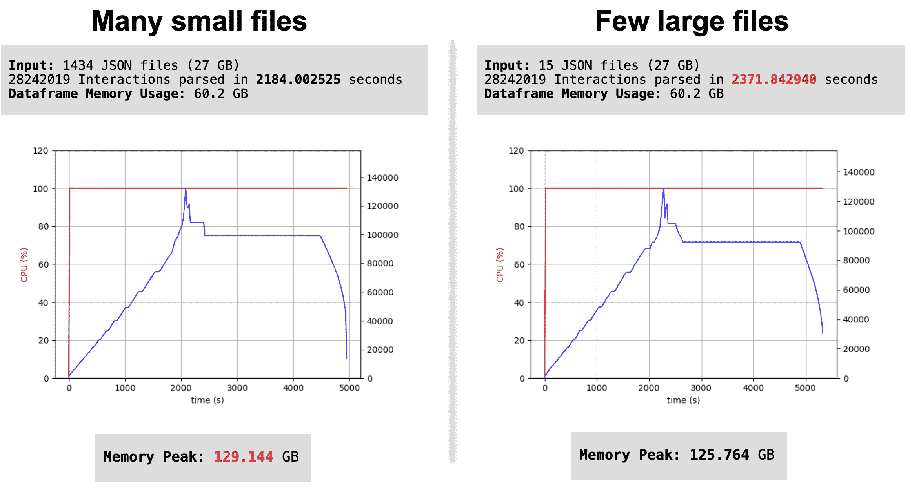

# 如何高效快速地管理大型 JSON:多个文件

> 原文：<https://web.archive.org/web/sease.io/2021/11/how-to-manage-large-json-efficiently-and-quickly-multiple-files.html>

如果你已经阅读了第一篇博文，你就已经学会了如何用 Python 处理大型 JSON 文件的一些技巧和诀窍。在这篇文章中，我想重点介绍如何有效地处理多个 JSON 文件。

如前所述，最好通过 Pandas 读取 JSON 文件，使用 read_json()方法并传递 chunksize 参数，以便一次只装载和操作一定数量的行。该方法不会返回数据框，而是返回要迭代的 JsonReader 对象。为了访问文件内容并创建熊猫数据框，您可以使用:

T3T5

###### 1)pandas . concat[【1】](https://web.archive.org/web/20221223104505/https://pandas.pydata.org/pandas-docs/stable/reference/api/pandas.concat.html?highlight=concat#pandas.concat)

```
interactions_data_frames = []
for interactions_input_file in json_files:
    interactions_temp = pd.concat(pd.read_json(interactions_input_folder+'/'+interactions_input_file,
orient='records', lines=True, chunksize=chunk_value))
    interactions_data_frames.append(interactions_temp)

interactions = pd.concat(interactions_data_frames, ignore_index=True, sort=True)
```

###### 2) **为循环**

```
interactions_data_frames = []
for interactions_input_file in json_files:
    interactions_temp = pd.read_json(interactions_input_folder + '/' + interactions_input_file, 
orient='records', lines=True, chunksize=chunk_value)
    for chunk in interactions_temp:
        interactions_data_frames.append(chunk)

interactions = pd.concat(interactions_data_frames, ignore_index=True, sort=True)
```

###### 代码解释

*   *   在这两种情况下，我们都创建了一个名为interactions _ data _ frames的空列表

*   *   在这两种情况下，我们都遍历了包含所有 json 文件的列表 json_files

*   *   例 1) interactions_temp 是一个熊猫数据帧。只有在读取了整个文件后，才会进行连接。然后，我们将所有数据帧(每个文件一个)添加到空列表中

*   *   例 2) interactions_temp 是一个 JsonReader 对象；通过迭代每个块，我们基本上获得了更小的数据帧(每个块一个)并将它们添加到空列表中

*   *   在这两种情况下，我们通过连接交互 _ 数据 _ 帧中的数据帧对象创建了一个唯一的数据帧(交互

我们使用相同的数据测试了这两种方法，发现 For 循环在时间方面(139.496203 秒，而不是 146.306893 秒)似乎优于 Concat，但在内存方面则不然，您可以从本实验的结果中看到:


您还可以调整 chunksize 参数的值，直到达到一个良好的平衡；该值必须根据数据的可用性来设置。特别是，我们注意到块越大，解析速度越快，内存使用率越高。然后，您可以尝试实现可接受的解析时间和内存使用。在我们的 chunksize 值为 10000 的例子中，我们达成了一个很好的妥协。


在这里你可以找到一些关于[【2】](https://web.archive.org/web/20221223104505/https://stackoverflow.com/questions/51278619/what-are-the-efficient-ways-to-parse-process-huge-json-files-in-python)[【3】](https://web.archive.org/web/20221223104505/https://github.com/pandas-dev/pandas/issues/17048)

话题的社区讨论

## 许多小文件与少数大文件

使用 JSON 时，小文件多好还是大文件少好？

为了解释我的意思，让我们想象有电子商务。

我们收集用户与网站产品的所有交互，并将它们保存在 JSON 日志中。然后，我们必须用 Python 读取所有这些文件，操纵它们，并创建训练和测试集，以便训练一个学习排序模型。

我们将系统配置为基于日期/时间滚动日志文件，并假设了两种不同的情况:

###### **1)每天滚动一次日志文件**

每天我们获取一个日志(2GB 左右)，例如:*user-interactions-2021-06-20 . log*

###### **2)每 15 分钟滚动一次日志文件**

每天我们获得 96 条日志(每条大约 20 MB)，例如:
*用户交互-2021-06-20-00-00.log
用户交互-2021-06-20-00-15.log
用户交互-2021-06-20-00-30 . log
……
用户交互-2021-06-20-23-45*

在这两种情况下，我们都有大约 2GB 的数据，但是我们想知道从时间和内存使用的角度来看，管理一个大文件还是几个小文件会更好。

我们在半个月的用户交互数据上使用这两种方法来测试管道，以模拟真实世界的应用程序。

以下是解析许多小文件和一些大文件之间的区别:



解析 27 GB 的 json 文件大约需要 40 分钟，数据帧内存使用量大约为 60 GB。

*   *   使用**许多小文件**，我们在加载日志的**时间**方面有优势:大约少 3 分钟
    *   使用**少数大文件**，我们在**内存**方面有优势:少 4GB

Pandas 函数**data frame . info()**[【4】](https://web.archive.org/web/20221223104505/https://pandas.pydata.org/docs/reference/api/pandas.DataFrame.info.html)用于打印关于数据帧的摘要信息。它包括列名、非空计数和 dtype。 **memory_usage** 参数指定是否应该显示数据帧元素(包括索引)的总内存使用量。“深度”值将执行实际内存使用量计算:

```
dataframe.info(memory_usage='deep')
```

###### **输出**

```
<class 'pandas.core.frame.DataFrame'>
RangeIndex: 28242019 entries, 0 to 28242018
Data columns (total 77 columns):
Feature1              63580000 non-null object
Feature2              62740023 non-null uint8
Feature3              63587849 non-null float64
........              ......
Feature75             61678009 non-null object
Feature76             63490887 non-null float16
dtypes: datetime64[ns](1), float16(23), float64(6), object(45), uint32(1), uint8(1)
memory usage: 60.2 GB
```

为了记录整个 Python 进程的 CPU 和内存活动，我们使用了一个名为 PS record[【5】](https://web.archive.org/web/20221223104505/https://pypi.org/project/psrecord/)的实用程序，它允许我们将数据存储到一个文件中或者绘制成一个图形:

```
pip install psrecord

psrecord 11653 --interval 20 --plot plot1.png --log log1.log
```

其中:

*   *   11653 是 **PID** (要监控的进程的 ID)
    *   **间隔**:指定轮询数据的时间间隔
    *   **绘图**:指定保存绘图的路径
    *   **日志**:指定保存日志的路径

从我们的实验中，我们注意到，当**拥有大量数据并且大多数特征都是分类的(对象)时，RAM 的使用将是原始文件**的 5 倍(就原始磁盘空间使用而言)。在我们的例子中，原始文件的大小为 27 GB，数据帧内存使用量为 60.2 GB，进程内存使用量约为 129 GB。

## 对象太多了！

让我们看看如果我们从同一个数据集中删除所有“对象”特征会发生什么。

T33

之前我们有 77 列，包括 45 个“对象”类型(都是数组)。删除它们后，我们得到 32 列，类型如下:

```
dtypes: datetime64[ns](1), float16(23), float64(6), uint32(1), uint8(1)
```

以下是解析许多小文件和一些大文件之间的区别:


###### **时间和记忆发生了剧烈的变化！**

在这种情况下，解析 25 GB 的 json 文件大约需要 10 分钟，数据帧内存使用量大约为 3 GB。甚至 RAM 的使用也显著下降。

这证明数据集包含的原始类型越多，数据解析的影响就越小。**对象特性的数量越多，json 文件在磁盘上的原始成本和数据帧内存之间的差距就越大。**

事实上，许多小文件比一些大文件需要更少的时间，但在解析时需要更多的内存，这一点没有受到影响！

为了简单起见，在这个实验中，我们只是删除了“对象”特性，以向您展示在时间和内存方面的优势。在真实的场景中，我们必须找到一种方法将所有的“object”列转换成更节省内存的类型。

T3

在下一篇“技巧和窍门”中，我们将详细讨论如何解决这个问题。敬请期待！

// our service

## 不要脸的塞给我们培训和服务！

我有没有提到我们在搜索培训中做 [Apache Solr 初学者](https://web.archive.org/web/20221223104505/https://sease.io/training/apache-solr-training/apache-solr-beginner-training)和[人工智能？
我们也提供关于这些主题的咨询，](https://web.archive.org/web/20221223104505/https://sease.io/artificial-intelligence-in-search-training)[如果你想借助人工智能的力量将你的搜索引擎提升到一个新的水平，请联系](https://web.archive.org/web/20221223104505/https://sease.io/contacts)！

// STAY ALWAYS UP TO DATE

## 订阅我们的时事通讯

你喜欢这篇关于如何高效快速地管理大型 JSON 的文章吗？不要忘记订阅我们的时事通讯，以便随时了解信息检索世界的最新动态！