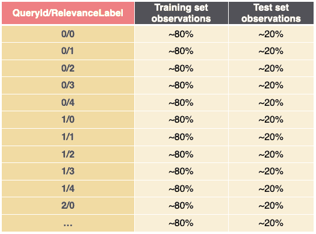
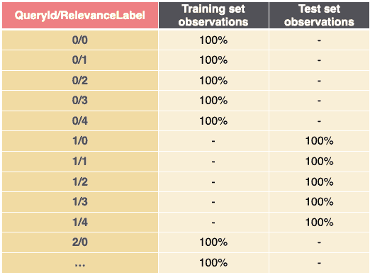

# 训练集和测试集分离，用于评估对模型进行排序的学习–第 2 部分

> 原文：<https://web.archive.org/web/sease.io/2022/09/how-to-split-your-dataset-into-train-and-test-sets-for-evaluating-learning-to-rank-models-2.html>

如果你来到这里，很可能是因为你想找到我们在这篇博文的第一部分分手的那个问题的答案。欢迎回来！

你不知道我们在说什么吗？！我们邀请您阅读[第 1 部分](https://web.archive.org/web/20220929234954/https://sease.io/2022/07/how-to-split-your-dataset-into-train-and-test-sets-for-evaluating-learning-to-rank-models.html)，其中我们将介绍**将数据划分为子集的不同技术，这些子集用于训练和评估“学习排名”模型**。

这篇博文的目标是**更多地关注“学习排序”数据集，**根据查询将文档分成几个组；因此，数据分割应该以不同于其他监督机器学习算法技术的方式进行管理，这也是我们将在这篇博文中涵盖的内容。

让我们从同一个问题开始:

## 在“学习排名”场景中，需要考虑的重要因素是什么？

在“学习排序”场景中，我们必须考虑两个重要的特征:**查询和相关性标签**。

数据集中的每个样本都是一个**查询-文档**对，以矢量格式表示。查询列由 Id 标识，该 Id 用于对来自同一用户搜索的样本进行分组；相关性标签(目标列)包含相关性分数，该分数表示每个样本在当前查询组中的相关性。

## 拆分数据时，处理查询(和相关性标签)的最合适方法是什么？

###### 查询拆分

在我们以前的方法中(在我们以前的“学习排名”博客中提到过),我们习惯于采用拒绝方法(在[第 1 部分](https://web.archive.org/web/20220929234954/https://sease.io/2022/07/how-to-split-your-dataset-into-train-and-test-sets-for-evaluating-learning-to-rank-models.html)中描述),在训练集和测试集之间分割每个查询 Id，有以下“规则”:

*   除非测试集包含的数据少于整个数据集的 20%,否则我们会在训练集中保留具有低于某个阈值的大量观察值的查询 id。在这种情况下，由于测试集可能太小，我们将一些欠采样查询移动到测试集(观察次数最多的查询 id)。原因是具有很少搜索结果的查询更容易排序，因此如果在测试集中出现，它们会使整体重新排序任务变得有点简单，具有较高的度量分数，结果可能不具有指示性或代表现实。
    
*   我们试图保持每个查询的相关性标签平均分布，手动选择并移动每个相关性标签所有观察值的 20%到测试集。在这样做的时候，我们确保所有的相关性标签都在两个集合中。

*Train-test 拆分示例，拆分查询 id*

在我们的[博客版块](https://web.archive.org/web/20220929234954/https://sease.io/blog-2/our-blog)，如果你好奇的话，你肯定会找到更详细描述这种方法的旧帖子。

###### 查询完整性

在我们的新方法中，实现了不同的训练测试分割，以便在创建两个集合时**将来自相同查询** **的样本保存在一起**。

具体来说，我们利用了 sk learn[StratifiedGroupKFold](https://web.archive.org/web/20220929234954/https://scikit-learn.org/stable/modules/generated/sklearn.model_selection.StratifiedGroupKFold.html)方法，该方法试图创建训练和测试集，这些训练和测试集在给定拆分之间的非重叠组的约束的情况下，尽可能多地保留每个查询/相关性标签的样本分布。这意味着它将试图**保持我们的相关性分布**(例如在从 0 到 4 的范围内)**，同时将查询**保持在一起。这允许我们获得更平衡的训练和测试集。

*训练-测试分割示例，将查询 id 保存在一起*

在第 1 部分中，我们包含了几个使用这种方法的代码示例，展示了不同的数据分割方法。

在这里，您可以找到另一个[示例实现](https://web.archive.org/web/20220929234954/https://medium.com/predictly-on-tech/learning-to-rank-using-xgboost-83de0166229d)，其中他们使用了一个不同的*[sk learn . model _ selection](https://web.archive.org/web/20220929234954/https://scikit-learn.org/stable/modules/classes.html#module-sklearn.model_selection)*方法来根据提供的组拆分数据，但这不考虑相关性标签。

## 我们的观察

一个有效和真实的测试应该是显示它从未见过的模型数据！事实上，模型的有效性必须在最坏的情况下进行评估，因此是基于训练时没有使用的数据。

根据我们刚才所说的，**我们相信这两种方法显然都是正确的**，因为我们确保它们的测试集不包含训练集中存在的任何文档/产品。

然而，**我们选择了查询完整性方法，因为我们认为在讨论排名**时，它在概念上比查询分裂更正确。如果一个系统必须学习如何对一个文档列表进行排序，那么当列表中的一些文档被删除时，它如何做得最好呢？！

事实上，尽管我们确保所有相关性标签(与特定查询相关)都在查询分裂的两个集合中，但我们实质上是从训练集合中移除了关于查询的总体排名的一些信息，因此模型可能不太能够概括。

此外，可能发生的情况是，一些查询可能具有非常少的具有高相关性的观察值，这将不可避免地只出现在两个集合中的一个集合中(或者在训练或测试中)。

查询拆分不应该是完全错误的，但是我们不能保证不引入评估“偏差”。测试集确实包含不同的数据，但它仍然包含与属于同一查询的训练集中的产品间接相关的产品，这可能会伪造所获得的性能结果。

###### 你有什么看法？你使用哪种方法？

喜欢你的想法，请在下面的评论中分享你的观点！

## 结论

我们希望我们已经在“学习排名”场景中正确传达了我们对查询拆分和查询完整性的疑虑和观察，以便与我们出色的社区公开讨论这一重要问题。

下一篇博文再见！

// our service

## 不要脸的塞给我们培训和服务！

我提到过我们做[学习排名](https://web.archive.org/web/20220929234954/https://sease.io/learning-to-rank-training)培训吗？
我们也提供这方面的咨询，[如果你想用学习排名的力量让你的搜索引擎更上一层楼，就联系](https://web.archive.org/web/20220929234954/https://sease.io/contacts)！

// STAY ALWAYS UP TO DATE

## 订阅我们的时事通讯

你喜欢这篇关于训练和测试集分开来评估模型排序的文章吗？不要忘记订阅我们的时事通讯，以便在信息检索世界中保持最新状态！