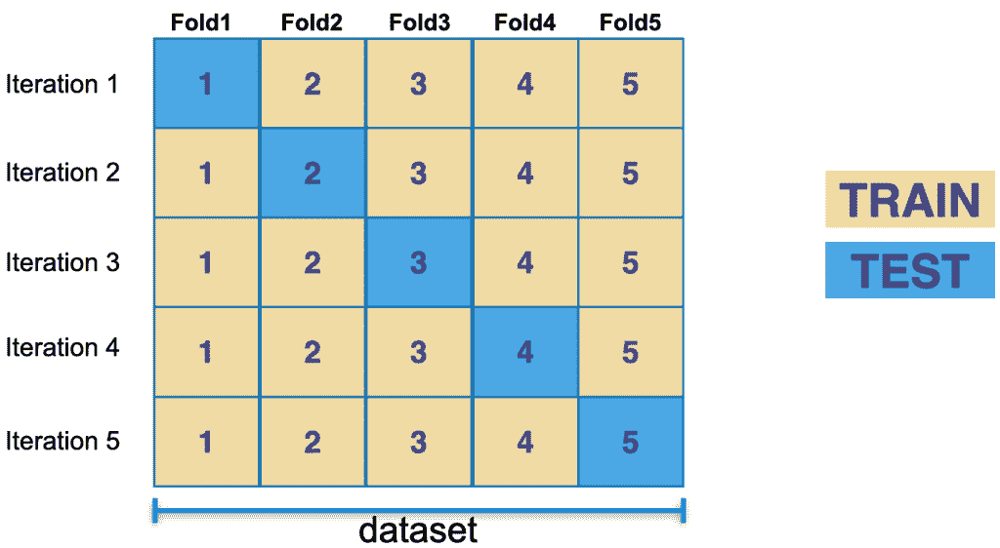
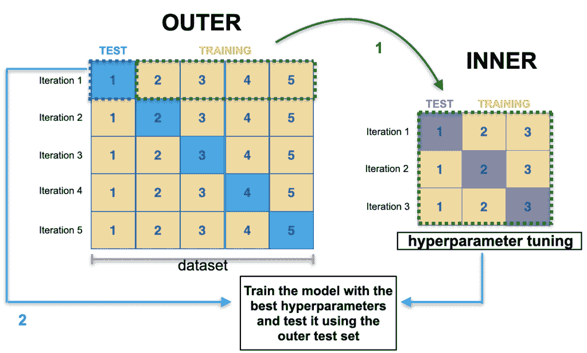

# 用于评估学习以对模型进行排序的训练集和测试集拆分

> 原文：<https://web.archive.org/web/sease.io/2022/07/how-to-split-your-dataset-into-train-and-test-sets-for-evaluating-learning-to-rank-models.html>

离线测试是最常见的评估方法，它可以帮助您找到最有前途的模型，这些模型能够在部署之前根据估计的相关性对文档进行排序。

对于分级学习(LTR)模型的离线评估，在清理和构建数据集所需的所有数据预处理步骤之后，在模型构建之前，必须执行**数据分割程序**。

整个数据集必须分成至少两部分:一个**训练集**和一个**测试集**。第一个由机器学习算法用来训练模型。第二个用于评估已训练模型的性能，方法是查看不同的离线指标，这些指标是模型在真实数据上的预期性能的指标。


这篇博客文章的目的是说明如何进行数据分割，以及为什么它在机器学习(ML)中是重要的和必需的。


从“学习排序”的角度来看，数据集中的每个样本都是一个查询-文档对，训练-测试分割需要以不同于其他 ML 技术的方式进行，因为需要考虑查询。


这就是为什么第 2 部分将很快跟进，讨论在“学习排序”场景中需要考虑的重要事项，以及在拆分数据时处理查询的最合适方法，

…敬请关注，祝学习愉快！

## 为什么数据拆分如此重要？

分割数据集至关重要，主要有两个原因:

*   对模型性能进行公正的评估
*   检测并潜在地减少两个非常常见的机器学习问题，称为**欠拟合**和**过拟合**

**欠拟合**发生在模型没有要求的那么复杂，并且在训练集和测试集上的表现都很差的时候，而**过拟合**发生在模型在训练数据上表现很好，但是不能推广到看不见的例子的时候。一般来说，模型越复杂，过拟合的可能性越大[ [1](https://web.archive.org/web/20221208014431/https://machinelearningmastery.com/overfitting-and-underfitting-with-machine-learning-algorithms/) ]。

## 我应该将数据集分成多少部分？

分割策略的选择对最终模型评估有很大影响，它主要受两个因素的影响:

*   可用的数据量
*   您用来训练模型的工具

有几种方法可以用来评估机器学习模型在看不见的数据上的表现，以及它们的优缺点。这篇博客文章的目的并不是详细介绍每种技术，而是简单描述一下最常用的技术:

###### 坚持

坚持是将数据集分成两部分的最简单的方法:**训练**和**测试**集。训练集用于训练模型，然后必须对“新”数据(测试集)评估模型的有效性，以估计其对训练阶段未使用的数据进行预测的能力。

这种方法适用于不太复杂的情况，并且当不需要调整模型超参数时，其值可以直接影响和控制学习过程；在第二个场景中，也有必要支持第三个子集，称为**验证**集。

验证和测试集的主要区别在于，前者用于在训练过程中评估模型并选择最佳模型，而后者用于在部署之前评估最终模型的准确性。

*LTR 场景中的拒绝代码示例:*


```
min_diff = len(data_set)
min_train_idx = []
min_test_idx = []
groups_split_object = StratifiedGroupKFold(n_splits=int(len(data_set)/test_set_size))
for train_idx, test_idx in groups_split_object.split(data_set, data_set['relevance_label'], data_set['query_id']):
    diff = abs(len(test_idx) - test_set_size)
    if diff < min_diff:
       min_diff = diff
       min_train_idx = train_idx
       min_test_idx = test_idx
       if diff == 0:
          break
interactions_train = data_set.iloc[min_train_idx]
interactions_test = data_set.iloc[min_test_idx]
```

*注意
在这个例子中，我们使用了 Sklearn 的“StratifiedGroupKFold”方法[ [3](https://web.archive.org/web/20221208014431/https://scikit-learn.org/stable/modules/generated/sklearn.model_selection.StratifiedGroupKFold.html#sklearn.model_selection.StratifiedGroupKFold) ]，而没有有效地执行 k-fold 交叉验证，我们将在这篇博文的第 2 部分**中解释这一选择的原因。*

有时，可能有必要使用最简单的方法来简单地创建两个测试集，并留下一个单独的测试集用于多种目的，例如与其他模型进行进一步的检查和比较。

无论如何，**坚持的方法有一些限制**，尤其是当使用非常小的数据集时。它对数据如何在每个集合中结束非常敏感，并且创建不平衡的测试集合会导致评估结果不能反映真实的模型行为。

这就是 k 倍交叉验证对我们的帮助，也是为什么它通常比坚持更受欢迎。

###### k 倍交叉验证

**K 倍交叉验证**是一个重采样程序，它将整个数据随机分成 *k* 个大小相似的子集(称为倍)。

使用对应于训练集的*k*–1(*k*减 1)个折叠来拟合模型，并使用剩余的 *k* 个折叠来验证模型。通过改变保留折叠(从 1 到 *k* ，重复上述过程，确保每个 *k* 折叠都被用作测试集。最终的性能指标是通过平均每个折叠的性能计算出来的。



K-fold cross-validation example (k=5)

它确实更耗时，因为它实际上需要多次重复训练和测试模型的过程，但它肯定被认为更健壮，因为它对数据如何划分不太重要。

k 的选择并不遵循正式的规则，而是必须小心谨慎。如果 *k* 太小，情况类似于具有高偏差和低方差的简单训练测试分割方法，而如果 *k* 太大，则意味着偏差更小，但方差更高，运行时间更长。通常，最常用的 *k* 值为 5 或 10，因为已经证明这些值达到了良好的偏差-方差平衡。

*LTR 场景中的 k 倍交叉验证代码示例*:**

 *

```
stratified_grouped_cv = StratifiedGroupKFold(n_splits=num_splits_cv)

logging.info('- - Cross-validation split info')
for train_idx, test_idx in stratified_grouped_cv.split(data_set, data_set_label_column, data_set_query_id_column):
    logging.debug("Training set length: " + str(len(data_set_label_column.iloc[train_idx])))
    logging.debug("Training set distinct query Ids: " + str(len((data_set_query_id_column.iloc[train_idx].unique()))))
    logging.debug("Test set length: " + str(len(data_set_label_column.iloc[test_idx])))
    logging.debug("Test set distinct query Ids: " + str(len((data_set_query_id_column.iloc[test_idx].unique()))) + '\n')
```

*在本例中，我们使用了 Sklearn 的“StratifiedGroupKFold”方法*，在该方法中，我们将折叠数作为参数传递(例如，num_splits_cv = 5)*  *甚至 **k 倍交叉验证也有弱点**。使用相同的数据集和交叉验证程序进行超参数调整和一般模型性能估计会导致过于乐观的结果。

这就是为什么**嵌套交叉验证**会出现在图片中 [4](https://web.archive.org/web/20221208014431/https://mlfromscratch.com/nested-cross-validation-python-code/) 。

###### 嵌套交叉验证

该方法也称为*双交叉验证*，因为它由两个独立但嵌套的循环组成:
–一个**内循环** (1)，用于模型选择/超参数调整
–一个**外循环** (2)，用于估计调整后模型的测试误差



Nested cross-validation example (Outer loop k=5, Inner loop k=3)

两个循环都执行交叉验证，通常在内循环( *k=3)* 中使用比外循环( *k=5* )中更小的 *k* 值，如上图所示。外部循环重复 5 次，从整个数据集生成 5 个不同的训练和测试集。对于每次迭代，在这种情况下，外部训练集被进一步分成 3 个部分，而内部循环依次重复 3 次。内层将只向外循环返回具有最佳超参数的模型，外循环将使用其测试集来估计模型的质量。在改变外部测试集之后，您将最终得到 5 个不同的估计值，可以对它们进行平均以获得最终的性能。

因此，当您想要执行模型选择和概化误差估计时，此方法的优势在于您可以通过为每个任务使用两个不同的集合来分离这两个任务，因此整个过程将为您提供对模型在真实场景中的性能的更好估计。

当数据集太大时，不建议使用**嵌套交叉验证，因为它会显著增加训练时间。**

*LTR 场景中的嵌套交叉验证* *代码示例:*


```
inner_cv = StratifiedGroupKFold(n_splits=num_splits_inner_cv)
outer_cv = StratifiedGroupKFold(n_splits=num_splits_outer_cv)

logging.info('- - - - Nested cross-validation split info')
outerK = 1
for train_outer_idx, test_outer_idx in outer_cv.split(data_set, data_set_label_column, data_set_query_id_column):
    logging.info('- - Outer: ' + str(outerK)
    logging.debug("Training set length: " + str(len(data_set_label_column.iloc[train_outer_idx])))
    logging.debug("Training set distinct query Ids: " + str(len((data_set_query_id_column.iloc[train_outer_idx].unique()))))
    logging.debug("Test set length: " + str(len(data_set_label_column.iloc[test_outer_idx])))
    logging.debug("Test set distinct query Ids: " + str(len((data_set_query_id_column.iloc[test_outer_idx].unique()))) + '\n')
    training_outer = data_set.iloc[train_outer_idx]
    training_label_outer = data_set_label_column.iloc[train_outer_idx]
    training_query_id_outer = data_set_query_id_column.iloc[train_outer_idx]
    outerK = outerK + 1
    innerK = 1
    for train_inner_idx, test_inner_idx in inner_cv.split(training_outer,training_label_outer,training_query_id_outer):
        logging.info('- - Inner: ' + str(innerK))
        logging.debug("Training set length: " + str(len(training_label_outer.iloc[train_inner_idx])))
        logging.debug("Training set distinct query Ids: " + str(len((training_query_id_outer.iloc[train_inner_idx].unique()))))
        logging.debug("Test set length: " + str(len(training_label_outer.iloc[test_inner_idx])))
        logging.debug("Test set distinct query Ids: " + str(len((training_query_id_outer.iloc[test_inner_idx].unique()))) + '\n')
        innerK = innerK + 1
```

*即使在这个例子中，我们也使用了 Sklearn 的“StratifiedGroupKFold”方法*，在这个方法中，我们将内部和外部循环的折叠次数作为参数传递。

## 拆分比例应该是怎样的？

最佳的数据分割总是取决于数据集的大小和模型的结构等因素。

训练集不能太小，否则模型将没有足够的数据来学习；另一方面，即使是验证集和测试集也不应该太小，否则评估度量将具有很大的差异，并且不会导致正确的模型调整或反映真实模型性能的值。

**那么它们应该有多大呢？**

如上所述，**该比率受整个数据集的大小影响**:

使用拒绝法时常见的比率是:

*   80%训练，20%测试
*   80%培训，10%开发，10%测试
*   70%训练，30%测试
*   60%培训，20%开发，20%测试

我们不得不说，当数据集规模较小时(总共数千个样本)，机器学习中的这些经验法则相当合理；但是在现代机器学习时代(特别是在使用深度学习时)，帮助建立验证和测试集的准则已经发生了一点变化，那些常见的比率不再适用。

如今，在处理大数据(百万/十亿样本)时，似乎如果您可以为验证和测试集收集足够的样本(例如，每个样本大于等于 10.000)，那么这是一个很好的集大小，它应该足够大，以便对您的系统的整体性能有很高的信心，而不管达到的百分比是多少。

事实上，使用少于 20%或 30%的数据用于验证和测试集，并留下更多的样本来训练模型是非常合理的。[ [5](https://web.archive.org/web/20221208014431/https://analyticsindiamag.com/best-practices-on-setting-up-development-and-test-sets-for-ml/)

此外，为了确保训练集和测试集代表原始数据集，为了学习对模型进行排序，以及为了分类模型，纯粹的随机分割并不总是正确的方法:我们需要保证查询和相关性标签的频率分布在两个集中大致相等。

## 在“学习排名”场景中，需要考虑的重要因素是什么？

当您处理“学习排序”时，尤其是列表方式，问题是如何正确地管理数据分割，考虑到按查询分组。

你是否很想了解更多关于这个话题的信息？下一篇博文再见！

## 结论

我们希望这篇博客能帮助你理解如何进行数据拆分，以及为什么它对于学习模型排序的离线评估非常重要。

// our service

## 不要脸的塞给我们培训和服务！

我有没有提到我们做[学习排名](https://web.archive.org/web/20221208014431/https://sease.io/learning-to-rank-training)培训？
我们也提供这方面的咨询，[如果你想用 LTR 的力量让你的搜索引擎更上一层楼，请联系](https://web.archive.org/web/20221208014431/https://sease.io/contacts)！

// STAY ALWAYS UP TO DATE

## 订阅我们的时事通讯

你喜欢这篇关于训练和测试集分开来评估模型排序的文章吗？不要忘记订阅我们的时事通讯，以便随时了解信息检索世界的最新动态！*