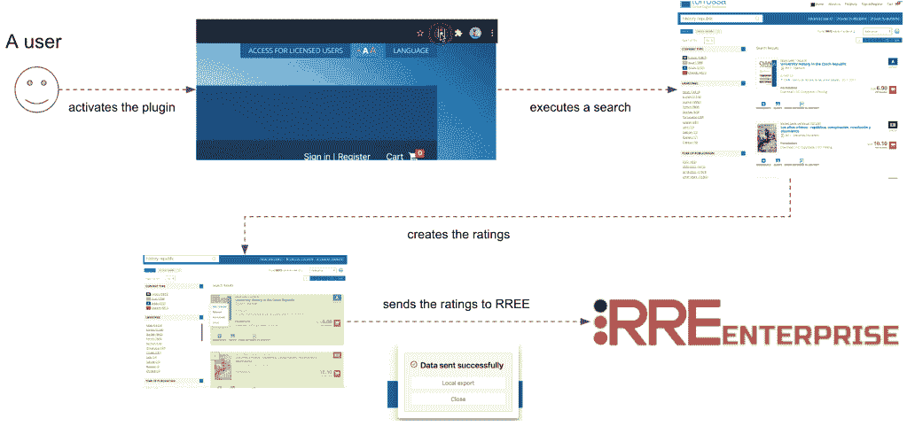

# 缺失的部分:RRE 企业中的身份发现

> 原文：<https://web.archive.org/web/sease.io/2022/09/id-discovery-in-rre-enterprise.html>

之前我们描述了 RREE 浏览器插件，它使得显式评级收集更加友好。我们强烈建议看看那个帖子，如果你没有的话，或者至少看看展示真实例子的[嵌入视频](https://web.archive.org/web/20220930004626/https://youtu.be/82e7e-ta6ZQ)。

**简化** RREE 为**定义**和**分配**给一组给定的搜索结果，这是有代价的。幸运的是，开发商已经为此付出了代价；让我们看看它由什么组成。

下图说明了 RREE 中的显式评级收集

整个过程是**面向用户的**:评委已经**熟悉**他们公司门户网站的**用户界面**。除了插件**激活**(必须完成一次)和**评级创建本身**，用户界面与用户习惯看到的一样。

让我们移动到最后一步:当**有效载荷**被发送到 **RREE** 时，不出所料，它包含了一组与用户评级相关的信息。

我们知道评级是三重关联:

*   一个疑问
*   一份文件
*   评级

可以想象，虽然信息**是在最后一步**中发送的，但它与运行搜索质量评估所需的信息 **RREE** 需要略有不同。具体来说，查询和文档提出了两个挑战，我们将在下面的小节中描述这两个挑战。

## 第一个挑战:查询

用户在典型的搜索界面中表达的查询由文本框中输入的一组术语组成:所谓的“简单搜索”。

在 **RREE 端**，我们需要运行**评估流程**的不是用户查询。相反，我们需要收集由于用户查询而触发的请求，并将其发送给中间的**搜索 API** :在 RREE 中，我们称之为**黑盒 API 请求**。这个名字表明这个层对我们来说是一种不透明的东西，一个介于 T42 客户端和服务器之间的应用层。

然后在 RREE 中使用**黑盒 API 请求**(其中**包括**用户查询)来发现**搜索引擎请求**，我们使用它来运行**评估流程**。

我们在上一篇关于 RRE 企业中[查询发现的文章中描述了**查询发现**过程。](https://web.archive.org/web/20220930004626/https://sease.io/2023/01/query-discovery-in-rre-enterprise.html)

## 第二个挑战:文件

在来自**用户**和**服务器视角**的**文档实体**表示之间有一个**逻辑间隙**。

对于用户来说，文档是用户界面中的一个项目，是给定搜索的结果，它被分配给给定的等级。在幕后，技术表示由 HTML 代码组成。

对于搜索引擎来说，文档是一个对象，一个用来表示搜索结果的类的实例。它通常由一个类似映射(即键-值对)的结构组成，其中键是属性名，值是属性值。

那两个实体的**身份**是**不同**。**服务器端**需要一个**唯一的**、**系统范围的**标识符与每个文档相关联。

相反，在**客户端**上，标识符:

*   **是可选的**
*   如果存在的话，它通常是**页面范围的**(即，在当前页面的其他标识符中是唯一的)
*   最有可能的是**不同于**和**服务器标识符**。

在这种情况下， **RREE ID Discovery** 组件会有所帮助。

当接收到一组显式评级时，首先发生的是标识符发现。

该组件能够找到在传入有效载荷中**接收的**文档**和相应的**服务器端表示**之间的**关联**。然后，相关性作为评等定义的一部分保留下来，并在后续评估过程中使用。**

关联阶段的主要挑战是有效载荷中可能出现的**缺少**信息**的情况。我们已经说过，标识符是可选的，可以不同，通常遵循完全不同的逻辑。**

**RREE** 中 **id 关联**良好的**键**因子无法提前确定；该过程依赖于在**浏览器插件**和**发现引擎**上的精确**配置**。

## 概述

ID 发现/关联是 RREE 搜索质量评估过程的关键部分。

它填补了客户机和服务器之间身份表示的空白。这个概念通常在这两个世界中呈现不同的形状，因为它遵循不同的规则，并且属于系统的不同部分。

RREE ID 发现发现它们之间的相关性，因此。关联阶段对最终用户完全透明，它允许:

*   使用强大的、面向最终用户的工具(浏览器插件)来表达评级
*   使用户文档表示与内部搜索引擎文档一致(实际用于评估过程)。

// BEGIN YOUR JOURNEY INTO THE SEARCH QUALITY EVALUATION

## 评级评估企业

[DISCOVER MORE AND DOWNLOAD](https://web.archive.org/web/20220930004626/https://sease.io/rated-ranking-evaluator-enterprise)// STAY ALWAYS UP TO DATE

## 订阅我们的时事通讯

你喜欢这篇关于 RRE 企业 id 发现的帖子吗？不要忘记订阅我们的时事通讯，以便在信息检索世界中保持最新状态！