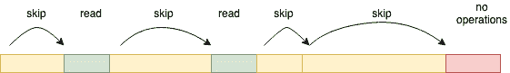

# 大型存储字段对 Apache Solr 查询性能的影响

> 原文：<https://web.archive.org/web/sease.io/2022/12/impact-of-large-stored-fields-on-apache-solr-query-performance.html>

## Solr 中存储的字段

在 Solr 中，字段可以设置为索引和/或存储。

```
<field name="field" type="text" indexed="true" stored="true" />
```

*   **索引**:如果设置为 true，则该字段可用于搜索。
*   **存储**:如果设置为真，字段值也存储在 solr 中。以下是一些用法示例:

1.  在查询时检索字段值
2.  部分更新(稍后将在博客中介绍)
3.  突出

存储字段在几种情况下会很有帮助。缺点是它们的使用会增加索引的大小，并且会影响性能，这取决于它们的使用方式。

在某些情况下，字段可能很长。想象一下一本电子书:它可以轻松达到相当大的兆字节。

在索引时，可以通过文本分析来建模和优化倒排索引的形状(例如，停用词过滤、同义词折叠)；此外，请记住，倒排索引中的字典会对所摄取的术语执行隐式重复数据删除:如果输入的电子书包含 1000 次术语检索，那么索引将只有一个条目。

但是，以上所有内容仅对索引字段有效，这些字段的内容构成了倒排索引。

###### 存储字段呢？

一个完全不同的行为:存储字段逐字保存在持久数据结构中:文本压缩在这里起着至关重要的作用，尤其是对于长文本，但关键是:在数据检索时，对于给定的存储字段，搜索引擎必须返回在索引时插入的准确的文字值。

## 案例研究:巨大的存储场

客户搜索基础设施包括一个关系数据库和 SolrCloud 6.1。

作为增量改进路径的一部分，一组变更请求需要启用部分更新[ [1](https://web.archive.org/web/20221223104504/https://solr.apache.org/guide/8_11/updating-parts-of-documents.html) ]功能。

部分更新只允许更新已经索引的 solr 文档中的字段子集，而不需要提交整个文档。

使用这种特性的前提条件是模式中的所有字段都必须是 stored (stored="true ")或 doc values(doc values = " true ")；唯一的例外与作为 copyField 指令目标的字段有关，这些字段必须设置为 stored="false "。

为了更新文档，solr 必须删除旧版本并用更新的信息索引新文档。通过部分更新，solr 能够使用存储字段的信息来索引文档中未更改的字段。通过这种方式，用户可以只发送已经更新的字段(例如元数据或一些小的内容)。这将大大减少用户要传输的数据量，唯一要付出的代价是索引大小的增加。

###### 问题:查询性能下降

将所有字段设置为存储后，查询性能变得更差。我们将平均查询时间从 10 毫秒缩短到了 500 毫秒。

乍一看，这似乎是一个奇怪的副作用，甚至与刚刚启用的部分更新功能无关(我们认为是这样的):后面没有索引，慢速查询的结构非常简单。

```
q=something&fl;=id,first_name,surname,age,email_address
```

在查询时，存储字段在数据检索阶段起着至关重要的作用，但是正如您从上面的查询中所看到的，我们只要求其中的一些字段。此外，姓名和电子邮件地址是平均长度较短的字段。

此外，声明要返回的字段在我们更改之前就已经存储了。

然后发生了什么？

###### 字段检索如何工作

在对 Solr 内部进行深入研究后，我们发现查询性能下降是由于 Solr 存储字段的检索方式。

下面是实现该检索逻辑的方法:

```
public void visitDocument(int docID, StoredFieldVisitor visitor) throws IOException {

    final SerializedDocument doc = document(docID);

    for (int fieldIDX = 0; fieldIDX < doc.numStoredFields; fieldIDX++) {
      final long infoAndBits = doc.in.readVLong();
      final int fieldNumber = (int) (infoAndBits >>> TYPE_BITS);
      final FieldInfo fieldInfo = fieldInfos.fieldInfo(fieldNumber);

      final int bits = (int) (infoAndBits & TYPE_MASK);
      assert bits <= NUMERIC_DOUBLE : "bits=" + Integer.toHexString(bits);

      switch (visitor.needsField(fieldInfo)) {
        case YES:
          readField(doc.in, visitor, fieldInfo, bits);
          break;
        case NO:
          if (fieldIDX == doc.numStoredFields - 1) { 
            return;
          }
          skipField(doc.in, bits);
          break;
        case STOP:
          return;
      }
    }
  }
```

该方法迭代所有存储的字段；它**跳过**不需要的字段，而**只保留**客户要求的字段。当光标在最后一个字段上时，如果它没有被请求，过程结束，因为不需要跳过(记住，我们在最后一个字段上)。

您可以将文档中存储的字段想象成一个长数组，其中字段一个接一个地编码。每个字段在前面提供一些元数据(例如，字段信息、长度)，允许访问者阅读或跳过它。如果我们想得到位置 n 的字段，我们必须遍历从 0 到 n-1 的所有字段(读取或跳过它们)。



读取一个字段值比跳过它代价更大。然而，跳过一个字段并不是免费的。从 CPU 的角度来看，这是一个恒定时间的操作，但从内存访问的角度来看，情况有所不同。当按顺序访问数据时，CPU 会在实际读取数据之前预取缓存中的数据。

举个简单的例子:如果读取数据块 X，数据块 X+1 会在缓存中预取，因为在读取 X 之后，可能会需要 X+1。将这一概念应用于我们读取存储字段的情况，通过跳过存储字段进行读取来遍历存储字段是一种快速操作，因为连续的块是连续预取的。每当光标移动到下一个字段时，数据已经在缓存中，等待数据移动到 CPU 缓存没有延迟。

现在，如果其中一个场非常大，会发生什么？(大于一个缓存块)。预取机制不能理解要预取哪个块(属于要读取的下一个字段的块),并且当光标在跳过之后到达那里时，必须停止执行，以等待正确的块被加载到 CPU 缓存中。这会导致执行延迟。

## SOLR 6.5 优化

**Solr 6.5** 这里介绍一个重要的优化( [SOLR-10273](https://web.archive.org/web/20221223104504/https://issues.apache.org/jira/browse/SOLR-10273) )。
该优化消除了由于跳过字段列表中没有请求的大字段而导致的开销。变化在于在索引时移动存储字段数组末尾的最大字段。

**N.B** :除了最后一个字段(如果不需要)，所有字段都被读取或跳过。最后一个字段不需要任何跳过。因此，如果大字段是最后一个，就没有开销，因为根本没有跳过。

问题解决了？或多或少。

###### 不止一个大领域？

虽然在一个文档中最多有一个大字段是很常见的，但是如果有多个大字段，会发生什么情况呢？不幸的是，这种情况不是由 [SOLR-](https://web.archive.org/web/20221223104504/http://solr-10273/) [10273](https://web.archive.org/web/20221223104504/https://issues.apache.org/jira/browse/SOLR-10273) 中介绍的优化来管理的。

如果有多个大的存储字段，那么在查询时性能会有所下降。唯一可能的建议是使用 **docValues** 来设计模式以避免这种情况。

让我们回到上面的方法:只有当客户机请求至少一个存储字段时，才执行这个方法。

出于这个原因，如果客户端只要求**也是**文档值**的字段**，Solr 根本不能访问存储的结构。因此，上面的检索工作流不适用。

// links and references

以下是文档值字段的一些参考:

*   [Apache Solr 文档价值指南](https://web.archive.org/web/20221223104504/https://solr.apache.org/guide/8_9/docvalues.html)
*   [文档值与存储字段、Apache Solr 特性和性能对比](https://web.archive.org/web/20221223104504/https://sease.io/2020/03/docvalues-vs-stored-fields-apache-solr-features-and-performance-smackdown.html)

// our services

## 不要脸的塞给我们培训和服务！

我提到过我们做[阿帕奇 Solr](https://web.archive.org/web/20221223104504/https://sease.io/training/apache-solr-training) 培训吗？我们也提供这些主题的咨询，[如果你想让你的搜索引擎更上一层楼，请联系](https://web.archive.org/web/20221223104504/https://sease.io/contacts)！

// STAY ALWAYS UP TO DATE

## 订阅我们的时事通讯

你喜欢这篇关于大型存储字段对 Apache Solr 查询性能的影响的文章吗？不要忘记订阅我们的时事通讯，以便随时了解信息检索世界的最新动态！