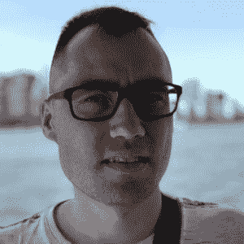

# 伦敦信息检索会议[2022 年 7 月]

> 原文：<https://web.archive.org/web/sease.io/2022/07/london-information-retrieval-meetup-july-2022.html>

我们非常高兴地宣布第十三届伦敦信息检索聚会，这是一次免费的**晚间聚会，旨在为对探索和讨论该领域最新趋势感兴趣的**信息检索爱好者和专业人士**提供服务。**

这一次聚会将是完全远程的！

会议将由 **1 技术会谈**和会谈后的 Q &一个环节组成。

## **在线聚会**

**需要注册**

**日期****:**2022 年 7 月 26 日|下午 6 点(GMT +1)

**位置:**缩放

[REGISTER HERE](https://web.archive.org/web/20221202225428/https://www.meetup.com/london-information-retrieval-meetup-group/events/287183033/?utm_medium=referral&utm_campaign=share-btn_savedevents_share_modal&utm_source=link)// LONDON INFORMATION RETRIEVAL MEETUP

## 程序

*【6:15 开始】*
在简短的欢迎仪式后&我们创始人的最新新闻演讲[**Alessandro Benedetti**](https://web.archive.org/web/20221202225428/https://sease.io/alessandro-benedetti)之后，我们将继续演讲。

// the talk

## 矢量搜索中的玩家:
算法、软件和用例

在这次演讲中，我们将深入到你不能忽视的向量搜索这个事实上已经出现的领域。我们将看看它是如何开始的，检查它的算法原理，探索数据库、框架和嵌入式服务器形式的软件，并浏览用例。讨论是基于作者自己在研究矢量搜索算法，为客户和媒体博客实现搜索引擎，以及采访他的矢量播客的制作者的经验。我们还将看看矢量搜索的实际应用，解决一些棘手的搜索问题，比如多语言和多模态。

// slides

[https://web.archive.org/web/20221202225428if_/https://docs.google.com/presentation/d/e/2PACX-1vSyNt8OQU7cKT7N9UsXZ6GbYhasIWyqB65Ay8b-MP8xYzCJ93GGCGZD_knUfv4oM0P9cDDJnAtxoRZC/embed?start=false&loop=false&delayms=3000](https://web.archive.org/web/20221202225428if_/https://docs.google.com/presentation/d/e/2PACX-1vSyNt8OQU7cKT7N9UsXZ6GbYhasIWyqB65Ay8b-MP8xYzCJ93GGCGZD_knUfv4oM0P9cDDJnAtxoRZC/embed?start=false&loop=false&delayms=3000)

// our speaker** **#### 德米特里·坎

Founder of Vector Podcast
co-founding Muves** **Dmitry 自 2010 年以来一直专注于搜索引擎，包括 Apache Lucene 和 Solr，以及自 2020 年以来的 Elasticsearch。他负责建立一个搜索团队和搜索技术，为 AlphaSense 产品提供支持，该产品如今被全球几乎所有垂直行业的数千家知名银行、对冲基金和公司使用。在筒仓。AI Dmitry 领导着一个由 NLP 研究人员、搜索、前端和 QA 工程师组成的团队，致力于网络规模的搜索，每天都与产品管理、工程师和数据团队进行互动。Dmitry 曾参与开源项目 Luke 和 Quepid，并与人合作创办了一些初创公司:文本分析、edtech 和团队参与领域。他是矢量播客的创始人和主持人。作为向量搜索领域的独立研究员，Dmitry 开始与他的联合创始人一起研究 Muves——多语言和多模式搜索引擎。在空闲时间，他喜欢阅读、骑自行车和写关于人工智能和搜索的博客。Dmitry 拥有应用数学博士学位和计算机科学硕士学位。** **[REGISTER HERE](https://web.archive.org/web/20221202225428/https://www.meetup.com/london-information-retrieval-meetup-group/events/287183033/?utm_medium=referral&utm_campaign=share-btn_savedevents_share_modal&utm_source=link)****// video

[https://web.archive.org/web/20221202225428if_/https://www.youtube.com/embed/8IOpgmXf5r8](https://web.archive.org/web/20221202225428if_/https://www.youtube.com/embed/8IOpgmXf5r8)**