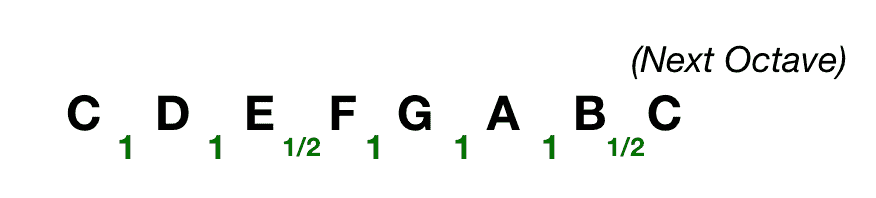
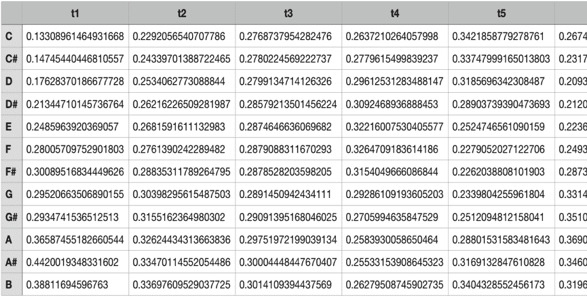
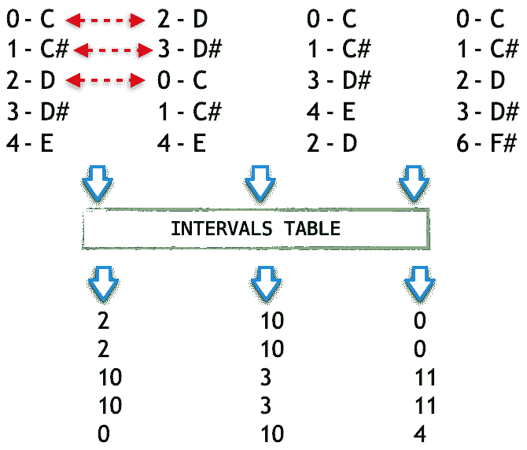

# 音乐信息检索:区间矩阵

> 原文：<https://web.archive.org/web/sease.io/2020/08/music-information-retrieval-the-intervals-matrix.html>

在这篇文章中，我们从 **[区间表](https://web.archive.org/web/20220930010254/https://sease.io/2020/02/music-information-retrieval-intervals-table.html)** 上移了一步，描述了我们称之为**区间矩阵**。

在我们 2019 年 10 月的[伦敦信息检索会议](https://web.archive.org/web/20220930010254/https://www.meetup.com/it-IT/London-Information-Retrieval-Meetup-Group)中已经描述了**区间矩阵**(这里是[幻灯片):它是我们正在研究的**翻唱歌曲检测**方法中使用的中间数据结构。](https://web.archive.org/web/20220930010254/https://www.slideshare.net/SeaseLtd/musical-information-retrieval-take-2-interval-hashing-based-ranking)

T15T17

我们已经在之前的帖子中描述过[什么是**间隔**以及它在我们方法中的核心作用；然而，有必要简单重复一下:它允许根据**【相对性】**来思考，而不关心**绝对频率**或音高。](https://web.archive.org/web/20220930010254/https://sease.io/2020/02/music-information-retrieval-intervals-table.html)

## 简要回顾:什么是间歇？

音乐理论将音程定义为两个声音**之间的**音高差**。**

T33

如果一个音程表示两个**相继**发声音调之间的距离，它可以是**水平**(或**线性**或**旋律**)，如果它属于**同时**发声音调，如在一个和弦中，它可以是**垂直**或**和声**。


在**西洋音乐**中，一个音程代表一个**全音阶**的**两个音符**之间的**距离**。这些音程中最小的是一个**半音**。

**全音阶**是一个**音阶**有

*   *   **每八度七个**音高
    *   **五个**双半音(又名**音**)音程
    *   **两个**半音音程由**两个**三个音程隔开

c 大调音阶是全音阶的完美例子(1/2 =半音，1 =音调):




## 简要回顾:区间表

**音程表**是一个**矩阵**，它定义了**半音阶**中每个音符之间的**可能音程**:

|   | **C** | **C#** | **D** | **D#** | **E** | **F** | **F#** | **G** | **G#** | **答** | **A#** | **B** |
| **C** | 0 | 1 | 2 | 3 | 4 | 5 | 6 | 7 | 8 | 9 | 10 | 11 |
| **C#** | 11 | 0 | 1 | 2 | 3 | 4 | 5 | 6 | 7 | 8 | 9 | 10 |
| **D** | 10 | 11 | 0 | 1 | 2 | 3 | 4 | 5 | 6 | 7 | 8 | 9 |
| **D#** | 9 | 10 | 11 | 0 | 1 | 2 | 3 | 4 | 5 | 6 | 7 | 8 |
| **E** | 8 | 9 | 10 | 11 | 0 | 1 | 2 | 3 | 4 | 5 | 6 | 7 |
| **F** | 7 | 8 | 9 | 10 | 11 | 0 | 1 | 2 | 3 | 4 | 5 | 6 |
| **F#** | 6 | 7 | 8 | 9 | 10 | 11 | 0 | 1 | 2 | 3 | 4 | 5 |
| **G** | 5 | 6 | 7 | 8 | 9 | 10 | 11 | 0 | 1 | 2 | 3 | 4 |
| **G#** | 4 | 5 | 6 | 7 | 8 | 9 | 10 | 11 | 0 | 1 | 2 | 3 |
| **答** | 3 | 4 | 5 | 6 | 7 | 8 | 9 | 10 | 11 | 0 | 1 | 2 |
| **A#** | 2 | 3 | 4 | 5 | 6 | 7 | 8 | 9 | 10 | 11 | 0 | 1 |
| **B** | 1 | 2 | 3 | 4 | 5 | 6 | 7 | 8 | 9 | 10 | 11 | 0 |

虽然在**乐理**中，每个音程都用一个名称来表示(例如 0 个半音= > unison)，但上表使用**个半音**作为表示距离的度量。

使用上面的**区间表**，我们可以说:

*   *   A 和 D#之间的距离是 6 个半音
    *   B and B 之间的距离是 0 个半音(同音)

## 区间矩阵

在介绍这篇文章的中心概念之前，最好从输入开始，即**色度特征/色度矩阵**，然后看看获得**间隔矩阵**所需的操作。

###### 色度特征

**色度特征**是一种**表示法**，沿着由后续瞬间{ t0–TN }组成的间隔，其中对于每个瞬间，使用与代表西方音乐符号中使用的八度音阶的 **12 个不同半音**(或**色度**)的 **12 类**相关联的**能量**来分解音频信号。这是一个样本矩阵:



在这里你可以看到 **12 * t** (在这种情况下 t=6，t6 是部分隐藏的)矩阵，其中每个**向量代表**给定时刻 t 的**十二个音高强度**。

下面是另一个例子:小红莓乐队的《僵尸》的低音部分。在上面的五线谱上，你可以看到重复片段的符号，下面是相应的色度图；彩色框突出显示了两种不同表现形式的重复片段的复合部分。


###### 从色度矩阵到区间矩阵

对于**每个色度矢量**，我们保留**前 k 个**最强烈的音调能量，并用它们相应的**顺序位置**替换它们:


我们将最终得到一个整数矩阵的**，它与原始矩阵的**列**相同，但只有 **k** 行。每个向量包含 k 个较强音高类别的排序列表，按降序排序。注意**潜在的假设**是为了**表示**和**概括**一个色度矢量，a 类能量**越强**越好**。****

 **基本完成:应用**区间表**作为具有**相同索引**并属于**后续色度矢量**的单元(**等级**)之间的函数，获得**区间矩阵**。

以这种方式，我们计算相邻向量(x[n]–x[n-1])之间的**距离，并且这些测量值组成输出矩阵，其具有:**

*   *   **输入矩阵的相同行数**
    *   **m-1 列**:其中 **m** 是输入矩阵的列数** **

## 实施

像往常一样，让我们首先定义我们想要实现的行为:

**区间矩阵**

*   *   应该使用**间隔表**以便**计算距离矢量**
    *   如果输入向量之间没有距离**应该是一个**零/空矩阵****
    *   如果输入的 **k 参数**大于**12**，则应抛出**异常**
    *   如果输入由一个空色度矩阵**组成，应该抛出一个异常**
    *   **应该过滤掉****所有基数****小于**的向量输入 **k 参数******
    *****   在输入中给定一个 **m * n** **色度矩阵**的维数应该等于**(m–1)* n***   应该为输入矩阵中每个后续的色度向量对返回一个区间向量，其大小为 k****

 ****我们将使用与代码[【1】](https://web.archive.org/web/20220930010254/https://gist.github.com/agazzarini/d4a9cab15eb9a4795e1f34e818c11a4a)相同的 BDD 方法来表达这些需求:****  ```
class IntervalsMatrixSpecs extends FlatSpec {

  "The Intervals Matrix" should "be a zero/null matrix if there's no distance between chroma vectors" in {
    val table = new IntervalsTable

    ...
  }

  it should "throw an exception in case the input k parameter is greater than 12" in {
    val table = new IntervalsTable
    val inputMatrix = chromaMatrix(31)

    assertThrows[IllegalArgumentException] {
      IntervalsMatrix(inputMatrix, 13, table)
    }

    assertThrows[IllegalArgumentException] {
      IntervalsMatrix(inputMatrix, 15, table)
    }
  }

  ...
}
```

最后，**区间矩阵**也可作为依据[【2】](https://web.archive.org/web/20220930010254/https://gist.github.com/agazzarini/77b06db5bc1c6aeb245e5dc029bc4975)。正如你所看到的，它是一个整数矩阵的基本包装器。构造函数获取一个色度矩阵，并创建内部数据结构来捕获分级区间。


太好了！我们的测试套件正在增长:


 *未完待续下集……*

// our service

## 不要脸的塞给我们培训和服务！

我提到过我们做 [Apache Solr 初学者](https://web.archive.org/web/20220930010254/https://sease.io/training/apache-solr-training/apache-solr-beginner-training)和 [Elasticsearch 初学者](https://web.archive.org/web/20220930010254/https://sease.io/training/elasticsearch-trainings/elasticsearch-beginner-training)培训吗？
我们还提供这些主题的咨询，[如果您想让您的搜索引擎更上一层楼，请联系](https://web.archive.org/web/20220930010254/https://sease.io/contacts)！

// STAY ALWAYS UP TO DATE

## 订阅我们的时事通讯

你喜欢这个关于音乐信息检索的帖子吗？不要忘记订阅我们的时事通讯，以便随时了解信息检索世界的最新动态！******