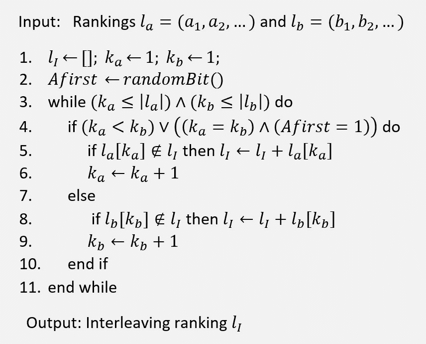
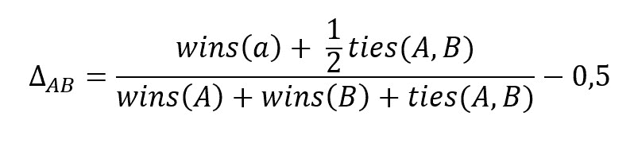
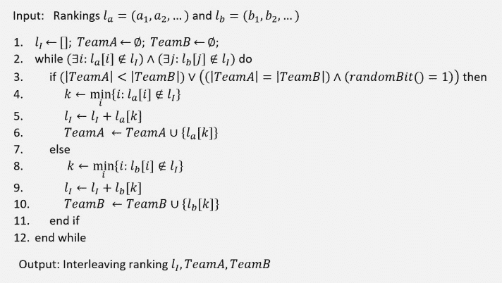
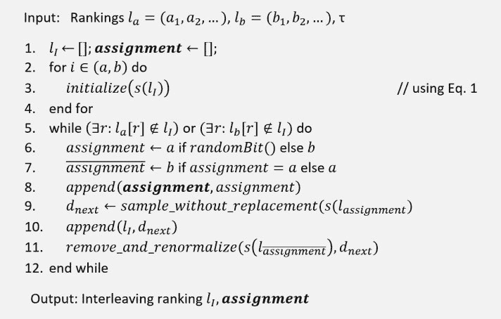

# 学习排名的在线测试:交错

> 原文：<https://web.archive.org/web/sease.io/2020/05/online-testing-for-learning-to-rank-interleaving.html>

如果你读过这篇博文的第一部分，你现在应该知道在线测试可以做多少奇妙的事情！特别是交错带来的相对于 A/B 测试的优势，但是你还在等待一个问题的答案:*如何实现？*

让我们一起来看看这些交错实现。首先，让我们描述一下第一种实现的交错方法，然后我将向您介绍两种最常用的方法。

## 平衡交错

第一种实现是:**平衡交织**。

平衡交错是最简单的交错方法。总是放入结果列表*l[I]的前 *k* 个结果，两个列表*l[A]T21*l[B]的前 *k* 个结果的文件。*
假设有两个指针 *k [a]* 和 *k [b]* ，对于两个排名榜 *l [A]* 和 *l [B]* ，总是指向各个榜的较高结果。**

实现的算法如下:

让我们举个例子来更清楚地解释一切。

假设有*l[A]=(*A[1]*， *a [2]* ，…)和*l[B]*=(*B[1]*， *b [2]
我们用 randomBit()函数(第 2 行)给两个模型中的一个赋予优先权。所选择的模型将首先决定将哪些文档添加到最终列表中。假设我们选择*model _ A*:*A first = 1*。
然后我们将重复这个过程，除非我们在*l[A]和*l[B]中至少有一个文档:****

1.  1.  如果(*k[A]*<*k[b]*)或(*k[A]*=*k[b]*和 *model_A* 是最喜欢的一个):如果 *k [a]* 指向的文档不是
    2.  否则:如果 *k [b]* 指向的文档不在 *l [I]* 中，我们插入它。

在这个循环结束时，我们将会把所有来自*l[A]和*l[B]的文档(最多丢弃一个)添加到*l[I]中。***

因此，我们可以看到，通过这种方式，我们创建了一个惟一的列表*l[I]，其中包含了来自两个模型的文档，并考虑了文档在它们的原始列表中的相对等级( *l [A]* 和 *l [B]* )。*

###### 如何评价结果？

得到的结果列表*l[I]=(*I[1]， *i [2]* ，…)现在显示给用户，用户点击那些最能反映其信息需求的文档。假设调用 *c [1]* ， *c [2]* ，…被点击文档的排名和*c[max]= max[I]c[I]*。
为了得出两个模型之间的偏好，我们统计了*l[I]的前 *k* 结果中每个模型的点击文档数，其中:***

*k = min*{*j*:(*I[Cmax]*=*a[j]*)或者(*I[Cmax]*=*b[j]*)}。

具体来说，每个模型的点击文档数为:

*h[A]*= | {*c[j]*:*I[CJ]*∈(*A[1]*，…，*A[k]*)} | for*model _* *B[k]*)} | for*model _ B*
If*h[A]*>h[B]*model _ A*将是最喜欢的一个，if *h [a]*

这是为查询 *q* 导出的首选项，但是在在线评估期间可以完成许多其他查询。我们如何为所有的查询导出一个偏好？
让*赢* (A)是 model_A 赢的比较次数，赢(B)是 *model_B 赢的比较次数*和*平* (A，B)我们平的次数。
为了计算总体偏好，我们使用了另一种统计方法:

δ[AB]的正值表示 *model_A* 是最喜欢的，δ[AB]的负值表示 *model_B* 是最喜欢的。

###### 缺点

当比较产生非常相似的排名列表的两个模型时，这种方法的一个缺点出现了。例如，如果 *model_A* 的排序列表与 *model_B* 的排序列表相同，但第一个文件除外:*l[A]=(*A*， *b* ，c，d)和*l[B]*=(*B*， *c* ，d，A)。比较阶段将使*B 型*比*A 型*更容易获胜。无论 *RandomBit()* 选择什么型号，都会发生这种情况。
这个缺点是由于选择 *k* 参数的方式(包括所有被点击文档的最小等级)以及 *model_B* 的等级高于 *model_A* 除了 *a* 之外的所有文档。*

## 团队选秀交错

**团队草案交错**方法通过一种新的构建交错结果列表*l[I]的方式克服了针对平衡交错描述的问题。特别是，该算法依赖于在团队比赛中广泛使用的队长方法来选择球员。*

假设有两个队长 *A* 和 *B* 。假设每轮随机选择两个中的一个。然后，被选中的队长将选择他最喜欢的仍然可用的球员，将他加入球队，然后将机会留给另一名队长。这将重复，除非有球员可用。

实现的算法如下:

让我们在这里举一个例子来更清楚地解释一切。

假设有*l[A]=(*A[1]*， *a [2]* ，…)和*l[B]*=(*B[1]*， *b [2]
这里，像在平衡交织中一样，起始模型的选择由 *randomBit()* 给出，但是这种选择在每一轮都进行，而不仅仅是在算法的开始。
我们将重复这个过程，除非我们在*l[A]和*l[B]中至少有一个文档:****

1.  如果 *TeamA* 的规模小于 *TeamB* 的规模或者(两个团队的规模相同且 *model_A* 具有优先权): *k* 将在 *l [A]* 尚未在 *l [I]* 中取得顶级文档的排名；该文档将被添加到交叉列表*l[I]和 *TeamA* 集合(该集合记录了从 *model_A* 中取出的所有文档)。*
2.  否则: *k* 将取*l[B]中尚未在*l[I]中的顶部文档的等级；该文档将被添加到交叉列表*l[I]和 *TeamB* 集合(该集合记录了从 *model_B* 中取出的所有文档)。***

在这个循环结束时，我们已经将来自*l[A]和*l[B]的所有文档(最多丢弃一个)添加到*l[I]中。我们还将获得属于*团队 A* 和*团队 B* 的文件清单。***

###### 如何评价结果？

再次，将得到的结果列表*l[I]=(*I[1]，*I[2]，…)显示给用户，用户点击那些最能反映其信息需求的文档。假设调用*c[1]， *c [2]* ，…被点击文档的行列。
为了在两个模型之间得出一个偏好，我们统计了每个*团队中点击文档的数量*:****

*h[A]= | {*c[j]:*I[CJ]*∈*TeamA*| for*model _*
*h[b]*= | {*c[j 对于*model _ B*
If*h*]*>*h[B]**model _ A*将是最喜欢的一个，If*h[A]*<*h[B]**model _ B***

以与平衡交错相同的方式，我们可以导出所有查询的偏好。
我们计算*胜(A)* 、*胜(B)* 、*平(A，B)* 然后δ[AB]。

###### 缺点

团队选秀交错也有一个缺点。
假设有两个排名列表:*l[A]*=(*A*， *b* ，c，d)和*l[B]*=(*B*， *c* ，d，A)。假设 *c* 是唯一相关的文档。
通过这种方法，我们可以获得四种不同的交错列表:

*l[I1]=(*A[A]，*B[B]，*c[A]，*d[B]*)
*l[I2 *d[A]*)
*l[I3]*=(*B[B]*，*A*， *c [A]* ， *d*]*****

他们都把 c 放在同一个级别。应用我们的偏好计算，这将导致两个模型之间的平局，而实际上应该选择最好的一个。

## 概率交错

**概率交织**方法通过一种新的构建交织结果列表*l[I]的方式，克服了针对平衡交织和团队起草描述的问题。具体而言，该算法依赖于在排序列表上创建概率分布。这种分布允许每个文档有非零概率被添加到交错结果列表中。*

实现的算法如下:

给定文档的排序列表，用于计算概率分布的等式是:

让我们解释一下它是如何工作的。

首先，我们必须在概率分布的计算上多花一些文字(第 3 行)。假设从 *model_A 开始，在第(3)行我们有 s(lA)的初始化。*是什么意思？
这一步背后的想法是将*l[A](以及 *l [B]* 之后)的每个文档关联一个概率。这个概率是使用一个 *softmax* 函数对每个文档的等级进行计算的。这允许我们为具有较高等级的文档获得较高的概率，而为具有较低等级的文档获得较低的概率。这样，列表顶部的文档将有更高的概率如我们所期望的那样被选择，因为我们理想地希望尽可能地保持相对排名。而且*l[A]的所有文档都有一个非零概率被选作 *l [I]* ，增加了算法的公平性。**

一旦获得了两个模型的分布( *model_A* 和 *model_B* ，我们就开始创建交叉链表*l[I]。
在每个循环中:*

1.  1.  选择一个随机模型(如在团队草稿交错中)，该选择存储在*赋值*变量和 ***赋值*** 向量中。最后一个将报告在交错列表创建期间发生的最终分配序列。
    2.  *not_assignment* 变量用*赋值*变量的相反值升级。*remove _ and _ re normalize()*方法需要该变量，以便在选择文档后更新概率分布。
    3.  由 *s(l [赋值] )* 模型分配选择一个文档。选择发生的方式是通过一个样本，而不是从所选模型的概率分布中进行替换。然后将该文件添加到*l[I]中。*
    4.  从未选择的模型的排序列表中移除所选文档。由于这种去除，然后重新计算概率分布。

在实现了*l[I]之后，可以应用类似于先前方法之一的评估。或者，可以进行与边缘化的概率比较。我不打算解释，但如果你对这个话题感兴趣，我推荐你阅读[1，2]。*

如[1]中所述，这种实现确保了无偏差。首先是因为，在预期中，每个排名者向*l[I]贡献相同数量的文档。
其次，因为为每个排名器构造的 *softmax* 函数具有相同的形状，因此，分配给每个文档的概率仅取决于其排名。第三，因为赋值的使用保证了每次点击只属于一个列表，就像在团队草稿方法中一样。*

###### 缺点

对文档选择使用概率分布增加了算法的公平性，但是它也可能导致更差的用户体验。确实可能发生具有低等级的文档被选择并在最终列表中被放在更高的位置。

## 摘要

让我们回顾一下这篇博文的要点。

进行在线测试是非常重要的，因为它允许我们对模型的表现有直接的反馈。所有获得的结果都是基于用户交互计算的，这是相关性表达的最可靠形式。

相对于 A/B 测试，交错有几个优点:

*   *   **减少差异:**在交错方法中，与 A/B 测试不同，没有将用户分组。在这里，同一个用户同时评估两个模型，使得在它们之间进行直接比较成为可能。该方法克服了查询流量分离带来的用户差异问题。
    *   **更敏感:**由于用户差异较大，A/B 测试对型号之间的差异也不太敏感。模型之间的差异越小，评估变异就越困难。
    *   **更少的流量:**由于敏感度较低，A/B 测试需要比交错多得多的流量才能达到相同的结果。我们需要分析许多用户交互，以了解获得的结果是否可靠。
    *   **更少的时间:**由于所需的流量很大，A/B 测试的执行时间比交叉存取要长。我们运行测试的时间越长，我们收集的交互就越多。

交叉存取有三种主要实现方式:

*   *   **平衡交错:**基于来自我们正在评估的两个模型的文档的简单交替。它允许我们呈现两种模型的结果，但是当它们产生非常相似的排名时，它不能正确地选择最好的一个。
    *   **组队选秀交错:**基于队员在组队比赛中从队长中进行的选择。至于平衡交织，这里也有一种特定的情况，其中该方法不能选择正确的方法作为获胜者。
    *   **概率交错:**基于与我们想要评估的每个模型相关联的概率分布的生成。就排序而言，这种方法可能导致更差的交错列表，但是它比其他两种方法更公平、更灵敏，并且呈现更少的偏差。

###### 参考

[1] Hofmann、Katja、Shimon Whiteson 和 Maarten De Rijke。"从点击量推断偏好的概率方法."*第 20 届 ACM 信息与知识管理国际会议论文集*。2011.
【2】霍夫曼，卡佳。"快速可靠的在线学习，为信息检索排序." *SIGIR 论坛*。第 47 卷。二号。2013.
[3] Chapelle，Olivier 等，“交叉搜索评估的大规模验证与分析。”*美国计算机学会信息系统汇刊(TOIS)* 30.1 (2012): 1-41。
[4]霍夫曼、卡佳、西蒙·怀特森、马腾·德·里克。"交错比较法的保真度、可靠性和效率."*美国计算机学会信息系统汇刊(TOIS)* 31.4 (2013): 1-43。

// our service

## 不要脸的塞给我们培训和服务！

我有没有提到我们做[学习排名](https://web.archive.org/web/20230126163934/https://sease.io/learning-to-rank-training)和[搜索质量评估](https://web.archive.org/web/20230126163934/https://sease.io/training/search-quality-evaluation-trainings/search-quality-evaluation-training)培训？
我们还提供关于这些主题的咨询，[如果您想让您的搜索引擎更上一层楼，请联系](https://web.archive.org/web/20230126163934/https://sease.io/contacts)！

// STAY ALWAYS UP TO DATE

## 订阅我们的时事通讯

你喜欢这篇关于学习排名在线测试的文章吗？不要忘记订阅我们的时事通讯，以便随时了解信息检索世界的最新动态！