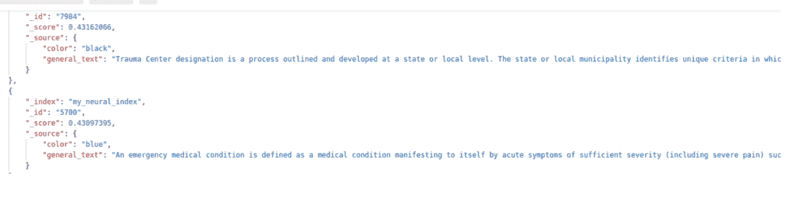

# OpenSearch 神经搜索插件教程

> 原文：<https://web.archive.org/web/sease.io/2022/12/opensearch-neural-search-plugin-tutorial.html>

## OpenSearch 神经搜索插件教程

嗨读者们！
在这篇博文中，我们将探索版本 **2.4.0** 中引入的新 **OpenSearch 神经搜索[插件](https://web.archive.org/web/20221226170401/https://opensearch.org/docs/latest/neural-search-plugin/index/)** ！


neural 插件是一个实验性的功能，允许用户在搜索中轻松集成机器学习和基于神经网络的语言模型。它管理语言模型，使用它们将文本转换成向量(在索引和查询时)，最后在检索阶段使用这些向量。


我们将通过我们的端到端测试经验给出该插件的详细描述，详细说明该插件的工作原理:


*   **模型管理和部署**:上传外部模型并监控其状态。
*   **索引文档**:使用该模型通过文本字段的数字向量表示来丰富文档。
*   **搜索**:使用模型执行神经查询。

然后，我们将强调使用它的优势、限制(或困难)(如果有的话),以及尚未提供的功能。

#### 管道

让我们从使用 OpenSearch 实现神经搜索的端到端管道的概述开始:


1.  下载 OpenSearch
2.  上传您的模型
3.  创建一个神经搜索管道
4.  创建包含向量字段的索引
5.  索引文档
6.  搜索(利用向量场)

流水线执行了两次，即在两个不同的操作系统上:


*   LTS Ubuntu 22 . 04 . 1
*   马科斯大苏尔 11.7

在复制整个管道时，我们没有观察到两个系统之间的特殊差异。

#### 1.下载 OpenSearch

你可以从[https://opensearch.org/downloads.html](https://web.archive.org/web/20221226170401/https://opensearch.org/downloads.html)下载 2.4.0 版本的 OpenSearch

唯一需要注意的是**环境**的正确设置，特别是*虚拟机* *(VM)* 如[https://open search . org/docs/latest/open search/install/important-settings/](https://web.archive.org/web/20221226170401/https://opensearch.org/docs/latest/opensearch/install/important-settings/)
中所述，因此:

*   *   Linux: ***`vm.max_map_count`*** 至少要设置成 *262144*
    *   MacOS: **RAM** 必须至少设置为 *4 GB* (在 Docker 资源中)


对于最新的 OpenSearch 版本，兼容的 Java 版本是 11 和 17。

正如[文档页面](https://web.archive.org/web/20221226170401/https://opensearch.org/downloads.html)所建议的，我们使用 **Docker Compose** 来尝试 OpenSearch。要执行它，您只需从文档中下载*[docker-compose . yml](https://web.archive.org/web/20221226170401/https://opensearch.org/samples/docker-compose.yml)*并运行:

```
docker-compose up
```

此过程将创建一个包含两个节点的集群。


对于本教程，我们使用 cURL 请求。API 调用需要认证，因此对于我们教程中的每个 cURL 操作，您都会发现头:

```
--header 'Authorization: Basic YWRtaW46YWRtaW4='
```

其中 *YWRtaW46YWRtaW4=* 是作为代表您的用户名和密码值的 Base64 编码字符串计算的授权令牌。对于 OpenSearch，默认验证值为*用户名=管理员*和*密码=管理员*。

否则，如果您想使用 OpenSearch Dashboards，默认的内置数据可视化工具，只需导航到 [http://localhost:5601/](https://web.archive.org/web/20221226170401/http://localhost:5601/) 并使用默认凭据登录。

#### 2.上传您的模型

一旦安装了 OpenSearch，要做的第一件事就是上传你想要用于你的神经搜索的模型。这是一个从文本中生成向量的函数。


为了做到这一点，OpenSearch 在 **ML-Commons 插件**中提供了一个名为**模型服务框架**的框架:[https://open search . org/docs/latest/ML-Commons-plugin/Model-Serving-Framework/](https://web.archive.org/web/20221226170401/https://opensearch.org/docs/latest/ml-commons-plugin/model-serving-framework/)
使用这个 [API](https://web.archive.org/web/20221226170401/https://opensearch.org/docs/latest/ml-commons-plugin/api/) 您可以:


1.  将外部模型上传到 OpenSearch
2.  将它加载到内存中
3.  使用模型进行推理
4.  卸载模型

除了模型推论，我们将使用所有这些特性。

即使上传外部模型很容易，但仍有一些限制:

*   仅支持没有 GPU 加速的文本嵌入**型号**。
    [https://open search . org/docs/latest/ml-commons-plugin/model-serving-framework/# model-support](https://web.archive.org/web/20221226170401/https://opensearch.org/docs/latest/ml-commons-plugin/model-serving-framework/#model-support)
    [https://github.com/opensearch-project/ml-commons/issues/302](https://web.archive.org/web/20221226170401/https://github.com/opensearch-project/ml-commons/issues/302)
*   仅支持 PyTorch 的 [**TorchScript**](https://web.archive.org/web/20221226170401/https://pytorch.org/docs/stable/jit.html) 格式。你要上传到 OpenSearch 的 TorchScript 文件需要保存为 **zip** 。
*   大小> =100 MB 的模型被拆分成块，以便存储在模型索引中。**注意型号**的尺寸，监控性能，避免停机。[https://open search . org/docs/latest/ml-commons-plugin/model-serving-framework/# model-support](https://web.archive.org/web/20221226170401/https://opensearch.org/docs/latest/ml-commons-plugin/model-serving-framework/#model-support)

##### 2.1 上传外部模型

对于本教程，我们[上传](https://web.archive.org/web/20221226170401/https://opensearch.org/docs/latest/ml-commons-plugin/model-serving-framework/#upload-model-to-opensearch)一个预先训练好的(并经过微调的)模型，名为**[all-MiniLM-L6-v2](https://web.archive.org/web/20221226170401/https://huggingface.co/sentence-transformers/all-MiniLM-L6-v2)**，这是一个自然语言处理(NLP)句子转换模型。
型号类型为 **BERT** ， *hidden_size* (所以 *`embedding_dimension`* )为 384，大致为 80MB。

我们使用“ *URL 上传操作*，它能够传递几个字段，比如模型的名称、版本和格式，包括 **URL** 来指定模型在外部的位置(比如 GitHub，在本例中，或者 S3 服务器)。

REQUEST

```
curl --location --request POST 
'https://localhost:9200/_plugins/_ml/models/_upload' \
--header 'Authorization: Basic YWRtaW46YWRtaW4=' \
--header 'Content-Type: application/json' \
--data-raw '{
  "name": "all-MiniLM-L6-v2",
  "version": "1.0.0",
  "description": "test model",
  "model_format": "TORCH_SCRIPT",
  "model_config": {
    "model_type": "bert",
    "embedding_dimension": 384,
    "framework_type": "sentence_transformers"
  },
  "url": "https://github.com/opensearch-project/ml-commons/raw/2.x/ml-
  algorithms/src/test/resources/org/opensearch/ml/engine/algorithms/text_embe
  dding/all-MiniLM-L6-v2_torchscript_sentence-transformer.zip?raw=true"
}'
```

RESPONSE

```
{
  "task_id": "MOSa24QBNFSZcaBDreDP",
  "status": "CREATED"
}
```

从响应中，保存 *`task_id`* 用于下一步。

##### 2.2 获取型号 id

要加载模型，需要*`model_id`*；从“ ***模型的上传操作 API*** ”的响应中保存 *`task_id`* ，并在接下来的步骤中使用它来获取 *`model_id`* :

REQUEST

```
curl --location --request GET 
'https://localhost:9200/_plugins/_ml/tasks/MOSa24QBNFSZcaBDreDP' \
--header 'Authorization: Basic YWRtaW46YWRtaW4='
```

RESPONSE

```
{
  "model_id": "loaded_neural_model_id",
  "task_type": "UPLOAD_MODEL",
  "function_name": "TEXT_EMBEDDING",
  "state": "COMPLETED",
  "worker_node": "aVrtho4BQhyDbA5QireffA",
  "create_time": 1670131658068,
  "last_update_time": 1670131682488,
  "is_async": true
}
```

*`model_id`* 是 OpenSearch 直接生成的 id，这里我们将使用 **loaded_neural_model_id** ，只是为了简单起见。

##### 2.3 负载模型

一旦得到了 *`model_id`* ，就可以传递给“ ***load API*** ”从模型索引中读取模型，加载到内存中使用；模型的一个实例保存在 ML 节点的缓存中。

REQUEST

```
curl --location --request POST 
'https://localhost:9200/_plugins/_ml/models/loaded_neural_model_id/_load' \
--header 'Authorization: Basic YWRtaW46YWRtaW4='
```

RESPONSE

```
{
  "task_id": "ROSg24QBNFSZcaBDJ-BT",
  "status": "CREATED"
}
```

从响应中，再次保存 *`task_id`* 并在下一步中使用，以检查模型的加载状态。


*注意:每次重新启动服务器时，都需要在内存中重新加载模型。*

###### 2.3.1 检查模型加载状态

使用这个 API 来检查加载任务的状态是否完成是很有用的，否则，模型就不能使用。

REQUEST

```
curl --location --request GET 
'https://localhost:9200/_plugins/_ml/tasks/ROSg24QBNFSZcaBDJ-BT' \
--header 'Authorization: Basic YWRtaW46YWRtaW4='
```

RESPONSE

```
{
  "model_id": "loaded_neural_model_id",
  "task_type": "LOAD_MODEL",
  "function_name": "TEXT_EMBEDDING",
  "state": "COMPLETED",
  "worker_node": "bLM0_iO0S8aCJZ1snb91sg,aVrtho4BQhyDbA5QireffA",
  "create_time": 1670132016977,
  "last_update_time": 1670132069239,
  "is_async": true
}
```

#### 3.创建一个神经搜索管道

在 neural 插件发布之前，为了执行利用矢量嵌入的搜索，有必要:

1.  在 OpenSearch 之外训练模型。
2.  使用自定义脚本从文档字段创建矢量嵌入。
3.  手动将嵌入内容上传到 OpenSearch。

多亏了神经插件，**现在可以从 OpenSearch** 中的文本自动创建向量，定义一个 [**神经搜索管道**](https://web.archive.org/web/20221226170401/https://opensearch.org/docs/2.4/neural-search-plugin/index/#ingest-data-with-neural-search) 。

管道由一系列在摄取过程中处理文档的处理器组成，允许将文档文本转换为矢量嵌入。
神经搜索支持的唯一处理器是 *text_embedding* ，在这里您可以使用 *field_maps* 参数来确定:

*   **输入字段名**:从哪些字段生成矢量嵌入。
*   **输出字段名**:存储字段矢量嵌入。


在这个管道创建示例中，我们将 *`general_text`* 定义为输入字段，从中获取文本以创建矢量嵌入，并将 *`general_text_vector`* 定义为输出字段，在其上存储它们。

REQUEST

```
curl --location --request PUT 
'https://localhost:9200/_ingest/pipeline/neural_pipeline' \
--header 'Authorization: Basic YWRtaW46YWRtaW4=' \
--header 'Content-Type: application/json' \
--data-raw '{
  "description": "An example neural search pipeline",
  "processors" : [
    {
      "text_embedding": {
        "model_id": "loaded_neural_model_id",
        "field_map": {
           "general_text": "general_text_vector"
        }
      }
    }
  ]
}'
```

RESPONSE

```
{
  "acknowledged": true
}
```

##### 3.1 多矢量场映射

如果您想为多个文本字段创建**矢量嵌入，您可以在 *`field_map`* 参数内的同一管道中定义所有矢量嵌入，如下所示。**

```
curl --location --request PUT 
'https://localhost:9200/_ingest/pipeline/neural_pipeline' \
--header 'Authorization: Basic YWRtaW46YWRtaW4=' \
--header 'Content-Type: application/json' \
--data-raw '{
  "description": "An example neural search pipeline",
  "processors" : [
    {
      "text_embedding": {
        "model_id": "loaded_neural_model_id",
        "field_map": {
           "general_text": "general_text_vector",
           "second_general_text": "second_general_text_vector"
        }
      }
    }
  ]
}'
```

#### 4.创建包含向量字段的索引

既然神经管道已经配置好了，我们需要将它与一个[索引](https://web.archive.org/web/20221226170401/https://opensearch.org/docs/2.4/neural-search-plugin/index/#ingest-data-with-neural-search)关联起来。这将是我们要添加向量场的索引。

创建索引时，我们需要定义一些参数:


*   *`index.knn`* **设置**必须设置为**真**。这将告诉 OpenSearch 我们将存储向量，并且我们希望对这些数据使用 k-NN 搜索。
*   **索引映射**必须包括 **k-NN 矢量场**以存储生成的嵌入。这些 *`knn_vector`* 字段需要具有与模型相匹配的维度。
    在我们的教程中，我们定义: *`general_text_vector`* 用于存储矢量嵌入， *`general_text`* 用于创建嵌入的源字段， *`color`* 用于显示过滤查询行为的附加字段。
*   **神经管道**必须关联。在我们的教程中，我们将`default_pipeline`定义为我们的神经管道。请注意，索引字段与管道映射中指定的字段对齐。

对于 *`general_text_vector`* 字段我们进一步定义:

*   **类型** : *knn_vector* 类型
*   **尺寸**:需要等于模型尺寸。在这种情况下 *384* 。
*   **方法**:近似 k-NN 搜索的层次邻近图方法。在这种情况下，*分层可导航小世界图(hnsw)。*
*   **引擎**:用于索引和搜索的近似 k-NN 库。在这种情况下，我们选择了 *lucene* 。


你可以在 OpenSearch [文档](https://web.archive.org/web/20221226170401/https://opensearch.org/docs/latest/search-plugins/knn/knn-index/#method-definitions)中找到更多的参数和选项。

REQUEST

```
curl --location --request PUT 'https://localhost:9200/my_neural_index' \
--header 'Authorization: Basic YWRtaW46YWRtaW4=' \
--header 'Content-Type: application/json' \
--data-raw '{
    "settings": {
        "index.knn": true,
        "default_pipeline": "neural_pipeline"
    },
    "mappings": {
        "properties": {
            "general_text_vector": {
                "type": "knn_vector",
                "dimension": 384,
                "method": {
                    "name": "hnsw",
                    "engine": "lucene"
                }
            },
            "general_text": { 
                "type": "text"            
            },
            "color": {
                "type": "text"
            }
        }
    }
}'
```

RESPONSE

```
{
  "acknowledged": true,
  "shards_acknowledged": true,
  "index": "my_neural_index"
}
```

#### 5.索引文档

我们现在准备索引我们的文档。

这一步照常进行，使用 OpenSearch 的[摄取 API](https://web.archive.org/web/20221226170401/https://opensearch.org/docs/latest/api-reference/ingest-apis/index/) 。在每个文档摄取之后，**由于与神经索引相关联的神经管道，嵌入向量将从定义的字段自动创建**。

对于本教程，我们采用了 MARCO 女士的一个语料库，这是一个用于深度学习的大规模信息检索数据集的集合。特别是，我们下载了文章检索集:【collection.tar.gz，并索引了大约 10k 篇文章。
正如在神经索引创建阶段提到的，我们还为每个包含颜色名称的文档添加了一个额外的字段。颜色名称是从值列表中随机分配的(绿色、白色、红色、黑色、黄色、蓝色、橙色和粉色)。

这是我们用来将几个文档(一次)推入我们的神经索引的 *[_bulk](https://web.archive.org/web/20221226170401/https://opensearch.org/docs/2.4/api-reference/document-apis/bulk/)* 请求:

REQUEST

```
curl --location --request POST 'https://localhost:9200/_bulk' \
--header 'Authorization: Basic YWRtaW46YWRtaW4=' \
--header 'Content-Type: application/json' \
--data-raw '{"create":{"_index":"my_neural_index", "_id":"0"}}
{"general_text":"The presence of communication amid scientific minds was
equally important to the success of the Manhattan Project as scientific
intellect was. The only cloud hanging over the impressive achievement of
the atomic researchers and engineers is what their success truly meant;
hundreds of thousands of innocent lives obliterated.","color":"red"}
{"create":{"_index":"my_neural_index", "_id":"1"}}
{"general_text":"The Manhattan Project and its atomic bomb helped bring an
end to World War II. Its legacy of peaceful uses of atomic energy continues
to have an impact on history and science.","color":"black"}
{"create":{"_index":"my_neural_index", "_id":"2"}}
{"general_text":"Essay on The Manhattan Project - ...'
```

RESPONSE

```
{
  "took": 87,
  "ingest_took": 238,
  "errors": false,
  "items": [{
    "create": {
      "_index": "my_neural_index",
      "_id": "0",
      "_version": 1,
      "result": "created",
      "_shards": {
        "total": 2,
        "successful": 2,
        "failed": 0
      },
      "_seq_no": 1,
      "_primary_term": 1,
      "status": 201
    }
  },{
  "create": {
    "_index": "my_neural_index",
    "_id": "1",
    ...
    ...
```

在这种情况下，我们在请求体中包含了索引名称，否则，只能在路径中指定一次:

```
curl --location --request POST 
'https://localhost:9200/my_neural_index/_bulk'
```

注意:在请求体的末尾，需要一个空行！

#### 6.利用向量场的搜索

多亏了这个插件，我们再也不用担心从外部生成查询向量并将其传递给 OpenSearch。
它提供了一个名为 [**的自定义查询类型，神经查询**](https://web.archive.org/web/20221226170401/https://opensearch.org/docs/2.4/neural-search-plugin/index/#ingest-data-with-neural-search) 会自动:


1.  使用语言模型从查询文本计算查询向量。
2.  将用户提供的查询转换成一个 [k-NN 向量查询](https://web.archive.org/web/20221226170401/https://opensearch.org/docs/latest/search-plugins/knn/index/)。

为了进行一些查询，我们从 Marco 女士那里下载了段落检索查询:[queries.tar.gz](https://web.archive.org/web/20221226170401/https://msmarco.blob.core.windows.net/msmarcoranking/queries.tar.gz)

##### 6.1 神经查询

这是一个神经查询的例子，是插件引入的。它使用用户提供的语言模型将文本查询转换成 k-NN 向量查询。

REQUEST

```
curl --location --request GET 
'https://localhost:9200/my_neural_index/_search' \
--header 'Authorization: Basic YWRtaW46YWRtaW4=' \
--header 'Content-Type: application/json' \
--data-raw '{
    "_source": [
        "general_text"
    ],
    "query": {
        "neural": {
            "general_text_vector": {
                "query_text": "what is a bank transit number",
                "model_id": "loaded_neural_model_id",
                "k": 3
            }
        }
    }
}'
```

在这种情况下，我们有:

**general_text_vector** =对
**query _ text**=(string)查询文本(来自*queries.tar.gz*)
**model _ id**=(string)语言模型的 ID，先前上传的
**k** = (int)从 k-NN 搜索返回的结果数。

RESPONSE

```
{
    "took": 105,
    "timed_out": false,
    "_shards": {
        "total": 1,
        "successful": 1,
        "skipped": 0,
        "failed": 0
    },
    "hits": {
        "total": {
            "value": 3,
            "relation": "eq"
        },
        "max_score": 0.44739452,
        "hits": [
            {
                "_index": "my_neural_index",
                "_id": "7686",
                "_score": 0.44739452,
                "_source": {
                  "general_text": "A. A federal tax identification number
                  (also known as an employer identification number or EIN), is a number
                  assigned solely to your business by the IRS. Your tax ID number is
                  used to identify your business to several federal agencies responsible
                  for the regulation of business."
                }
            },
            {
                "_index": "my_neural_index",
                "_id": "7691",
                "_score": 0.44169965,
                "_source": {
                  "general_text": "A. A federal tax identification number (also known as
                  an employer identification number or EIN), is a number assigned solely
                  to your business by the IRS."
                }
            },
            {
                "_index": "my_neural_index",
                "_id": "7692",
                "_score": 0.43761322,
                "_source": {
                  "general_text": "Lets start at the beginning. A tax ID number or
                  employer identification number (EIN) is a number you get from the U.S.
                  federal government that gives an identification number to a business,
                  much like a social security number does for a person."
                }
            }
        ]
    }
}
```

##### 6.2 过滤器+神经查询

让我们通过一个例子来看看在执行一个神经查询时如何管理过滤器。

假设执行前面示例中的神经查询，但是使用 *k* =8:

```
curl --location --request GET 
'https://localhost:9200/my_neural_index/_search' \
--header 'Authorization: Basic YWRtaW46YWRtaW4=' \
--header 'Content-Type: application/json' \
--data-raw '{
    "query": {
        "neural": {
            "general_text_vector": {
                "query_text": "what is a bank transit number",
                "model_id": "loaded_neural_model_id",
                "k": 8
            }
        }
    }
}'
```

在这种情况下，响应包含具有以下颜色的八个文档(按顺序排列):

1.  红色
2.  红色
3.  怀特（姓氏）
4.  柑橘
5.  蓝色
6.  格林（姓氏）；绿色的
7.  怀特（姓氏）
8.  怀特（姓氏）

现在假设使用过滤器和神经查询进行组合查询:

```
curl --location --request GET 
'https://localhost:9200/my_neural_index/_search' \
--header 'Authorization: Basic YWRtaW46YWRtaW4=' \
--header 'Content-Type: application/json' \
--data-raw '{
    "query": {
        "bool": {
            "filter": {
                "term": {
                    "color": "white"
                }
            },
            "must": {
                "neural": {
                    "general_text_vector": {
                        "query_text": "what is a bank transit number",
                        "model_id": "loaded_neural_model_id",
                        "k": 3
                    }
                }
            }
        }
    }
}'
```

该查询的目的是为查询“*什么是银行转帐号”*获得最佳的三个文档。

在响应中，我们获得了一个带有单个“白色”文档的 1 次命中。
**如果我们设置 *k* =3，为什么我们只获得一个文档？**
这是因为 OpenSearch 对这个查询执行了一个**后置过滤**。

通过改变 *k* 值，我们可以很容易地看到这一点:

*   k=3，我们有一个命中
*   k=6 我们有一个命中
*   k=7 我们有两个命中
*   k=8 我们有三个命中

当设置 *k* =3 时，OpenSearch 首先执行获取 3 个文档的神经查询:红色、红色和**白色**，然后通过颜色过滤它们，只保留白色的一个。
对于 *k* =6 也是如此，我们得到:红色、红色、**白色**、橙色、蓝色和绿色，只有一个白色文档。
然后对于 *k* =7 我们得到:红色，红色，**白色**，橙色，蓝色，绿色，**白色**，总共 2 次命中。


即使在 k-NN 搜索插件中也有预过滤功能，但在 neural 插件中还没有。
事实上，如果您试图在神经查询中添加一个[过滤器参数](https://web.archive.org/web/20221226170401/https://opensearch.org/docs/2.4/search-plugins/knn/filter-search-knn/#step-3-search-your-data-with-a-filter)，例如针对 k-NN 的查询，您会得到以下错误:

```
{
  "error": {
    "root_cause": [
      {
        "type": "parsing_exception",
        "reason": "[neural] unknown token [START_OBJECT] after [filter]",
        "line": 12,
        "col": 27
      }
    ],
    "type": "parsing_exception",
    "reason": "[neural] unknown token [START_OBJECT] after [filter]",
    "line": 12,
    "col": 27
  },
  "status": 400
}
```

这是因为神经查询中目前没有*过滤器* [参数支持](https://web.archive.org/web/20221226170401/https://opensearch.org/docs/2.4/neural-search-plugin/index/#neural-request-fields)，只有: *vector_field* ， *query_text* ， *model_id* ， *k* 。

##### 6.3 神经结果示例

以下是通过运行从 MS MARCO passage 排名数据集中提取的一些神经查询得到的一些神经结果示例。为了简单起见，我们只返回了 *`general_text`* 字段，而不是 *knn_vector* 字段。


**query_text** :“定义极限”


**query_text** :“定义激烈”


**query_text** :“定义医学领域的极端”



从结果中可以看出，由于使用了语言模型，返回的文档与执行的查询非常接近，神经搜索似乎可以处理“同义词”和类似的上下文。

## 摘要

新的 OpenSearch Neural 插件将神经搜索向前推进了一步，使操纵语言模型、创建文本嵌入和执行 k-NN 查询变得更加容易。仍然有一些工作可以做，以使文档不那么分散，但它写得很好，并且该工具很有价值并且易于使用。

在我们的实验中，模型加载时间和索引时间是可以接受的，但是应该进行深入的研究来分析插件的性能。

如果将来还能集成预过滤和高亮显示功能，那就太好了，因为目前它们还不可用。仅允许后置过滤。

// REFERENCES

神经插件库:[https://github.com/opensearch-project/neural-search](https://web.archive.org/web/20221226170401/https://github.com/opensearch-project/neural-search)
神经插件 Git issue:[https://github . com/open search-project/Neural-search/issues/11](https://web.archive.org/web/20221226170401/https://github.com/opensearch-project/neural-search/issues/11)
神经插件文档:[https://open search . org/docs/latest/Neural-search-plugin/index/](https://web.archive.org/web/20221226170401/https://opensearch.org/docs/latest/neural-search-plugin/index/)
k-NN 插件库:[https://github.com/opensearch-project/k-NN](https://web.archive.org/web/20221226170401/https://github.com/opensearch-project/k-NN)
k-NN 插件文档:[https://open search . org/k](https://web.archive.org/web/20221226170401/https://opensearch.org/docs/latest/search-plugins/knn/index/)

// our service

## 无耻的为我们服务！

我提到过我们提供 OpenSearch 技术的咨询吗？如果你想让你的搜索引擎更上一层楼，请联系我们！

// STAY ALWAYS UP TO DATE

## 订阅我们的时事通讯

你喜欢这个关于 OpenSearch 神经搜索插件教程的帖子吗？不要忘记订阅我们的时事通讯，以保持对信息检索世界的不断更新！