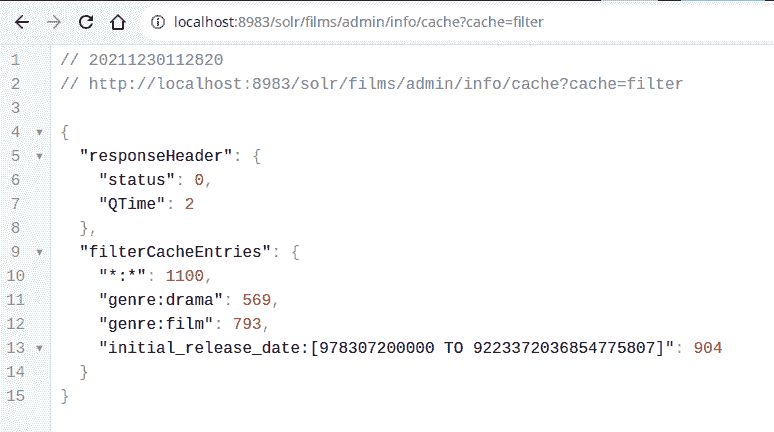

# Apache Solr 中的 QueryResultCache 和 FilterCache

> 原文：<https://web.archive.org/web/sease.io/2022/04/queryresultcache-and-filtercache-in-apache-solr.html>

这篇博客旨在解释在 Apache Solr 8.11.0 的基本查询处理过程中如何使用 QueryResultCache 和 FilterCache。这篇博客并没有解释在执行更高级的组件(比如 faceting)时如何使用这些缓存。

Solr 缓存与索引搜索器的特定实例相关联。默认情况下，缓存中的元素不会在一段时间后过期，相反，它们在索引搜索器的生命周期内保持有效。基于时间的过期可以通过使用 **maxIdleTime** 选项来启用。该属性以秒为单位，默认值为 0，表示没有条目会因超过空闲时间而被自动收回。

在 Solr 中，可以使用以下缓存实现: **CaffeineCache** 、 **LRUCache** 、 **FastLRUCache、**和 **LFUCache** 。建议使用 CaffeineCache ,因为它通常提供更低的内存占用、更高的命中率和更好的多线程性能，所有其他缓存都在弃用之列，它们将在 Solr 9.0 中被移除。

Solr Admin UI 中的 Statistics 页面显示了所有活动缓存的性能信息。

如果我们想获得关于缓存的键的更多细节，从 2021 年 12 月起，一个新的开源工具就可以使用了。Shawn Heisey 实现了 cacheviewphandler[【1】](https://web.archive.org/web/20220930005708/https://github.com/elyograg/cacheviewhandler)，它提供了一个 rest 端点来查看有哪些键以及为每个键缓存的文档数量。



我们现在关注 Solr 搜索器如何使用 **queryResultCache** 和 **filterCache** 的细节。

## QueryResultCache

Solr 文档[【2】](https://web.archive.org/web/20220930005708/https://solr.apache.org/guide/8_11/query-settings-in-solrconfig.html#queryresultcache)

queryResultCache 保存以前搜索的结果，这是提交新查询时涉及的第一个缓存。

缓存存储了作为先前提交的查询结果返回的 Lucene 文档 id 的有序列表。每个条目都与查询参数 q (query)、fq (filterQuery)、sort 和 minExactCount 相关联。因此，每当您提交一个查询，其中至少有一个参数发生了变化，您将会得到一个缓存未命中，查询将被执行，一个新的条目将被缓存。

让我们看看在一些例子中会发生什么:

###### Lucene 查询解析器

SOLR_URL/solr/films/select？q = name:bend & FQ =-类型:电影&sort=name asc

关键是

```
{
    query: "name:bend",
    filterQuery: "-genre:film",
    sort: "name asc",
    minExactCount: Integer.MAX_VALUE
}
```

请注意，过滤器查询保持原样:否定查询将保留否定含义。我们将看到关于 filterCache 的不同行为。

###### Dismax 查询解析器

SOLR_URL/solr/films/select？defType = dismax & fq =流派:电影& q =戏剧弯曲& qf =流派名称

关键是

```
{
    query: "+((genre:drama | name:drama) (genre:bend | name:bend))",
    filterQuery: "genre:film",
    sort: null,
    minExactCount: Integer.MAX_VALUE
}
```

## FilterCache

Solr 文档[【2】](https://web.archive.org/web/20220930005708/https://solr.apache.org/guide/8_11/query-settings-in-solrconfig.html#filtercache)

filterCache 用于存储一个无序集，其中包含每个 **fq** 搜索参数的结果，在某些情况下，还包含 **q** 参数。

这个缓存总是使用正逻辑，所以如果查询包含参数`&fq=-field:value`，缓存的查询将是`&fq=field:value`。例如，如果我想获得集合中所有的电影，不包括类型为“戏剧”的电影，我将提交查询`q=*:*&fq=-genre:drama`。filterCache 将用关键字`genre:drama`和与之关联的文档集填充。

默认情况下，filterCache 仅用于保存每个 **fq** 参数的结果(如果需要，转换为正查询)。无论如何，如果满足以下两个条件，Solr 搜索器也使用 filterCache 来存储 **q** 参数的结果:

*   *   在`solrconfig.xml`文件中参数`useFilterForSortedQuery`被设置为真
    *   查询排序子句不包括分数(如果未定义排序子句，默认情况下，结果按分数排序，因此排序确实隐式包括分数，并且不满足此条件)

让我们执行一些示例查询，并通过使用上面描述的 cacheviewphandler[【3】](https://web.archive.org/web/20220930005708/https://github.com/elyograg/cacheviewhandler)来验证缓存的内容。注意 Solr 在每个例子之前已经被重新启动，以避免缓存被污染。

###### 正 FQ 子句:只缓存 FQ 条件的结果

我们希望所有电影的名字包含单词“弯曲”，我们过滤所有的结果有“戏剧”类型。正如所料，filterCache 仅用于存储过滤器“流派:戏剧”的结果

| **查询** | **useFilterForSortedQuery** |
| ？q =名称:弯曲& fq =类型:戏剧 | 错误的 |

【T8

/solr/films/admin/info/cache？缓存=过滤器

```
 "filterCacheEntries": {
    "genre:drama": 569
  }
```

###### 负 FQ 条款:FQ 条件转化为正

与我们之前看到的示例相同，但是在这种情况下，我们将对筛选查询使用否定条件。因为所有的过滤器都是否定的，所以 fq 子句在`fq=*:*-genre:drama`中被自动转换。搜索器分别执行两个查询:`*:*`和`genre:drama`。最终结果是第一个查询返回的文档列表，而不是第二个查询返回的文档列表。在这个例子中，filterCache 存储了`*:*`和`genre:drama`查询的结果。

注意，如前所述，负数条目被转换为正数

| **查询** | **useFilterForSortedQuery** |
| ？q = name:bend & FQ =-流派:戏剧 | 错误的 |

/solr/films/admin/info/cache？缓存=过滤器

```
 "filterCacheEntries": {
    "*:*": 1100,
    "genre:drama": 569
  }
```

###### 指定了排序子句:Q 结果被缓存

在本例中，我们将参数**useFilterForSortedQuery**设置为 true，并按名称对所有结果进行排序。在查询阶段，拥有一个未排序的文档列表是非常好的，因为 Solr 必须按名称对所有文档进行重新排序。这是一个完美的例子，Solr 搜索器将使用 filterCache 来存储 q 子句。事实上，当我们检查缓存的内容时，我们会立即注意到键“name:bend”的存在。

| **查询** | **useFilterForSortedQuery** |
| ？q = name:bend & FQ =流派:剧情&sort=name asc | 真实的 |

/solr/films/admin/info/cache？缓存=过滤器

```
 "filterCacheEntries": {
    "genre:drama": 569,
    "name:bend": 3
  }
```

###### 未指定排序子句:没有缓存 Q 结果

这是之前看到的同一个例子，但是我们删除了排序。尽管参数**useFilterForSortedQuery**为真，但 filterCache 不会用于 **q** 子句，因为结果是按分数隐式排序的。在这种情况下，Solr 搜索器的行为与我们在第一个例子中看到的完全一样

| **查询** | **useFilterForSortedQuery** |
| ？q =名称:弯曲& fq =类型:戏剧 | 真实的 |

filterCache 内容

```
 "filterCacheEntries": {
    "genre:drama": 569
  }
```

###### 合成条件

在我们之前看到的所有例子中，我们对每个查询使用了一个 fq 条件。如果我们想要更多的过滤器，我们可以添加多个 fq 子句，最终的查询过滤器将是所有 fq 条件的拦截。查询`&fq=condition1&fq=condition2`提供了与`fq=condition1 AND condition2`相同的结果。如果我们想要得到多个条件的并集，我们使用语法:`fq=condition1 OR condition2`。

T37

现在让我们看看当我们提交这些带有组合条件的查询时，过滤器缓存中会发生什么。

| **查询** |   |   |
| ？q = **:**&FQ =流派:剧情&FQ =导演 _ 编导:罗素 |   |   |

filterCache 内容

```
 "filterCacheEntries": {
    "directed_by:russell": 2,
    "genre:drama": 569
  }
```

执行这个查询，solr 独立计算每个 fq 子句，并将每个结果存储在缓存中；然后它计算截距。使用上面列出的其他语法，存储在缓存中的结果将是所有条件的最终截取结果。

| **查询** |   |   |
| ？q = **:**&FQ =类型:戏剧和导演 _ 作者:罗素 |   |   |

filterCache 内容

```
 "filterCacheEntries": {
    "+genre:drama +directed_by:russell": 2
  }
```

使用多个 fq 子句，我们将以更高的粒度将数据存储在过滤器缓存中，因此我们在未来的搜索中更有可能命中缓存。如果用户提交相同的查询，filterCache 将不会命中，并且必须为每个查询计算所有条件的截取。另一方面，使用由 AND/OR 多个条件组成的单个 fq 子句，只有当未来的查询包含完全相同的 fq 子句时，我们才会命中缓存。

| **查询** |   |   |
| ？q = **:**&FQ =滤镜(流派:戏剧)或滤镜(导演 _ 作者:罗素) |   |   |

filterCache 内容

```
 "filterCacheEntries": {
    "directed_by:russell": 2,
    "filter(genre:drama) filter(directed_by:russell)": 569,
    "genre:drama": 569
  }
```

关键字`filter()`用于告诉 Solr 使用 filterCache，即使是在组合的 fq 子句中存储单个条件的结果。如果未来的查询将包含相同的 fq 组合条件或单个条件，这允许我们能够命中缓存。

// our service

## 不要脸的塞给我们培训和服务！

我提到过我们做 [Apache Solr 初学者](https://web.archive.org/web/20220930005708/https://sease.io/training/apache-solr-training)和 [Elasticsearch 初学者](https://web.archive.org/web/20220930005708/https://sease.io/training/elasticsearch-trainings/elasticsearch-beginner-training)培训吗？
我们还提供关于这些主题的咨询，[如果您想让您的搜索引擎更上一层楼，请联系](https://web.archive.org/web/20220930005708/https://sease.io/contacts)！

// STAY ALWAYS UP TO DATE

## 订阅我们的时事通讯

你喜欢这篇关于 Apache Solr 中的 QueryResultCache 和 FilterCache 的帖子吗？不要忘记订阅我们的时事通讯，以便随时了解信息检索世界的最新动态！