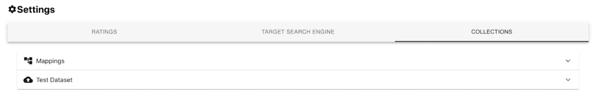
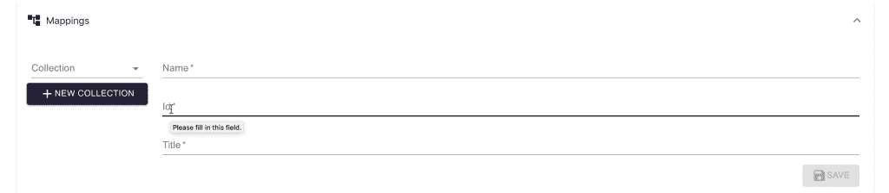
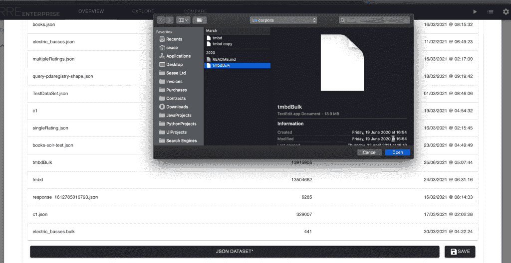

# RRE 企业:如何管理您的数据收集

> 原文：<https://web.archive.org/web/sease.io/2022/06/rre-enterprise-how-to-manage-your-data-collections.html>

一旦配置了[黄金真理](https://web.archive.org/web/20221203000538/https://sease.io/2021/12/rre-enterprise-how-to-manage-your-ratings.htm)和[目标搜索引擎](https://web.archive.org/web/20221203000538/https://sease.io/2021/12/rre-enterprise-how-to-set-up-your-target-search-engine.htm)，现在是时候定义数据集合了。
RRE 企业中的每个数据集合都链接到一个**弹性搜索索引**或 **Apache Solr 集合**。
它对一组共享相同数据模型和结构的数据进行建模。

## 映射

**Elasticsearch** 和 **Solr** 中的一个文档被表示为一个映射**字段名** - > **值**，可能包含几十个字段。
为了简化 RRE 企业搜索结果列表的浏览和调试，可以定义感兴趣字段的子集。

Currently, it’s supported to define:
– a unique identifier field for the collection
– the field containing a descriptive title
…and you are good to go.
The name of the collection must be associated with the mapping so that it can be retrieved at evaluation time.

## 测试数据集

如果你在一个嵌入式搜索引擎实例上处理一个集合，当你在评估时启动它们时，有必要将一些数据推送到 **Elasticsearch** 或 **Solr** 。

具体来说，您需要向 **RRE 企业**提供准备黄金真理评级集时使用的相同数据。
**用于嵌入式评估**的每个评级集**恰好与一个测试数据集**相关联。

上传测试数据集非常简单:

**注意**如果你正在评估一个外部搜索引擎，你不需要担心 RRE 企业版的测试数据集。但是你需要格外小心，确保运行评估时其中的数据与评级一致。

我们现在准备运行我们的第一个评估！

请继续关注我们的下一篇博文！

[https://web.archive.org/web/20221203000538if_/https://www.youtube.com/embed/32a6D3p2Yyc](https://web.archive.org/web/20221203000538if_/https://www.youtube.com/embed/32a6D3p2Yyc)

// BEGIN YOUR JOURNEY INTO THE SEARCH QUALITY EVALUATION

## 评级评估企业

[Discover more and download](https://web.archive.org/web/20221203000538/https://sease.io/rated-ranking-evaluator-enterprise)// STAY ALWAYS UP TO DATE

## 订阅我们的时事通讯

你喜欢这篇关于 Drop constant features:一个现实世界的学习排名场景的帖子吗？不要忘记订阅我们的时事通讯，以便随时了解信息检索世界的最新动态！