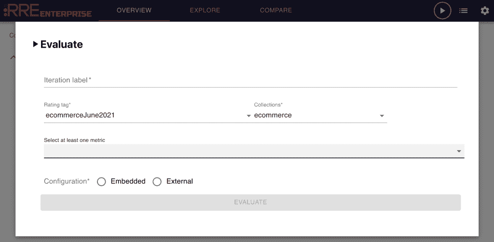
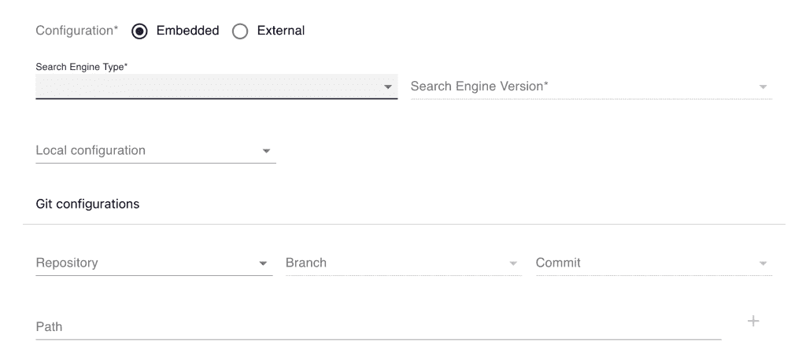
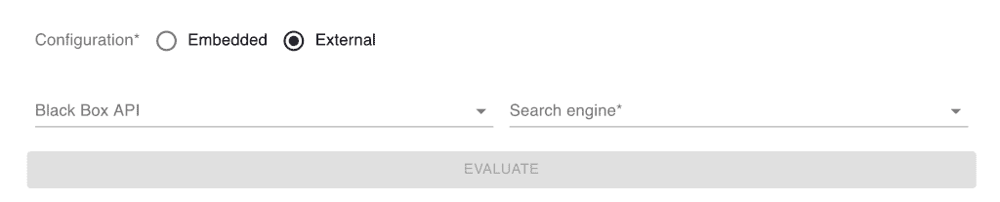
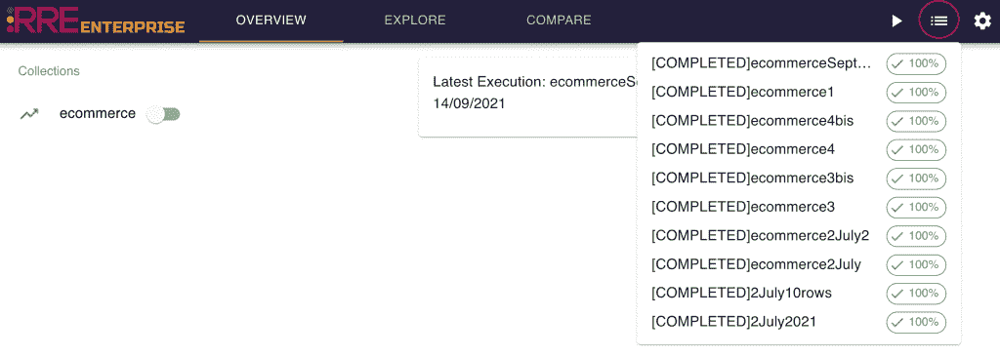

# RRE 企业:如何进行评估

> 原文：<https://web.archive.org/web/sease.io/2022/07/rre-enterprise-how-to-run-an-evaluation.html>

在配置了所有必要的构建模块(评级集、目标搜索引擎和数据收集)之后，现在是时候讨论运行您的第一个评估了。

让我们看看要传递的运行时参数:

*You open the Evaluation interface clicking on the ‘play’ button on the right end side of the top bar*

*   `**iteration label**`:与该评估相关联的人类可读标签

，这可能包含有助于您识别此评估的任何有用信息

*   `**Rating tag**` : 评估中使用的等级集。您可以从已保存的所有等级集中进行选择。

*   `**Collections**`:<select>要在评估中使用的数据集合注意:您只能选择您已选择的评级集中可用的集合。 Metrics :</select> 评估中要计算的评估指标。

RRE 企业支持 RRE 开源软件中的所有可用指标:

*   **[精度](https://web.archive.org/web/20221202222200/https://en.wikipedia.org/wiki/Precision_and_recall)** :检索到的文档中相关的部分
*   **[检索](https://web.archive.org/web/20221202222200/https://en.wikipedia.org/wiki/Precision_and_recall)** :检索到的相关文档的分数
*   **倒数排名**:是第一个“正确”答案排名的乘法倒数:第一名 1，第二名 1/2，第三名 1/3，以此类推。
*   **[【ERR】](https://web.archive.org/web/20221202222200/https://dl.acm.org/doi/abs/10.1145/1645953.1646033)**:具有分级相关性的倒数排名的扩展，测量用户查找相关文档将花费的预期倒数时间长度。
*   **[平均精度](https://web.archive.org/web/20221202222200/https://en.wikipedia.org/wiki/Evaluation_measures_(information_retrieval)#Average_precision)** :精度-召回曲线划定的区域。
*   **[【NDCG】](https://web.archive.org/web/20221202222200/https://en.wikipedia.org/wiki/Discounted_cumulative_gain)**:一种评估指标，考虑了搜索结果的分级相关性和位置的影响
*   **[F-Measure](https://web.archive.org/web/20221202222200/https://en.wikipedia.org/wiki/F-score)** :衡量用户对回忆的重视程度是对精度的重视程度的β倍时，检索的有效性。RRE 提供了三个最流行的 F-Measure 实例:F0.5、F1 和 F2；此外，如果需要，您可以指定自己的β值(参见下面的[)。](https://web.archive.org/web/20221202222200/https://github.com/SeaseLtd/rated-ranking-evaluator/wiki/Evaluation-Measures#controlling-evaluation)

一些受支持的指标提供了额外的参数:

*   **F 值测量**
    *   K–该指标基于搜索响应的前 K 个结果进行计算
    *   `beta`–精确度和召回率之间的平衡因素。
*   **NDCG@K**
    *   `k`–该指标基于搜索响应的前 K 个结果进行计算
    *   `maximumGrade`–判断文档时可用的最高关联度(可选，默认为 4.0)。
    *   `missingGrade`–在没有给出判断的情况下，应该分配给文件的等级。这是可选的–默认值是`maximumGrade / 2`(如果已经提供`maximumGrade`)或 2.0。
    *   `name`–用于在输出中记录该指标的名称(可选，默认为`NDCG@k`，其中`k`的设置如上)。例如，这允许使用不同的缺失等级值多次运行该指标。
*   **ERR @ K**–预期倒数排名
    *   `k`-根据搜索响应的前 K 个结果计算指标
    *   `maximumGrade`–判断文档时可用的最大关联度(可选，默认为 3.0)。
    *   `missingGrade`–在未给出判断的情况下，应分配给文件的等级。这是可选的–默认值是`maximumGrade / 2`(如果已经提供了`maximumGrade`)或 2.0。
    *   `name`–用于在输出中记录该指标的名称(可选，默认为`ERR@k`，其中`k`如上设置)。例如，这允许使用不同的缺失等级值多次运行该指标。
*   **RR @ K**–倒数排名
    *   `k`–该指标基于搜索响应的前 K 个结果进行计算
    *   `maximumGrade`–判断文档时可用的最大关联度(可选，默认为 3.0)。
    *   `missingGrade`–在未给出判断的情况下，应分配给文件的等级。这是可选的——默认值为`maximumGrade / 2`(如果提供了`maximumGrade`)或 2.0。
    *   `name`–用于在输出中记录该指标的名称(可选，默认为`RR@k`，其中`k`如上设置)。例如，这允许使用不同的缺失等级值多次运行该指标。

`maximumGrade`和`missingGrade`都可以是浮点值。

一旦选择了感兴趣的指标，就可以指定目标搜索引擎方法:嵌入式/外部:

## 嵌入式目标搜索引擎

*   `**Search Engine Type**` : <select>为你的搜索引擎提供动力的技术(Elasticsearch 或 Apache Solr)</select>

*   `**Search Engine Version**` : <select>支持的搜索引擎版本列表</select>

*   `**Local configuration**` : <select>启动嵌入式搜索引擎时使用的搜索引擎配置。</select>

*   `**Git configuration**` : <select>启动嵌入式搜索引擎时使用的搜索引擎配置</select>

，从 Git 存储库、分支和提交点获取。该路径用于定位 Git 存储库中的配置。

## 外部目标搜索引擎

*   `**Black Box API**` : <select>保存的 API 端点中的目标黑盒</select>

*   `**Search Engine**` : <select>与所选黑盒 API 关联的</select>**elastic search**<select>或</select> **Apache Solr** <select>端点，在保存的端点中</select>

填写完毕后，您可以按“评估”按钮开始评估。

您可以通过检查作业列表跟踪来跟踪评估执行情况。

Clicking on each evaluation you can see the details:

These details also include failures and details on why an execution failed (potentially wrong setting, unreachable hosts, configuration errors…)

在下一篇博文中，让我们看看如何显示和导航评估结果！

// BEGIN YOUR JOURNEY INTO THE SEARCH QUALITY EVALUATION

## 评级评估企业

[DISCOVER MORE AND DOWNLOAD](https://web.archive.org/web/20221202222200/https://sease.io/rated-ranking-evaluator-enterprise)// STAY ALWAYS UP TO DATE

## 订阅我们的时事通讯

你喜欢这篇关于 Drop constant features:一个现实世界的学习排名场景的帖子吗？不要忘记订阅我们的时事通讯，以便随时了解信息检索世界的最新动态！