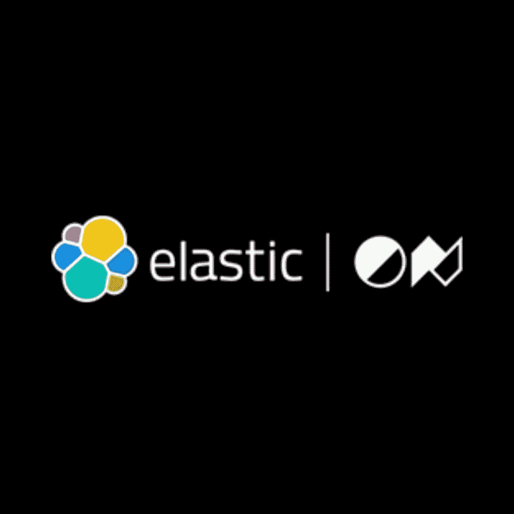

# ElasticON 2023 赛季

> 原文：<https://web.archive.org/web/sease.io/2023/02/sease-at-elasticon-2023.html>

## 弹性图标

ElasticON Global 是一个免费的活动，它将来自世界各地的开发者和思想领袖团结在一起。通过弹性专家、合作伙伴和客户会议，体验全球弹性社区的力量。了解如何通过弹性解决方案和弹性堆栈将搜索的力量引入您的企业搜索、可观察性和安全性用例。

地点: [**在线**](https://web.archive.org/web/20230320000122/https://www.elasticon.com/event/e4d4b4ed-77a7-48d2-b711-74fea8341273/summary)
日期:**三月七日**

// our talk

## 如何用 Kibana 实现你的在线搜索质量评估

7th March | 7:30 - 7:50 PM (PT)

在线测试仍然是证明你的排名模型在现实世界中表现如何的最佳方式。它确认了离线测试的估计，给出了对模型行为的更好的理解，并建立了一个坚实的基础来学习改进它。如今，可用的评估工具在使用数据和指标方面有一些限制；在这次演讲中，我们将描述一种通过使用 Kibana 评估排名模型的替代和定制方法。我们将深入我们的 Kibana 实现，探索它提供的工具，并向您展示如何创建可视化和仪表板来比较不同的模型。我们将通过具体情况的实际例子(基于数据过滤)来分享查询和代码。

[More details](https://web.archive.org/web/20230320000122/https://www.elasticon.com/event/e4d4b4ed-77a7-48d2-b711-74fea8341273/websitePage:68f6fbfb-c357-484c-a070-afd26ebc8d9d)// slides

[https://web.archive.org/web/20230320000122if_/https://www.slideshare.net/slideshow/embed_code/key/28JV9yw8tIzq3q?hostedIn=slideshare&page=upload](https://web.archive.org/web/20230320000122if_/https://www.slideshare.net/slideshow/embed_code/key/28JV9yw8tIzq3q?hostedIn=slideshare&page=upload)

// our speakers *#### [Ilaria Petreti](https://web.archive.org/web/20230320000122/https://sease.io/ilaria-petreti)

R&D; SOFTWARE ENGINEER
MACHINE LEARNING EXPERT** *#### 安娜·鲁杰罗

R&D; SOFTWARE ENGINEER
SEARCH CONSULTANT****// video

[https://web.archive.org/web/20230320000122if_/https://www.youtube.com/embed/DZTaiESWl5o](https://web.archive.org/web/20230320000122if_/https://www.youtube.com/embed/DZTaiESWl5o)**