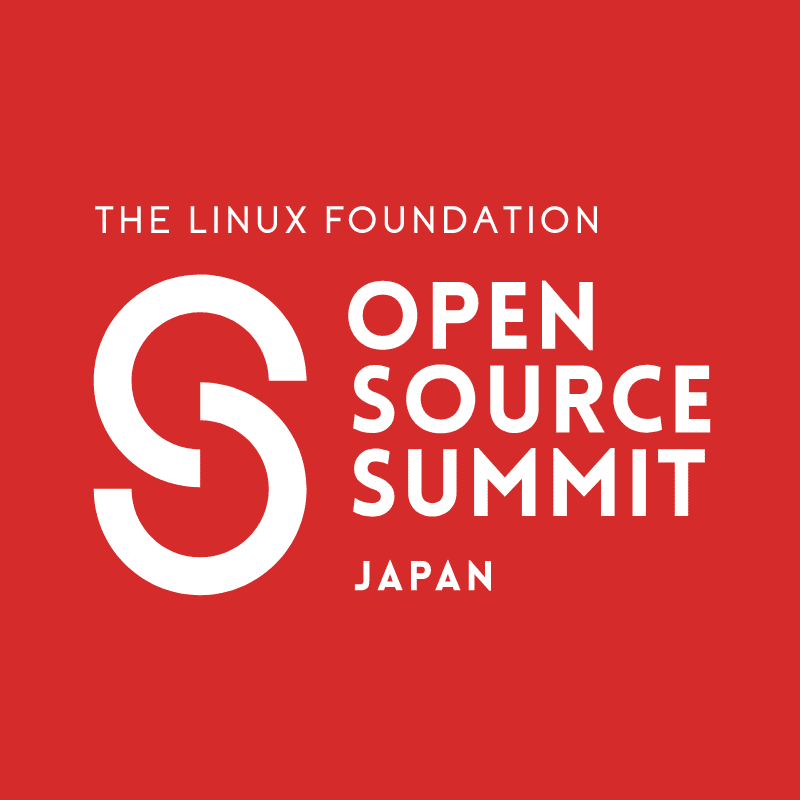

# 在 2022 年日本开源峰会上

> 原文：<https://web.archive.org/web/sease.io/2022/11/sease-at-open-source-summit-2022.html>

## 日本 2022 开源峰会

日本开源峰会是日本连接开源生态系统的领先会议，为技术专家和开源行业领导者提供了一个论坛，以合作和共享信息，了解开源技术的最新进展，并了解如何通过使用创新的开放解决方案获得竞争优势。

地点:**日本横滨+虚拟**
日期:【2022 年 12 月 5-6 日

// our talk

## Apache Solr 9.1 对神经搜索的改进:近似最近邻和预过滤

6th December - 11:10 AM (GMT+9)

神经搜索是一种人工智能技术，它允许搜索引擎返回与用户信息需求相关的文档，而不必包含输入的查询术语；它通过深度神经网络和数值向量表示来学习术语和句子的相似度。这解决了词汇不匹配问题，这是许多搜索引擎的一个限制，搜索结果必须包含用户在搜索框中键入的关键字才能被检索到。例如，查询“leopard”不会检索只包含术语“Panthera pardus”的文档。本次演讲的重点是描述 Apache Solr 神经搜索模块，介绍 Apache Solr 9.1 中的新改进:–索引时间和内存改进，以构建 HNSW 图形数据结构–预过滤功能，可在精确和近似最近邻搜索之间动态切换–深度学习集成(如 BERT)加入我们，探索这一令人兴奋的 Apache Solr 新功能，并了解如何使用它来改进您的搜索！这将是这个主题第一次在亚洲出现，这次演讲与之前的演讲有很大的不同，因为它第一次展示了 Apache Solr 9.1 的新发展。

// slides

[https://web.archive.org/web/20230127150437if_/https://www.slideshare.net/slideshow/embed_code/key/28JV9yw8tIzq3q?hostedIn=slideshare&page=upload](https://web.archive.org/web/20230127150437if_/https://www.slideshare.net/slideshow/embed_code/key/28JV9yw8tIzq3q?hostedIn=slideshare&page=upload)

// our speaker** **#### 亚历山德罗·贝内代蒂

Director @ Sease
APACHE LUCENE/SOLR COMMITTER
APACHE SOLR PMC MEMBER****// video

[https://web.archive.org/web/20230127150437if_/https://www.youtube.com/embed/z-i8mOHAhlU?controls=0](https://web.archive.org/web/20230127150437if_/https://www.youtube.com/embed/z-i8mOHAhlU?controls=0)**