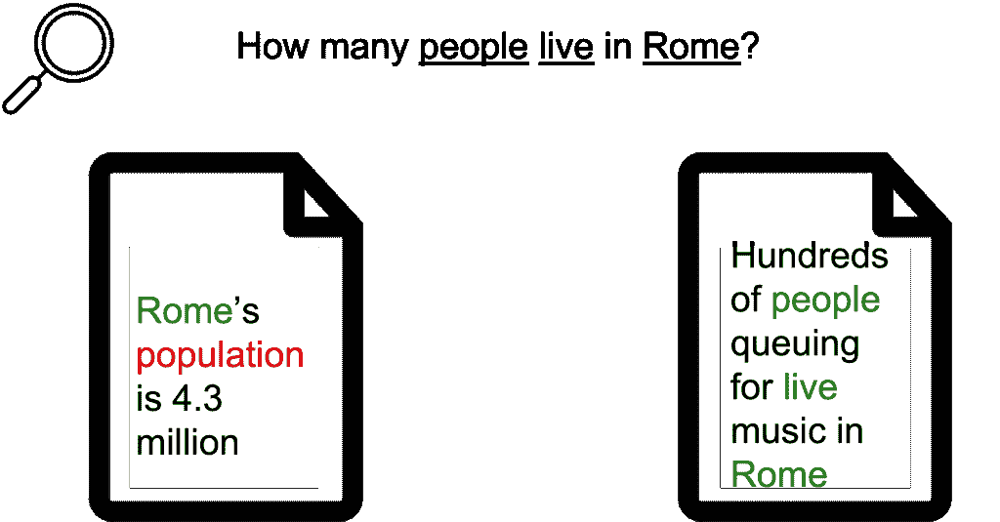
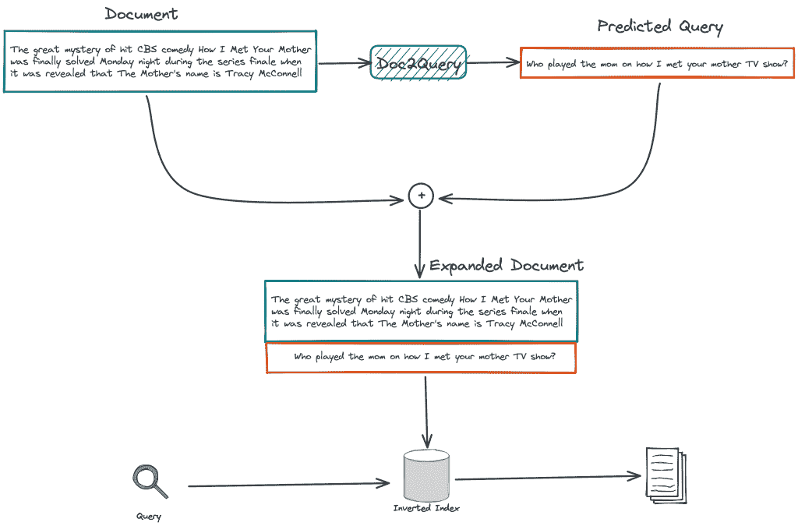
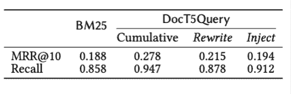
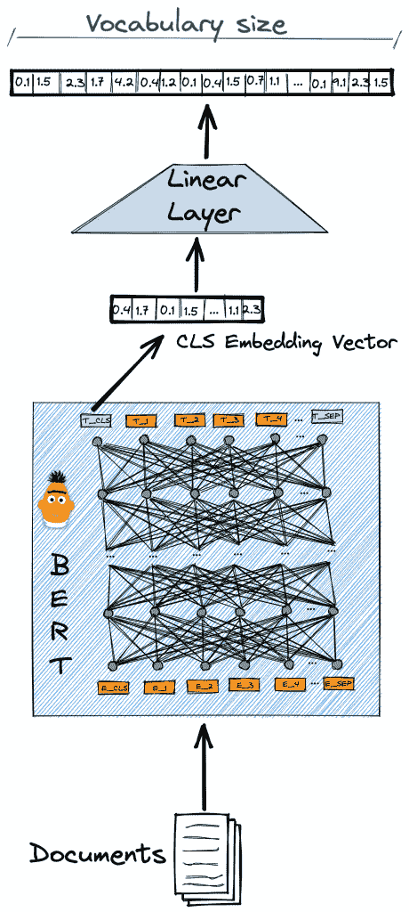

# 用文档扩展解决词汇不匹配问题

> 原文：<https://web.archive.org/web/sease.io/2022/01/tackling-vocabulary-mismatch-with-document-expansion.html>

在本系列的上一篇博文中，我们看到了如何使用 [BERT 通过执行文档重新排序来提高搜索相关性](https://web.archive.org/web/20221209184622/https://sease.io/2021/12/using-bert-to-improve-search-relevance.html)。这种方法的假设是，需要重新排序的文档集，也称为候选，包含与查询相关的最大数量的文档。我们说检索候选项是面向回忆的任务，因为由复杂的基于神经的方法驱动的下一步是负责从最高到最低相关性排序列表的步骤。

T3

传统的基于倒排索引的方法仍然广泛用于生产系统中执行候选生成，因为这些是特别有效和成熟的技术，使它们在处理数十亿个文档时非常适合缩放。
不幸的是，使用倒排索引有效地执行搜索也意味着受到查询和文档术语之间精确词汇匹配的约束。由于这个原因，这些检索模型无法匹配相关术语，导致了**词汇不匹配问题**。

## 词汇不匹配问题

词汇不匹配[【1】](https://web.archive.org/web/20221209184622/https://dl.acm.org/doi/10.1145/32206.32212)是当**查询-文档相关性没有被正确估计**时发生的现象，这是由于缺少查询标记到文档中的精确词汇匹配。当用户的意图用不同于相关文档作者所用的词来表达时，就会发生词汇不匹配。

词汇不匹配问题的一个非常严重的后果是**它会影响整个检索管道**。与查询没有重叠术语的相关文档将不会被上述候选生成步骤检索到，因此将永远不会被任何下游神经模型评估和重新排序。这导致对于丢失语义相关文档的有效性的显著损失，所述语义相关文档是神经重分类器能够正确排序的，但是相反，词汇系统之前已经过滤掉了。



在上图中，我们可以看到词汇不匹配不仅过滤掉了一个相关的文档，而且一个完全不相关的文档根据其与查询的词汇相似性得到了更好的匹配。这是一个非常简单的例子，但是给出了词汇不匹配可能产生的灾难的概念。

## 查询扩展

查询扩展是缓解词汇不匹配问题的常用方法。其思想是将查询扩展为包括同义词和语义相关的术语。这是因为用户表达概念的方式不同于它们在语料库中出现的方式。

虽然，**查询扩展有几个缺点和问题**。首先，它**使得查询成本更高**。运行包含许多术语的查询通常要昂贵得多，并且可能会花费用户认为可接受的太长时间，因此超过了服务延迟限制。

另一个问题表现为**主题漂移**，即查询主题向非预期方向的变化。导致此问题的原因可能有几个，如错误提取额外的查询词、有偏见的查询词加权方法或有偏见的检索模型。

最后，查询扩展通常难以正确执行的原因是搜索引擎的平均查询的固有特征。与语料库中的文档相比，查询是很小的术语集，其中**携带很少的上下文**。即使对人类来说，从如此短的文本中推断上下文或找到语义相关的术语也变得非常困难。

【T8

为了克服或减少这些问题，提出了包含文档集合分析的查询扩展方法。例如，许多方法判断使用未扩展查询检索到的顶部文档，并使用该反馈信息来扩展具有附加术语的查询。这就是所谓的伪相关反馈(PRF)。因此，扩展机制可以依靠额外的较长文本来推断查询的真实含义，但是需要做更多的工作，这使得整个过程更加缓慢。

## 文档扩展

查询扩展的一种替代方法是文档扩展，它重新表达被搜索文档的文本，而不是查询的文本。

文档扩展，相对于查询扩展，**可能更有益于**。首先，文档通常比查询长得多，因此**为语言模型提供更多的上下文**来选择扩展术语。即使在处理段落或短句时也是如此，因为与一袋关键字相比，语境化的语言模型更好地处理用自然语言编写的文本。

此外，它**可以脱机**执行，同时索引文档。文档扩展是一个令人尴尬的并行任务，每个文档都可以独立扩展，不依赖于其他文档，允许在多个实例上产生多线程执行。

最后，用额外的术语或句子扩展文档会转化为倒排索引，其发布列表平均更长。虽然扩展文档也意味着更慢的查询处理，但由于流行的提前终止和查询处理的动态剪枝优化，这种影响比查询扩展情况下要小得多，从而使前者成为更有效的选择。


现代深度学习模型可以帮助执行文档扩展。我们提出了两种最近的方法，它们利用基于**转换器的神经模型来推断与原始文档相关的附加文本**。

###### 基于查询的文档扩展

第一次尝试使用神经网络进行文档扩展实际上是最近的事情，可以追溯到 2019 年。Nogueira 等人[【2】](https://web.archive.org/web/20221209184622/https://arxiv.org/pdf/1904.08375.pdf)提出的方法最初被称为 **Doc2Query** ，其思想非常简单。模型被训练来学习有可能找到相关文档的查询。基本上，对于每个文档，该模型能够产生一个数量不确定的相关查询的列表。

用于执行此任务的模型是一个序列到序列模型，使用相关的**查询-文档对的数据集进行训练。**
**通过简单地将**附加在许多生成的查询的末尾来扩展语料库的文档。然后，使用搜索引擎不变的管道正常地对新文档进行索引和查询。该扩展程序可视为额外的预处理步骤，新索引只是**的替代**。


随后，Doc2Query 工作得到了扩展，用于预测新查询的 transformer 模型被 T5 模型取代，T5 模型是一种预训练的编码器-解码器模型，对文本生成特别有效。我们把这个优化版的 Doc2Query 称为 **Doc2Query-T5** 或者**doct 5 query**[【3】](https://web.archive.org/web/20221209184622/https://cs.uwaterloo.ca/~jimmylin/publications/Nogueira_Lin_2019_docTTTTTquery-v2.pdf)。



Doc2Query 可以被视为一种双重方法:

–(**重写**)通过添加已经是文档一部分的术语，它重写了它们的频率。
–(**注入**)此外，它向文档中注入了新的术语，这些术语原本不是文档的一部分。

在下表中，我们可以看到，相对于标准 BM25，这两个组件独立地提高了排名的质量，但是结合使用这两个组件会进一步扩大差距。



###### 通过令牌重要性预测的文档扩展

Doc2Query 并不是利用深度学习来执行文档扩展的唯一方法。

令牌重要性预测背后的思想很简单。所采用的深度模型将文档作为输入，并输出词汇表上的**令牌似然分布。我们可以说，给定一个文本，它**估计词汇表中更有可能与文档**相关的术语。对于每个文档，我们从词汇表中选择没有出现在原始文档中的顶级术语，并将它们附加到文档的末尾。**

【T9

模型架构由一个简单的线性层组成，该层位于一个标准的上下文化模型之上。线性层将 768 长的 CLS 令牌嵌入映射到具有相同词汇表长度的向量嵌入中。输出向量的每个值都是一个浮点数，表示相应位置的词汇表检索词的重要性。



这种方法最初是由庄和祖康在 2021 年[【4】](https://web.archive.org/web/20221209184622/http://ielab.io/publications/pdfs/arvin2021tilde.pdf)提出的，命名为 **TILDE** 。

## 履行

在这一节中，我们将看到如何使用之前微调过的模型对给定文本执行文档扩展。在本节中，我们不会看到如何微调这些模型，而只是如何利用这两篇论文的作者发布的微调模型。然而，实验观察到，这些模型对新数据相当有效，因为它们概括得相当好。

## doct 5 查询

下面是使用基于 T5 的 Doc2Query 方法(也称为 DocT5Query)预测给定文档的查询的代码片段。该代码基于[拥抱脸变形金刚库](https://web.archive.org/web/20221209184622/https://github.com/huggingface/transformers)中的**t5 条件生成**模型。我们还使用了原作者在 HuggingFace model hub 上发布的官方微调过的[模型](https://web.archive.org/web/20221209184622/https://huggingface.co/castorini/doc2query-t5-base-msmarco)。

```
import torch
from transformers import T5Tokenizer, T5ForConditionalGeneration

device = torch.device('cuda' if torch.cuda.is_available() else 'cpu')
tokenizer = T5Tokenizer.from_pretrained('castorini/doc2query-t5-base-msmarco')
model = T5ForConditionalGeneration.from_pretrained('castorini/doc2query-t5-base-
msmarco')
model.eval().to(device)

# we need set how many questions per document we want to predict 
num_queries = 10 

# the document content
document = "..."

input_ids = tokenizer.encode(document, return_tensors='pt').to(device)
learned_queries = model.generate(
             input_ids=input_ids,
             max_length=64,
             do_sample=True,
             num_return_sequences=num_queries)

# we need to decode the predicted token IDs to text
for learned_query in learned_queries:
    tokenizer.decode(learned_query, skip_special_tokens=True)
```

## 加在西班牙语 n 字上的发音符号

在这段代码中，我们将在标记级别执行预测。代码依赖于来自[拥抱脸变形金刚库](https://web.archive.org/web/20221209184622/https://github.com/huggingface/transformers)的 **BertLMHeadModel** 。我们还使用了原作者在 HuggingFace 模型中心发布的官方微调过的[模型](https://web.archive.org/web/20221209184622/https://huggingface.co/ielab/TILDE)。

```
import torch
from transformers import BertLMHeadModel, BertTokenizer
import numpy as np 

device = torch.device('cuda' if torch.cuda.is_available() else 'cpu')
model = BertLMHeadModel.from_pretrained("ielab/TILDE")
tokenizer = BertTokenizer.from_pretrained('bert-base-uncased')
model.eval().to(device)

# we need set how many terms per document we want to predict 
num_terms = 100 

# the document content
document = "..."
encode = tokenizer(document, return_tensors='pt').to(device)

with torch.no_grad():
      logits = model(**encode, return_dict=True).logits[:, 0]
      batch_selected = torch.topk(logits, num_terms).indices.cpu().numpy()

for i, selected in enumerate(batch_selected):
      expand_term_ids = np.setdiff1d(selected, encode.input_ids.cpu().numpy()[i], 
assume_unique=True)
      expand_terms = tokenizer.decode(selected)
```

## 摘要

在这篇博客文章中，我们看到了如何使用两种基于 transformer 的方法来利用文档扩展**减少词汇不匹配**。特别是，我们研究了相关查询生成机制和基于令牌的扩展方法。

我们已经看到了如何通过使用这两种方法的原始作者发布的微调模型来执行附加内容的推断。显然，**对你自己的数据进行微调可以让你更好地利用这些模型的力量**，因此我们建议花一些时间收集训练数据。如果你想知道更多关于文档扩展的信息，请联系[。](https://web.archive.org/web/20221209184622/https://sease.io/contacts)

T13T15

最后，如果你有兴趣听到更多关于深度学习在搜索中的应用，请继续关注我们的下一集，学习传统倒排索引的排名函数。

// our service

## 不要脸的塞给我们培训和服务！

我有没有提到我们在搜索培训中做[学习排名](https://web.archive.org/web/20221209184622/https://sease.io/learning-to-rank-training)和[人工智能？
我们也提供这些话题的咨询，](https://web.archive.org/web/20221209184622/https://sease.io/artificial-intelligence-in-search-training)[如果你想借助人工智能的力量让你的搜索引擎更上一层楼，请联系](https://web.archive.org/web/20221209184622/https://sease.io/contacts)！

// STAY ALWAYS UP TO DATE

## 订阅我们的时事通讯

你喜欢这个关于词汇不匹配问题的帖子吗？不要忘记订阅我们的时事通讯，以便随时了解信息检索世界的最新动态！