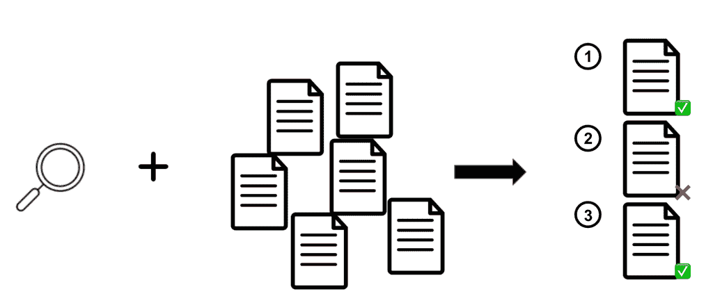
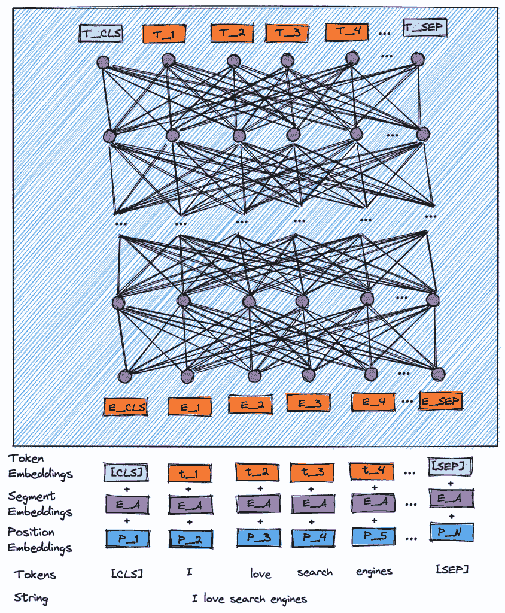
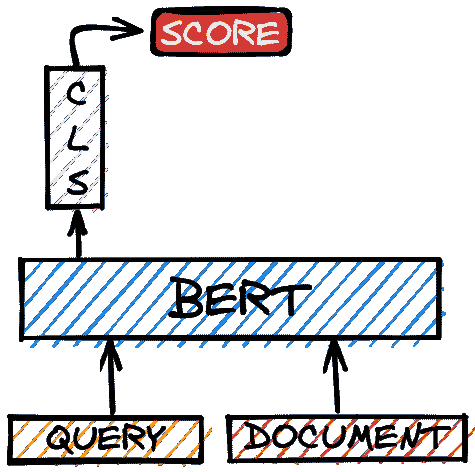
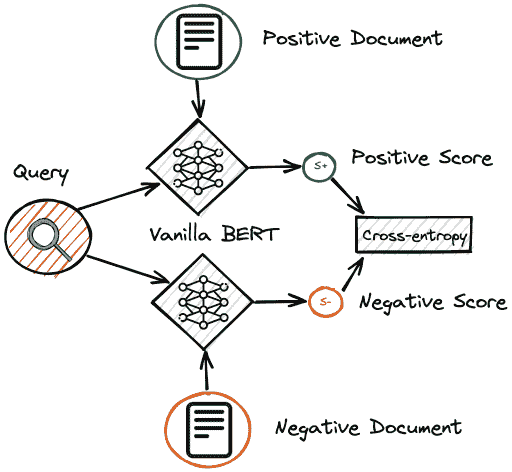
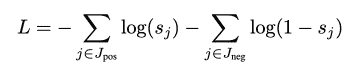

# 从训练到排名:使用 BERT 提高搜索相关性

> 原文：<https://web.archive.org/web/sease.io/2021/12/using-bert-to-improve-search-relevance.html>

如果你参加过我们的[人工智能搜索培训](https://web.archive.org/web/20221130074157/https://sease.io/event/artificial-intelligence-in-search-training)，你现在应该熟悉应用于搜索的**自然语言处理**和**深度学习**。如果你还没有，不要担心，因为我们正计划安排另一个日期，我们将通过我们的[时事通讯](https://web.archive.org/web/20221130074157/https://sease.io/newsletter)向你发布消息，所以请确保你订阅了。与此同时，你可以通过阅读这篇博客开始了解使用深度学习(DL)的文本排名。

我们越来越频繁地听说人工智能如何渗透到我们日常生活的方方面面。当我们谈论人工智能时，我们指的是使机器能够像人类一样学习和推理的一系列技术。人工智能自 50 年代以来就已经存在，但只是在最近随着深度学习的出现才出现爆炸式增长。事实上，深度学习是人工智能的一部分，它利用特殊的**神经网络**来解决无法简单通过算法解决的复杂问题。

就搜索引擎而言，深度学习可以帮助执行几项任务，如查询理解、个性化或推荐。在这篇文章中，我们将重点放在文本排名。

我们将解决的问题通常被称为“特定检索”，这是一个标准的检索任务，其中用户通过一个查询指定他的信息需求，该查询启动对可能与用户相关的文档的搜索。基本上，给定一个查询和一组文档，我们需要返回一个排序的结果列表，使*最大化一个感兴趣的度量**。***

搜索是文本排序的最常见的实际实现，其中搜索引擎被用作检索系统，以产生网页、pdf、新闻文章、tweets 或任何其他形式的文本的排序列表，该列表根据相对于用户意图的估计相关性来排序。



A figure representing ad hoc retrieval.

## 伯特

信息检索的最新进展表明，通过利用大规模预训练的**基于转换器的语言模型**，如伯特[【1】](https://web.archive.org/web/20221130074157/https://arxiv.org/pdf/1810.04805.pdf)，有望提高性能。
谷歌发明的 BERT 是这些预训练模型中最著名的例子，这些模型是采用自我注意机制[【2】](https://web.archive.org/web/20221130074157/https://arxiv.org/pdf/1706.03762.pdf)的神经网络家族，这是一种模仿认知注意力的技术。**注意机制**试图将单个序列的不同位置联系起来，以计算其表示，增强输入的重要部分并淡出其余部分。变形金刚，这种用注意力机制构建的网络，收集关于给定单词的相关上下文的信息，然后将上下文编码成一个丰富的向量，智能地表示该单词。

下图描述了 BERT 模型的内部架构以及所使用的输入/输出表示。首先使用一种称为**单词块**[【3】](https://web.archive.org/web/20221130074157/https://static.googleusercontent.com/media/research.google.com/ja//pubs/archive/37842.pdf)的算法对输入进行标记化，并添加特殊标记:

*   *   [CLS] ->称为分类标记，用在序列的开始。
    *   [SEP] ->表示两个序列的分隔，充当分隔符。
    *   【MASK】-->用于表示 MLM 任务中被屏蔽的令牌。

然后，标记化的输入被转换成*标记嵌入*以及另外的*片段嵌入*和*位置嵌入*。标记嵌入是每个标记的词汇 id。句子嵌入只是一个数字类，用于在使用分隔符标记提供两个或更多句子时区分句子。位置嵌入只是表示每个单词在序列中的位置。最后，模型架构使用的嵌入是令牌嵌入、位置嵌入以及段嵌入的总和。


生成的令牌嵌入然后通过由 12 层(至少在基本版本中)转换器编码器组成的 BERT 模型。BERT 的输出是对应于输入序列中每个标记的预定义隐藏大小的隐藏状态向量。在 BERT 基的情况下，这些输出嵌入的大小为 768。



A figure depicting the internal architecture of the BERT model.

像**谷歌**[【4】](https://web.archive.org/web/20221130074157/https://blog.google/products/search/search-language-understanding-bert/)或者**微软**[【5】](https://web.archive.org/web/20221130074157/https://azure.microsoft.com/en-us/blog/bing-delivers-its-largest-improvement-in-search-experience-using-azure-gpus/)这样的大公司已经公开证实了在商业 Web 引擎中使用 BERT。正如他们所说，对于传统方法来说，更长更会话式的查询更难，而语境化语言模型方法可以更好地理解介词“for”和“to”的含义，能够捕捉查询中单词的上下文。基于 Transformer 的模型理解句子中每个单词及其周围所有单词之间的上下文和关系。


An example of the improvement introduced by BERT on a commercial search engine

上面的例子清楚地证明了单词“to”及其与查询中其他单词的关系对于理解其含义尤为重要。这个查询显示了 BERT 理解用户查询背后意图的能力，这个用户查询是关于一个去美国旅行的巴西人，而不是相反。

## 神经排序

预训练的上下文语言模型的一个最简单但仍然非常有效的应用是“ **vanilla BERT** ”设置，其中查询和文档被联合编码，模型的分类组件被调整以提供排名分数。人们有时也把这种方法称为 CLS、莫诺贝特[3]、伯特卡特或简称为交叉编码器。




Cross-encoder architecture.

**交叉编码器是一种昂贵的方法**,因为查询和文档需要在查询时由 BERT 模型同时处理，这使得它们在用作先前使用传统倒排索引和快速评分功能(如 BM25)生成的候选人池的重新排序器时成为更好的解决方案。

T17

该模型将一个由与文档连接的查询组成的序列作为输入，这些序列由一个[SEP]标记分隔。输入还以一个[CLS]标记开头，以另一个[SEP]标记结尾。

```
[CLS] QUERY [SEP] DOCUMENT [SEP]
```

经过适当标记化的上述序列被传递给 BERT 作为输入，它为输入序列中的每个标记生成一个上下文化的表示向量。基本上，查询和文档的每个单词，以及特殊的记号，都将得到一个向量表示。

在这种相关性分类方法中，对应于[CLS]标记的向量表示是用于推断查询文档相关性分数的向量表示。为了将[CLS]令牌的向量投影成标量值，使用了单层全连接神经网络。这个单层网络最初未经训练，因为我们从零开始初始化它，并且在微调整个模型时调整权重。

准确地说，为了估计查询-文档对的得分，首先生成[CLS]向量表示，丢弃所有其他标记的向量。我们将自己局限于[CLS]标记，因为它是序列(与文档连接的查询)的聚合表示，它能够捕获全局上下文，并且可以被视为单词的加权平均，从而捕获整个序列的表示。

在 BERT 基本模型中，[CLS]向量只是一个大小为 768 的浮点数组。BERT 模型顶部的线性层需要是一个大小为(768，1)的数组，这样两者的点积将产生一个标量值。这个标量是文档与查询的估计相关性。通过收集给定查询的候选库的每个文档的分数，可以按照与用户意图的相关性递减来对它们进行排序。

## 微调

语境化的语言模型通常是预先训练好的。
在没有监督的情况下，在非常大的数据集上执行预训练。在 BERT 的情况下，该模型已经在无监督的维基百科和图书语料库数据集上进行了预训练。执行两个任务，即**掩蔽语言模型** (MLM)和**下一句预测** (NSP)。

*   *   在屏蔽语言模型中，来自每个序列的 15%的标记被随机屏蔽(替换为标记[MASK])，并且该模型被训练为使用该序列的所有其他标记来预测这些标记。
    *   在下一个句子预测中，模型被提供有两个句子作为输入，并且必须预测语料库中第二个句子是否在第一个句子之后。

T14T16

提高所采用的模型的有效性的一种常见方法是利用微调步骤，向它传递关于要解决的任务的更好的知识。一种微调用于重新排列文档的模型的方法是设置目标，确定文档是否与具有成对策略的查询相关。



Pairwise fine-tuning a “vanilla” BERT model.

BERT 可用于为每个文档单独生成一个分数，并通过计算分数上的成对 softmax 交叉熵损失进行优化
。

交叉输入损失:



其中 J [pos] 是相关候选的索引集，J [neg] 是不相关文档的索引集。在成对训练中，我们当时只考虑两个文档，并且这两个文档中只有一个是相关的。

## 履行

在这个例子中，我们将展示我们刚刚描述的概念的实现。特别是，我们将看到如何定义模型以及成对训练步骤是什么样子的。我们将使用 py torch[【6】](https://web.archive.org/web/20221130074157/https://pytorch.org/)和 hugging face Transformers[【7】](https://web.archive.org/web/20221130074157/https://github.com/huggingface/transformers)，这是一个实现基于 Transformer 的架构并为这些架构和预训练模型提供 API 的库。

###### 模型

在下面的代码片段中，我们将定义我们的模型。我们依赖于由 transformers 库提供的 BertForSequenceClassification 模型。
BertForSequenceClassification 只是一个顶部带有序列分类/回归头的 Bert 模型转换器，它是一个位于合并输出顶部的线性层。在这个例子中，我们将标签的数量设置为等于 1，这将导致模型能够为每个查询-文档对学习单个分数。

```
from transformers import *

class MonoBERT(BertPreTrainedModel):
    def __init__(self, config):
        config.num_labels = 1
        super(MonoBERT, self).__init__(config)
        self.bert = BertForSequenceClassification(config)
        self.init_weights()

    def forward(self, input_ids, attention_mask, token_type_ids):
        outputs = self.bert(input_ids, attention_mask, token_type_ids)
        logits = outputs[0]
        return logits
```

###### 训练步骤

为了微调我们的模型，我们需要利用一些三元组形式的训练数据。每个三元组由一个查询和两个文档组成。第一个文档已经被标记为与查询直接相关(肯定的例子)，而第二个文档没有被标记为相关(否定的例子)。以下代码片段是执行培训步骤所需步骤的示例。请注意，下面的示例没有考虑使训练有效的几个基本组件，如较大的批量或梯度裁剪。

```
import torch
from torch.nn.functional import cross_entropy
from transformers import AdamW

model = MonoBERT.from_pretrained("bert-base-uncased"
tokenizer = BertTokenizer.from_pretrained("bert-base-uncased")

optimizer = AdamW(model.parameters(), lr=1e-5, eps=1e-8)
optimizer.zero_grad()

pos_text = "{} [SEP] {}".format(query, pos_doc) // query, pos_doc and neg_doc can be 
neg_text = "{} [SEP] {}".format(query, neg_doc) // retrieved from the training triples

pos_encoded = tokenizer.encode_plus(pos_text, return_tensors="pt")
neg_encoded = tokenizer.encode_plus(neg_text, return_tensors="pt")

pos_output = model.forward(**pos_encoded).squeeze(1)
neg_output = model.forward(**neg_encoded).squeeze(1)

labels = torch.zeros(1, dtype=torch.long)

loss = cross_entropy(torch.stack((pos_output, neg_output), dim=1), labels)

loss.backward()
optimizer.step()
```

在加载模型和标记器之后，训练三元组被格式化为两个查询-文档对，其中相同的查询使用分隔符标记与每个文档连接两次。这两个格式化的字符串在被标记化并转换成张量之后，被用作模型的输入，该模型返回每一对的得分作为输出。

T17

这两个推断出的分数，结合指示相关文档的标签，然后被用于计算训练损失。有了损失，梯度可以计算出来，权重最终由优化器的步骤更新。

## 摘要

在这篇文章中，我们已经了解了如何利用 BERT 进行更准确的文档排序。特别地，我们已经研究了能够推断查询-文档对的相关性分数的交叉编码器技术。此外，我们已经快速浏览了使用成对方法的相关性分类任务的模型微调。

虽然实现简单，但基于变压器的模型非常强大。如果您打算尝试一下，请注意，训练一个 transformer 模型是一项对错误非常敏感的任务，它可能会导致失败。此外，在您非常熟悉这些工具之前，解释哪里出错并不容易。如果在第一次尝试时，你的模型不像预期的那样工作，不要放弃并认为它不适合你的数据，而是[向专家](https://web.archive.org/web/20221130074157/https://sease.io/contacts)寻求帮助。

T3T5

最后，如果你有兴趣听到更多关于深度学习在搜索中的应用，请继续关注我们下一集的文档扩展。

// our service

## 不要脸的塞给我们培训和服务！

我有没有提到我们做[学习排名](https://web.archive.org/web/20221130074157/https://sease.io/learning-to-rank-training)和[搜索相关性](https://web.archive.org/web/20221130074157/https://sease.io/training/search-relevance-training/search-relevance-training-solr)培训？
我们还提供这些主题的咨询，[如果您想让您的搜索引擎更上一层楼，请联系](https://web.archive.org/web/20221130074157/https://sease.io/contacts)！

// STAY ALWAYS UP TO DATE

## 订阅我们的时事通讯

你喜欢这篇关于使用 BERT 提高搜索相关性的文章吗？不要忘记订阅我们的时事通讯，以便随时了解信息检索世界的最新动态！