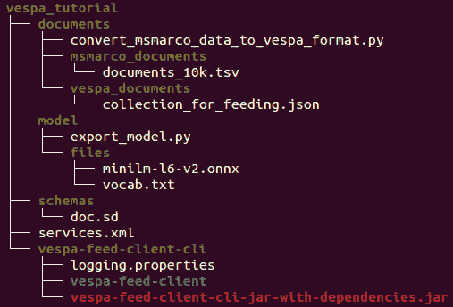

# Vespa 神经搜索教程

> 原文：<https://web.archive.org/web/sease.io/2023/02/vespa-neural-search-tutorial.html>

嗨读者们！
在这篇博文中，我们将通过一个端到端的教程来探索如何在 Vespa 中进行**神经搜索。**

通过实例，我们将了解如何:

*   **准备合适的文件**
*   **导出合适的神经模型**并在 Vespa 中使用
*   **为神经搜索配置 Vespa】**
*   **运行最近邻查询**，将它们与过滤器和文本搜索相结合

## 1.下载 Vespa

为了保持一切简单，我们使用一个**最小本地 Vespa** 。
为了安装它，我们遵循 **Vespa [快速启动](https://web.archive.org/web/20230314041044/https://docs.vespa.ai/en/vespa-quick-start.html)指南**。如官方文件所述，在继续之前，**请确保符合所有先决条件**。

安装 Vespa:
`brew install vespa-cli`

对于我们的教程，我们创建一个具有以下结构的项目:



*   *   *documents* 文件夹将包含 python 脚本，用于将 MSMarco 数据转换为适用于 Vespa 的文档格式，以及包含输入( *msmarco_documents* )和输出( *vespa_documents* )文件的两个文件夹。

*   *   *model* 文件夹将包含从 HuggingFace 导出句子转换器并将其转换为适合 Vespa 的 ONNX 格式的 python 脚本，以及包含必要模型文件(模型和词汇)的*文件*。

*   *   *模式*文件夹将包含文档模式文件。

*   *   *service.xml* 将定义 Vespa 配置和组件。

*   *   用于将文档输入 vespa 的 *vespa-feed-client* 工具。

所有的材料都可以在我们的 GitHub 资源库中找到:
[https://github.com/SeaseLtd/vespa-neural-search-tutorial](https://web.archive.org/web/20230314041044/https://github.com/SeaseLtd/vespa-neural-search-tutorial)

## 2.准备文件

现在我们已经安装了 Vespa，让我们开始创建我们的文档。

对于本教程，我们采用一个语料库[**MARCO 女士**](https://web.archive.org/web/20230314041044/https://microsoft.github.io/msmarco/) ，这是一个用于深度学习的大规模信息检索数据集的集合。具体来说，我们下载**短文检索集**:[collection.tar.gz](https://web.archive.org/web/20230314041044/https://msmarco.blob.core.windows.net/msmarcoranking/collection.tar.gz)并提取其中的**前 10k 个文档**。然后我们把这个文件放在 *msmarco_documents* 文件夹中，命名为 *documents_10k.tsv* 。

为了在 Vespa 中推送 MS Marco 数据，我们需要对其进行操作，并使用 Vespa 支持的格式创建文档。为此，我们使用*文档*文件夹中的***convert _ ms Marco _ data _ to _ vespa _ format . py***python 脚本。

为了保持一个清晰的环境，我们在 [Anaconda](https://web.archive.org/web/20230314041044/https://www.anaconda.com/products/distribution) 中安装了所有的依赖项。
让我们首先创建一个 *conda* 环境来管理必要的库:
`conda create -n vespa_tutorial_env python=3.10 && conda activate vespa_tutorial_env`

现在我们已经准备好生成文档了。下面是要使用的脚本:

```
import random

if __name__ == "__main__":
    **fields_list = ["id", "text", "color"]**
    categorical_list = ["yellow", "red", "blue", "green", "white", "black", "pink", "orange"]

    **input_file** = open("**./msmarco_documents/documents_10k.tsv**", "r")
    **output_file** = open("**./vespa_documents/collection_for_feeding.json**", "w")
    document = ""
    count = 1
    for line in input_file.readlines():
        text = line.split("\t")[1]
        categorical_value = random.randint(0, 7)
        document = document + "{\"put\": \"**id**:doc:doc::" + str(count) + "\","
        document = document + "\"**fields**\": {\"**text**\": \"" + text.replace("\\d", "d").replace("\\", "")[:-1] + "\","
        document = document + "\"**color**\": \"" + categorical_list[categorical_value] + "\"}"
        document = document + "}\n"
        count = count + 1
    output_file.write(document)
    output_file.close()
    input_file.close()
```


其中:

1.  *。/ms Marco _ documents/documents _ 10k . tsv*是**输入文件**的路径，从中获取文档。

2.  *。/vespa _ documents/collection _ for _ feeding . JSON*是**输出文件**的路径，在这里写入生成的 Vespa 文档。

然后，让我们使用以下命令执行该脚本:

`cd documents`
`python convert_msmarco_data_to_vespa_format.py`

我们创建的每个文档都包含:

1.  一个增量 **id** (从 1 开始)

2.  包含 MS Marco 文档

    文本的**文本**字段
3.  添加了一个随机的**颜色**字段，只是为了展示过滤查询如何与神经搜索一起工作

*vespa_documents* 输出文件夹中最终生成的文件(*collection _ for _ feeding . JSON*)如下图所示:

```
{
	"put": "id:doc:doc::1",
	"fields": {
		"text": "The presence of communication amid scientific minds was equally important to the success of the Manhattan Project as scientific intellect was...",
		"color": "yellow"
	}
} {
	"put": "id:doc:doc::2",
	"fields": {
		"text": "The Manhattan Project and its atomic bomb helped bring an end to World War II. Its legacy of peaceful uses of atomic energy continues to have an impact on history and science.",
		"color": "pink"
	}
} {
	"put": "id:doc:doc::3",
	"fields": {
		"text": "Essay on The Manhattan Project - The Manhattan Project The Manhattan Project was ...",
		"color": "red"
	}
}
```

这是使用我们稍后将使用的 [vespa-feed-client](https://web.archive.org/web/20230314041044/https://docs.vespa.ai/en/vespa-feed-client.html) 工具输入文档时所需的[文档 JSON 格式](https://web.archive.org/web/20230314041044/https://docs.vespa.ai/en/reference/document-json-format.html#document-operations)。

## 3.导出神经模型

现在我们有了文件，我们可以专注于准备神经模型。
首先，我们需要下载想要的型号。

对于本教程，我们使用来自 HuggingFace 的 **[all-MiniLM-L6-v2](https://web.archive.org/web/20230314041044/https://huggingface.co/sentence-transformers/all-MiniLM-L6-v2) 句子转换器** **。它是一个大约 90MB 的 **BERT** 型号，具有 384 的*hidden _ size*(*embedding _ dimension*)。**

我们可以直接下载词汇表( *[vocab.txt](https://web.archive.org/web/20230314041044/https://huggingface.co/sentence-transformers/all-MiniLM-L6-v2/blob/main/vocab.txt)* 文件)，而对于型号我们需要转换它，因为 **Vespa 只支持 [ONNX 型号格式](https://web.archive.org/web/20230314041044/https://docs.vespa.ai/en/onnx.html)** 。

为了做到这一点，我们使用了一个需要 [PyTorch](https://web.archive.org/web/20230314041044/https://pytorch.org/) 和[变形金刚](https://web.archive.org/web/20230314041044/https://huggingface.co/docs/transformers/installation)hugging face 库的 python 脚本。
安装它:
`pip install torch`
`pip install transformers`

现在我们准备转换模型。
我们执行的文件是***[export _ model . py](https://web.archive.org/web/20230314041044/https://github.com/SeaseLtd/vespa-neural-search-tutorial/blob/main/model/export_model.py)***。这摘自 Vespa [简单语义搜索](https://web.archive.org/web/20230314041044/https://github.com/vespa-engine/sample-apps/blob/a7f555fdb943a4a42a723f56664dec2fe1252f1e/simple-semantic-search/) GitHub 示例，特别是[export _ model _ from _ HF . py](https://web.archive.org/web/20230314041044/https://github.com/vespa-engine/sample-apps/blob/a7f555fdb943a4a42a723f56664dec2fe1252f1e/simple-semantic-search/export_model_from_hf.py)文件:

```
# Copyright Yahoo. Licensed under the terms of the Apache 2.0 license. See LICENSE in the project root.
from transformers import BertModel
import torch

encoder = BertModel.from_pretrained("**sentence-transformers/all-MiniLM-L6-v2**")

# Vespa bert embedder expects these inputs and outputs
# Vespa implements the pooling, default average
input_names = ["input_ids", "attention_mask", "token_type_ids"]
output_names = ["output_0"]

input_ids = torch.ones(1,32, dtype=torch.int64)
attention_mask = torch.ones(1,32,dtype=torch.int64)
token_type_ids = torch.zeros(1,32,dtype=torch.int64)
args = (input_ids, attention_mask, token_type_ids)
**torch.onnx.export**(encoder,
  args=args,
  f="**./files/minilm-l6-v2.onnx**",
  do_constant_folding=True,
  input_names = input_names,
  output_names = output_names,
  dynamic_axes = {
    "input_ids": {0: "batch", 1:"batch"},
    "attention_mask": {0: "batch", 1: "batch"},
    "token_type_ids": {0: "batch", 1: "batch"},
    "output_0": {0: "batch"},
  },
  opset_version=14)
```

这个脚本从 HuggingFace 下载*句子-变形金刚/all-MiniLM-L6-v2* 模型并导出到一个文件(*)。/files/minilm-l6-v2.onnx* )与正确的 onnx 格式。

让我们用下面的代码来执行它:

```
cd model
python export_model.py
```

我们现在可以停用我们的 *conda* 环境，因为我们不再需要它了:

```
conda deactivate
```

## 4.配置 Vespa

### 4.1 服务

现在让我们在 Vespa 应用程序中定义[服务](https://web.archive.org/web/20230314041044/https://docs.vespa.ai/en/tutorials/news-2-basic-feeding-and-query.html#services-specification)。这里我们不会太详细，因为我们基本上保持默认配置。

下面是我们创建的 *services.xml* 文件:

```
<?xml version="1.0" encoding="utf-8" ?>
<services version="1.0" xmlns:deploy="vespa" xmlns:preprocess="properties">

    <!-- See https://docs.vespa.ai/en/reference/services-container.html -->
    <container id="default" version="1.0">

        <!-- See https://docs.vespa.ai/en/embedding.html#bertbase-embedder -->
        **<component id="bert" class="ai.vespa.embedding.BertBaseEmbedder" bundle="model-integration">
            <config name="embedding.bert-base-embedder">
                <transformerModel path="model/files/minilm-l6-v2.onnx"/>
                <tokenizerVocab path="model/files/vocab.txt"/>
            </config>
        </component>**

        <document-api/>
        <search/>

        <nodes>
            <node hostalias="node1" />
        </nodes>
    </container>

    <!-- See https://docs.vespa.ai/en/reference/services-content.html -->
    <content id="text" version="1.0">
        <redundancy>2</redundancy>
        <documents>
            <document type="doc" mode="index" />
        </documents>
        <nodes>
            <node hostalias="node1" distribution-key="0" />
        </nodes>
    </content>

</services>
```

让我们来关注一下 **[嵌入](https://web.archive.org/web/20230314041044/https://docs.vespa.ai/en/embedding.html)组件**:

```
<component id="bert" class="ai.vespa.embedding.BertBaseEmbedder" bundle="model-integration">
    <config name="embedding.bert-base-embedder">
        <**transformerModel path**="model/files/**minilm-l6-v2.onnx**"/>
        <**tokenizerVocab path**="model/files/**vocab.txt**"/>
    </config>
</component>
```

这是我们用来从文本中创建向量的模型，具体来说，我们利用了 Vespa 的 [BertBaseEmbedder](https://web.archive.org/web/20230314041044/https://docs.vespa.ai/en/embedding.html#bertbase-embedder) 组件。唯一需要注意的是 *transformerModel* 和 *tokenizerVocab* 路径，它们应该指向我们想要使用的模型和词汇文件。

### 4.2 模式

最后，我们可以为我们的神经搜索定义 Vespa [模式](https://web.archive.org/web/20230314041044/https://docs.vespa.ai/en/schemas.html)(*模式*文件夹中的 *doc.sd* 文件)。这个文件包含我们的文档的字段定义和我们将在查询时使用的排名配置文件。

让我们看看它是什么样子的，并详细探索每个部分。
***doc . SD***文件:[https://github . com/SeaseLtd/vespa-neural-search-tutorial/blob/main/schemas/doc . SD](https://web.archive.org/web/20230314041044/https://github.com/SeaseLtd/vespa-neural-search-tutorial/blob/main/schemas/doc.sd)

#### 字段定义

让我们从字段定义开始:

```
**document** doc {
    # Field that contains MSMarco document's text
    **field** **text** type string {
        indexing: summary | index
        index: enable-bm25
    }

    # Field that contains our random color
    **field** **color** type string {
        indexing: summary | index
        rank: filter
    }

}

# Field that contains the vector(extracted from text)
**field embedding** type tensor<float>(x[384]) {
    indexing: input text | embed bert | attribute | index
    attribute {
        distance-metric: euclidean
    }
    index: hnsw
}
```

这里我们定义了三个字段:

1.  **Text** :包含每个文档的 MS Marco 文本。
    
2.  **颜色**:包含我们在文件准备步骤中分配给每个文件的随机颜色。

3.  **嵌入**:它将包含表示文本字段中相应文本的数值向量。这里我们定义了一个张量< float >，其维数为 384，对应于我们的神经模型的输出。该字段有三个参数集:索引、属性和索引。

让我们更详细地看看嵌入参数。

###### 索引

正如 Vespa [文档](https://web.archive.org/web/20230314041044/https://docs.vespa.ai/en/schemas.html#indexing) : *中所述，“索引指令的流水线语义类似于 Unix shell 命令，数据从左向右流动。它们可以对字段值执行复杂的转换，或者只是将字段值原封不动地发送到索引结构的下一部分。”*。

在我们的例子中,[管道](https://web.archive.org/web/20230314041044/https://docs.vespa.ai/en/embedding.html#embedding-a-document-field)是:

```
input text | embed bert | attribute | index
```

这里，*文本*字段的内容被用作嵌入生成的输入。向量通过 *bert* 嵌入器(在 *services.xml* 文件中定义的嵌入器的 id)创建，然后作为内存中的属性添加。最后是索引。

###### 属性

如 Vespa [文档](https://web.archive.org/web/20230314041044/https://docs.vespa.ai/en/reference/schema-reference.html#attribute)中所述:*属性包含在[字段](https://web.archive.org/web/20230314041044/https://docs.vespa.ai/en/reference/schema-reference.html#field)或[结构字段](https://web.archive.org/web/20230314041044/https://docs.vespa.ai/en/reference/schema-reference.html#struct-field)中。指定索引结构特性的属性。*。
当我们定义[距离度量](https://web.archive.org/web/20230314041044/https://docs.vespa.ai/en/reference/schema-reference.html#distance-metric)与[最近邻](https://web.archive.org/web/20230314041044/https://docs.vespa.ai/en/reference/query-language-reference.html#nearestneighbor)查询操作符一起使用时，这是必要的，在我们的例子中是欧几里德距离。

###### 索引

如 Vespa [文档](https://web.archive.org/web/20230314041044/https://docs.vespa.ai/en/reference/schema-reference.html#attribute)中所述:[字段](https://web.archive.org/web/20230314041044/https://docs.vespa.ai/en/reference/schema-reference.html#field)或[结构字段](https://web.archive.org/web/20230314041044/https://docs.vespa.ai/en/reference/schema-reference.html#struct-field)中包含的*属性。指定索引结构特性的属性。*。
当我们定义与[最近邻](https://web.archive.org/web/20230314041044/https://docs.vespa.ai/en/reference/query-language-reference.html#nearestneighbor)查询操作符一起使用的[距离度量](https://web.archive.org/web/20230314041044/https://docs.vespa.ai/en/reference/schema-reference.html#distance-metric)时，这是必要的，在我们的例子中是欧几里德距离。

#### 等级配置文件

在 Vespa 中，[等级配置文件](https://web.archive.org/web/20230314041044/https://docs.vespa.ai/en/ranking.html#rank-profiles)用于定义在查询时可以选择的等级表达式功能和设置。不同的简档可以具有不同的相关性表达、不同的度量和排名行为；允许在输入中使用不同的查询功能。

我们的第一个[等级档案](https://web.archive.org/web/20230314041044/https://docs.vespa.ai/en/ranking.html#rank-profiles)是*纯 _ 神经 _ 等级*档案。

###### 纯神经等级轮廓

```
# Rank profile that implements a pure Neural Search
**rank-profile pure_neural_rank** {
    num-threads-per-search: 1

    inputs {
        query(first_query) tensor<float>(x[384])
        query(second_query) tensor<float>(x[384])
    }
    first-phase {
        expression: closeness(field, embedding)
    }
    match-features {
        closeness(field, embedding)
        closeness(label, first_query) 
        closeness(label, second_query)
        distance(field,embedding)
    }

}
```

**该配置文件的目的是执行纯粹的最近邻搜索。在查询时接受一两个嵌入并返回最近的文档。**

这里我们定义了三个[元素](https://web.archive.org/web/20230314041044/https://docs.vespa.ai/en/reference/schema-reference.html#rank-profile):

*   [输入](https://web.archive.org/web/20230314041044/https://docs.vespa.ai/en/reference/schema-reference.html#inputs):查询该档案中排名表达式消耗的特征。

*   [第一阶段](https://web.archive.org/web/20230314041044/https://docs.vespa.ai/en/reference/schema-reference.html#firstphase-rank):排位[第一阶段](https://web.archive.org/web/20230314041044/https://docs.vespa.ai/en/phased-ranking.html)使用的排位配置。

*   [匹配特征](https://web.archive.org/web/20230314041044/https://docs.vespa.ai/en/reference/schema-reference.html#match-features):在*匹配*阶段计算的[等级特征](https://web.archive.org/web/20230314041044/https://docs.vespa.ai/en/reference/rank-features.html)将随每次命中返回。

**输入**

对于神经搜索，我们定义了在查询中传递两个张量的可能性:`query(first_query)`和`query(second_query)`。两者都是由我们的 *bert* 嵌入器在查询时生成的张量。这些向量在`inputs.query()`查询参数中传递，如:

```
input.query(first_query)=embed(#of calories to eat to lose weight)
```

其中`embed()`是调用我们的 *bert* 嵌入器从文本创建向量的函数。

**第一阶段**

这里我们定义了相关性计算的表达式。
Vespa 支持多等级阶段。对于本教程，我们只是设定了一期排名，但如果你有兴趣，更多详情可以在这里[找到](https://web.archive.org/web/20230314041044/https://docs.vespa.ai/en/phased-ranking.html)。

我们选择[接近度](https://web.archive.org/web/20230314041044/https://docs.vespa.ai/en/reference/rank-features.html#attribute-match-features-normalized)作为度量，它与[最近邻](https://web.archive.org/web/20230314041044/https://docs.vespa.ai/en/reference/query-language-reference.html#nearestneighbor)查询操作符一起使用。该指标在内部使用模式的*嵌入*字段中定义的*距离*。

当一个通用的`closeness(field, embedding)`表达式被用于传递两个查询张量时，文档相关性将是为每个向量计算的那些之间的最大接近度。因此:

```
max{closeness(label, first_query), closeness(label, second_query)}
```

**匹配特征**

在*匹配特征*中，我们可以定义想要在结果中监控的有用指标。这确实是每个结果命中要包括的等级特征的列表。

出于本教程的目的，我们将展示:

*   `closeness(field, embedding)`最终文档紧密度(之前解释的最大紧密度)。

*   `closeness(label, first_query)`文档与第一个查询向量的接近度。

*   `closeness(label, second_query)`文档和第二查询向量之间的接近度。

为了显示两个不同向量的接近程度，我们使用了**查询注释**，特别是**标签**。
这些是在查询时在*最近邻*方法中定义的，并且唯一地标识向量。例如，对于第一个张量，我们可以定义:

```
{**label:'first_query'**, targetHits:100}nearestNeighbor(embedding, first_query)
```

我们将在查询示例中看到真实的用法；文档中的更多信息可在[这里](https://web.archive.org/web/20230314041044/https://docs.vespa.ai/en/nearest-neighbor-search-guide.html#multiple-nearest-neighbor-search-operators-in-the-same-query)找到。

###### 混合等级

让我们看看第二个侧面:

```
# Rank profile that implements a combination of Neural and Textual Search
**rank-profile hybrid_rank inherits pure_neural_rank** {
    inputs {
        query(textWeight) : 1.0
        query(vectorWeight) : 1.0
    }
    first-phase {
        expression {
            query(textWeight) * bm25(text) +
            query(vectorWeight) * closeness(field, embedding)
        }
    }
    match-features {
        closeness(field, embedding)
        bm25(text)
    }
}
```

在这里，我们希望**计算一个更复杂的相关性，同时考虑词汇排名(用 *bm25* )和神经排名(用*接近度* )** 。该配置文件继承了 *pure_neural_rank* 配置文件，因此我们首先读取张量并计算 *pure_neural_rank* 中的接近度，然后我们找到与新公式的最终相关性。

**输入**

当*为这个概要文件输入*时，我们定义了两个**权重**:一个用于*文本*相关性，一个用于*向量*相关性。它们用于第一阶段排名表达式。如果没有传递值，则分配默认的 1 权重。

**一期**

作为相关性公式，我们定义了在文本字段上计算的 *bm25* 得分与在 *pure_neural_rank* 简档中计算的接近度之和，乘以它们相应的权重。

**匹配特征**

最后，我们打印为每个文档命中计算的*接近度*和 *bm25* 值。

###### 神经秩和贴近度

让我们看看最后一个侧写。

```
# Rank profile that implements a different relevance metric for the pure Neural Search
**rank-profile neural_rank_sum_closeness** {
    num-threads-per-search: 1

    inputs {
        query(first_query) tensor<float>(x[384])
        query(second_query) tensor<float>(x[384])
    }
    first-phase {
        expression: closeness(label, first_query) + closeness(label, second_query)

    }
    match-features {
        distance(field, embedding)
        closeness(field, embedding)
        closeness(label, first_query) 
        closeness(label, second_query)
    }

}
```

在这个配置文件中，我们希望使用**作为相关性，它是为查询时传递的每个张量**计算的紧密度之和。

## 5.索引文档

在进行查询之前，我们需要做的最后一件事是将文档推入 Vespa。
为了一次馈送多个文档，我们需要**下载并安装 [vespa-feed-client](https://web.archive.org/web/20230314041044/https://docs.vespa.ai/en/vespa-feed-client.html)** 。

我们可以通过以下方式做到这一点:

```
F_REPO="https://repo1.maven.org/maven2/com/yahoo/vespa/vespa-feed-client-cli" && F_VER=$(curl -Ss "${F_REPO}/maven-metadata.xml" | sed -n 's/.*<release>\(.*\)<.*>/\1/p') && curl -SsLo vespa-feed-client-cli.zip ${F_REPO}/${F_VER}/vespa-feed-client-cli-${F_VER}-zip.zip && unzip -o vespa-feed-client-cli.zip
```

然后，我们用 [docker](https://web.archive.org/web/20230314041044/https://www.docker.com/) 运行 Vespa。确保在**启动 Vespa** 之前安装好:

```
vespa config set target local
docker run --detach --name vespa --hostname vespa-container --publish 8080:8080 --publish 19071:19071 vespaengine/vespa
vespa status deploy --wait 300
vespa deploy --wait 300
```

和**索引文件**:

```
./vespa-feed-client-cli/vespa-feed-client --file ./documents/vespa_documents/collection_for_feeding.json --endpoint http://localhost:8080
```

## 6.问题

现在让我们深入到神经搜索查询。

### 6.1 精确最近邻搜索

为了利用神经搜索，Vespa 提供了`nearestNeighbor`()方法。它允许我们执行精确和近似的最近邻搜索。

这是一个执行**精确最近邻搜索** ( `approximate:false`)的查询示例:

```
vespa query "yql=select * from doc where {**approximate:false**,targetHits: 100}nearestNeighbor(embedding, first_query)" "input.query(first_query)=embed(#of calories to eat to lose weight)" "ranking=**pure_neural_rank**"
```

RESPONSE

```
{
    "root": {
        "id": "toplevel",
        "relevance": 1.0,
        "fields": {
            "totalCount": 597
        },
        "coverage": {
            "coverage": 100,
            "documents": 10000,
            "full": true,
            "nodes": 1,
            "results": 1,
            "resultsFull": 1
        },
        "children": [
            {
                "id": "id:doc:doc::4753",
                "relevance": 0.18904411884161854,
                "source": "text",
                "fields": {
                    "matchfeatures": {
                        "closeness(field,embedding)": 0.18904411884161854,
                        ...
                        "distance(field,embedding)": 4.289770483882663
                    },
                    "sddocname": "doc",
                    "documentid": "id:doc:doc::4753",
                    "text": "For a **healthy daily calorie count**, allow 10 calories per pound of body weight ...",
                    "color": "green"
                }
            },
            {
                "id": "id:doc:doc::4528",
                "relevance": 0.1750265633743142,
                "source": "text",
                "fields": {
                    "matchfeatures": {
                        "closeness(field,embedding)": 0.1750265633743142,
                        ...
                        "distance(field,embedding)": 4.713418470437464
                    },
                    "sddocname": "doc",
                    "documentid": "id:doc:doc::4528",
                    "text": "... calories in each gram -- 1 g of fat provides 9 calories. If you consume 2,500 **calories per day**, ...",
                    "color": "yellow"
                }
            },
            {
                "id": "id:doc:doc::9349",
                "relevance": 0.17466600309410665,
                "source": "text",
                "fields": {
                    "matchfeatures": {
                        "closeness(field,embedding)": 0.17466600309410665,
                        ...
                        "distance(field,embedding)": 4.725212590232682
                    },
                    "sddocname": "doc",
                    "documentid": "id:doc:doc::9349",
                    "text": "The **Zone diet typically caps daily calories** for women at 1,200 and 1,500 for men...",
                    "color": "pink"
                }
            },

...
```

该查询最重要的参数是:

*   *   [`**targetHits**`](https://web.archive.org/web/20230314041044/https://docs.vespa.ai/en/nearest-neighbor-search.html#querying-using-nearestneighbor-query-operator) ( **必选**)查询标注。
        它指定了查询中涉及的每个节点想要暴露给第一阶段排名的结果的数量。这是每个节点的下限，通过精确搜索，比 *targetHits* 更多的命中被暴露给第一阶段排名。

*   *   [`**approximate**`](https://web.archive.org/web/20230314041044/https://docs.vespa.ai/en/reference/query-language-reference.html#approximate) 查询标注。它指定了我们是否想要进行精确的或近似的最近邻搜索。精确搜索通过`approximate:false`设置进行设置，否则，使用默认的`approximate:true`并进行近似搜索。

*   *   `**first_query**`可变。
        它应该与等级配置文件中定义的查询输入相匹配。它在`nearestNeighbor`和`input.query()`方法中用来指定我们传递的输入。

*   *   `**input.query()**`方法。它定义了我们正在使用的等级档案的输入之一。在这种情况下，它将嵌入传递给我们的神经查询。`embed()`是调用在 *service.xml* 中定义的嵌入器的方法(如果使用多个嵌入器，需要给出一个 *id* ，如这里的[所解释的](https://web.archive.org/web/20230314041044/https://docs.vespa.ai/en/embedding.html#embedding-a-query-text))并计算文本查询*“减肥要吃多少卡路里”*的向量。

*   *   `**ranking=pure_neural_rank**`参数。
        它定义了用于查询的等级配置文件。在本例中，我们将使用 *pure_neural_rank* 。

### 6.2 近似最近邻搜索

要使用[近似最近邻](https://web.archive.org/web/20230314041044/https://docs.vespa.ai/en/nearest-neighbor-search-guide.html#approximate-nearest-neighbor-search)，只需省略`approximate`参数，默认为*真*:

```
vespa query "yql=select * from doc where {targetHits: 100}nearestNeighbor(embedding, first_query)" "input.query(first_query)=embed(#of calories to eat to lose weight)" "ranking=pure_neural_rank"
```

RESPONSE

```
{
    "root": {
        "id": "toplevel",
        "relevance": 1.0,
        "fields": {
            "totalCount": 100
        },
        "coverage": {
            "coverage": 100,
            "documents": 10000,
            "full": true,
            "nodes": 1,
            "results": 1,
            "resultsFull": 1
        },
        "children": [
            {
                "id": "id:doc:doc::4753",
                "relevance": 0.1890441216634541,
                "source": "text",
                "fields": {
                    "matchfeatures": {
                        "closeness(field,embedding)": 0.1890441216634541,
                        ...
                        "distance(field,embedding)": 4.289770404922987
                    },
                    "sddocname": "doc",
                    "documentid": "id:doc:doc::4753",
                    "text": "For a **healthy daily calorie count**, allow 10 calories per pound of body weight ...",
                    "color": "green"
                }
            },
            {
                "id": "id:doc:doc::4528",
                "relevance": 0.1750265612999238,
                "source": "text",
                "fields": {
                    "matchfeatures": {
                        "closeness(field,embedding)": 0.1750265612999238,
                        ...
                        "distance(field,embedding)": 4.713418538152102
                    },
                    "sddocname": "doc",
                    "documentid": "id:doc:doc::4528",
                    "text": "... If you consume 2,500 **calories per day**, your fat intake should range from 56 g to 97 g. Recommendations for fat are further specified by type of fat.",
                    "color": "yellow"
                }
            },
            {
                "id": "id:doc:doc::9349",
                "relevance": 0.1746659943912434,
                "source": "text",
                "fields": {
                    "matchfeatures": {
                        "closeness(field,embedding)": 0.1746659943912434,
                        ...
                        "distance(field,embedding)": 4.7252128754956635
                    },
                    "sddocname": "doc",
                    "documentid": "id:doc:doc::9349",
                    "text": "The **Zone diet typically caps daily calories** for women at 1,200 and 1,500 for men...",
                    "color": "pink"
                }
            },
...
```

### 6.3 使用查询过滤器的近似最近邻

可以将最近邻搜索与[过滤器](https://web.archive.org/web/20230314041044/https://docs.vespa.ai/en/nearest-neighbor-search-guide.html#combining-approximate-nearest-neighbor-search-with-query-filters)集成。
让我们用以下方式对色域进行过滤:

```
vespa query "yql=select * from doc where {targetHits: 100}nearestNeighbor(embedding, first_query) **AND color contains 'yellow'**" "input.query(first_query)=embed(#of calories to eat to lose weight)" "ranking=pure_neural_rank"
```

RESPONSE

```
{
    "root": {
        "id": "toplevel",
        "relevance": 1.0,
        "fields": {
            "totalCount": 100
        },
        "coverage": {
            "coverage": 100,
            "documents": 10000,
            "full": true,
            "nodes": 1,
            "results": 1,
            "resultsFull": 1
        },
        "children": [
            {
                "id": "id:doc:doc::4528",
                "relevance": 0.1750265612999238,
                "source": "text",
                "fields": {
                    "matchfeatures": {
                        "closeness(field,embedding)": 0.1750265612999238,
                        ...
                        "distance(field,embedding)": 4.713418538152102
                    },
                    "sddocname": "doc",
                    "documentid": "id:doc:doc::4528",
                    "text": "... If you consume 2,500 **calories per day**, your fat intake should range from 56 g to 97 g...",
                    **"color": "yellow"**
                }
            },
            {
                "id": "id:doc:doc::4947",
                "relevance": 0.16819859694194497,
                "source": "text",
                "fields": {
                    "matchfeatures": {
                        "closeness(field,embedding)": 0.16819859694194497,
                        ...
                        "distance(field,embedding)": 4.945352804251736
                    },
                    "sddocname": "doc",
                    "documentid": "id:doc:doc::4947",
                    "text": "**How Many Calories** are in the Alcohol ...",
                    **"color": "yellow"**
                }
            },
            {
                "id": "id:doc:doc::9348",
                "relevance": 0.1666637050622998,
                "source": "text",
                "fields": {
                    "matchfeatures": {
                        "closeness(field,embedding)": 0.1666637050622998,
                        ...
                        "distance(field,embedding)": 5.000106619651799
                    },
                    "sddocname": "doc",
                    "documentid": "id:doc:doc::9348",
                    "text": "You can use Weight Loss Resources to follow the **Zone diet** by setting your target nutrition profile ...",
                    **"color": "yellow"**
                }
            },
...
```

这里 Vespa 只返回颜色为*黄色*的文档，因为它使用**预过滤**。关于 Vespa 中过滤如何工作的更多细节，请查看这些参考资料:
[https://docs . Vespa . ai/en/nearest-neighbor-search-guide . html # controlling-filter-behavior](https://web.archive.org/web/20230314041044/https://docs.vespa.ai/en/nearest-neighbor-search-guide.html#controlling-filter-behavior) [https://blog . Vespa . ai/constrained-approximate-neighbor-search/](https://web.archive.org/web/20230314041044/https://blog.vespa.ai/constrained-approximate-nearest-neighbor-search/)

正如在 Vespa [文档](https://web.archive.org/web/20230314041044/https://docs.vespa.ai/en/nearest-neighbor-search-guide.html#strict-filters-and-distant-neighbors) : *中提到的，“使用严格的过滤器，返回的邻居可能质量较低(距离较远)。解决这个问题的一个方法是使用 nearestNeighbor 查询运算符的 [distanceThreshold](https://web.archive.org/web/20230314041044/https://docs.vespa.ai/en/reference/query-language-reference.html#distancethreshold) 查询注释参数。*。
因为距离值取决于使用的[距离度量](https://web.archive.org/web/20230314041044/https://docs.vespa.ai/en/reference/schema-reference.html#distance-metric)。通过将[距离(场，嵌入)](https://web.archive.org/web/20230314041044/https://docs.vespa.ai/en/reference/rank-features.html#distance(dimension,name))等级特征添加到等级简档的匹配特征，可以分析什么距离可以被认为太远。

这可以在查询中定义为:

```
vespa query "yql=select * from doc where {distanceThreshold: 5.0, targetHits: 100}nearestNeighbor(embedding, first_query) AND color contains 'yellow'" "input.query(first_query)=embed(#of calories to eat to lose weight)" "ranking=pure_neural_rank"
```

RESPONSE

```
{
    "root": {
        "id": "toplevel",
        "relevance": 1.0,
        "fields": {
            **"totalCount": 2**
        },
        "coverage": {
            "coverage": 100,
            "documents": 10000,
            "full": true,
            "nodes": 1,
            "results": 1,
            "resultsFull": 1
        },
        "children": [
            {
                "id": "id:doc:doc::4528",
                "relevance": 0.1750265612999238,
                "source": "text",
                "fields": {
                    "matchfeatures": {
                        "closeness(field,embedding)": 0.1750265612999238,
                        ...
                        **"distance(field,embedding)": 4.713418538152102**
                    },
                    "sddocname": "doc",
                    "documentid": "id:doc:doc::4528",
                    "text": "Fat is the most energy-dense macronutrient, which means it contains the most calories ...",
                    "color": "yellow"
                }
            },
            {
                "id": "id:doc:doc::4947",
                "relevance": 0.16819859694194497,
                "source": "text",
                "fields": {
                    "matchfeatures": {
                        "closeness(field,embedding)": 0.16819859694194497,
                        ...
                        **"distance(field,embedding)": 4.945352804251736**
                    },
                    "sddocname": "doc",
                    "documentid": "id:doc:doc::4947",
                    "text": "How Many Calories are in the Alcohol You Like to Drink? import 2014-05-19T05:40:13+00:00...",
                    "color": "yellow"
                }
            }
        ]
    }
}
```

如您所见，现在只返回两个文档，即距离小于 5 的文档。

### 6.4 混合稀疏和密集检索方法

刚才看到的密集检索可以[结合](https://web.archive.org/web/20230314041044/https://docs.vespa.ai/en/nearest-neighbor-search-guide.html#hybrid-sparse-and-dense-retrieval-methods-with-vespa)传统的稀疏检索。如等级配置文件中所述，我们已经在 *hybrid_rank* 等级配置文件的定义中实现了该行为。

为了用，就用 *hybrid_rank* 一个换排名:

```
vespa query "yql=select * from doc where {targetHits: 100}nearestNeighbor(embedding, first_query) OR text contains 'exercise'" "type=weakAnd" "**ranking=hybrid_rank**" "input.query(first_query)=embed(#of calories to eat to lose weight)"
```

RESPONSE

```
{
    "root": {
        "id": "toplevel",
        "relevance": 1.0,
        "fields": {
            "totalCount": 135
        },
        "coverage": {
            "coverage": 100,
            "documents": 10000,
            "full": true,
            "nodes": 1,
            "results": 1,
            "resultsFull": 1
        },
        "children": [
            {
                "id": "id:doc:doc::4761",
                **"relevance": 9.125252513334813,**
                "source": "text",
                "fields": {
                    "matchfeatures": {
                        **"bm25(text)": 8.97712592472415**,
                        **"closeness(field,embedding)": 0.1481265886106627**
                    },
                    "sddocname": "doc",
                    "documentid": "id:doc:doc::4761",
                    "text": "A report by the Mayo Clinic indicates that **proper nutrition** can boost any **exercise** ...",
                    "color": "white"
                }
            },
            {
                "id": "id:doc:doc::8732",
                **"relevance": 9.081256342626082,**
                "source": "text",
                "fields": {
                    "matchfeatures": {
                        **"bm25(text)": 8.95203518376092,**
                        **"closeness(field,embedding)": 0.12922115886516217**
                    },
                    "sddocname": "doc",
                    "documentid": "id:doc:doc::8732",
                    "text": "The form of **exercise** increases...",
                    "color": "black"
                }
            },
            {
                "id": "id:doc:doc::4756",
                **"relevance": 8.669726817466929,**
                "source": "text",
                "fields": {
                    "matchfeatures": {
                        **"bm25(text)": 8.498001371344154,
                        "closeness(field,embedding)": 0.17172544612277515**
                    },
                    "sddocname": "doc",
                    "documentid": "id:doc:doc::4756",
                    "text": "As a rule of thumb, **weight loss is generally 75 percent diet and 25 percent exercise**...",
                    "color": "green"
                }
            },
...
```

该查询使用逻辑析取(or)将*最近邻居*运算符与 *[weakAnd](https://web.archive.org/web/20230314041044/https://docs.vespa.ai/en/reference/query-language-reference.html#weakand)* 运算符组合在一起(您可以在这里找到关于 weakAnd 如何工作的更多信息[)。这种类型的查询支持基于语义(向量距离)和传统稀疏(精确)匹配的检索。](https://web.archive.org/web/20230314041044/https://docs.vespa.ai/en/using-wand-with-vespa.html#weakand)

为了能够计算文本字段的 *bm25* 指标，我们向查询添加了*“或文本包含‘练习’”*条件。

对于我们如何定义等级配置文件，也可以将*文本*和*向量*权重传递给相关性表达式。在第一个查询示例中，查询的输入中没有给定权重，因此将默认值 1 分配给两者。关联度确实是 *bm25* 和*亲密度*之和。
关联式的[权重](https://web.archive.org/web/20230314041044/https://docs.vespa.ai/en/nearest-neighbor-search-guide.html#hybrid-sparse-and-dense-retrieval-methods-with-vespa)可以用`ranking.features.query()`方法设置为:

```
vespa query "yql=select * from doc where {targetHits: 100}nearestNeighbor(embedding, first_query) OR text contains 'exercise'" "type=weakAnd" "ranking=hybrid_rank" "input.query(first_query)=embed(#of calories to eat to lose weight)" "ranking.features.query(textWeight)=0.5" "ranking.features.query(vectorWeight)=30"
```

RESPONSE

```
{
    "root": {
        "id": "toplevel",
        "relevance": 1.0,
        "fields": {
            "totalCount": 135
        },
        "coverage": {
            "coverage": 100,
            "documents": 10000,
            "full": true,
            "nodes": 1,
            "results": 1,
            "resultsFull": 1
        },
        "children": [
            {
                **"id": "id:doc:doc::4756"**,
                **"relevance": 9.400764069355333,**
                "source": "text",
                "fields": {
                    "matchfeatures": {
                        "bm25(text)": 8.498001371344154,
                        "closeness(field,embedding)": 0.17172544612277515
                    },
                    "sddocname": "doc",
                    "documentid": "id:doc:doc::4756",
                    "text": "As a rule of thumb, **weight loss is generally 75 percent diet and 25 percent exercise**...",
                    "color": "green"
                }
            },
            {
                **"id": "id:doc:doc::4761"**,
                **"relevance": 8.932360620681955**,
                "source": "text",
                "fields": {
                    "matchfeatures": {
                        "bm25(text)": 8.97712592472415,
                        "closeness(field,embedding)": 0.1481265886106627
                    },
                    "sddocname": "doc",
                    "documentid": "id:doc:doc::4761",
                    "text": "A report by the Mayo Clinic indicates that proper **nutrition** can boost any **exercise** routine ...",
                    "color": "white"
                }
            },
            {
                **"id": "id:doc:doc::4277"**,
                **"relevance": 8.836020903237696**,
                "source": "text",
                "fields": {
                    "matchfeatures": {
                        "bm25(text)": 8.165063896210217,
                        "closeness(field,embedding)": 0.1584496318377529
                    },
                    "sddocname": "doc",
                    "documentid": "id:doc:doc::4277",
                    "text": "11 8\. â**Exercise** is an effective method of weight management.âs cardio, resistance training or flexibility work, **rely on the nutrition you provide them through your diet**...",
                    "color": "black"
                }
            },
...
```

多亏了权重，我们才能够更加重视最终相关性的接近程度。我们可以在排名上升的文档 *4756* 上看到新的行为。

### 6.5 同一查询中的多个最近邻搜索运算符

也可以用[多重嵌入](https://web.archive.org/web/20230314041044/https://docs.vespa.ai/en/nearest-neighbor-search-guide.html#multiple-nearest-neighbor-search-operators-in-the-same-query)查询。为此，只需在查询中组合多个*最近邻*操作符:

```
vespa query "yql=select * from doc where ({**label:'first_query'**, targetHits:100}nearestNeighbor(embedding, first_query)) OR ({**label:'second_query'**, targetHits:100}nearestNeighbor(embedding, second_query))" "ranking=pure_neural_rank" "input.query(first_query)=embed(#of calories to eat to lose weight)" "input.query(second_query)=embed(diet zone strategy)"
```

RESPONSE

```
{
    "root": {
        "id": "toplevel",
        "relevance": 1.0,
        "fields": {
            "totalCount": 161
        },
        "coverage": {
            "coverage": 100,
            "documents": 10000,
            "full": true,
            "nodes": 1,
            "results": 1,
            "resultsFull": 1
        },
        "children": [
            {
                "id": "id:doc:doc::4753",
                **"relevance": 0.1890441216634541**,
                "source": "text",
                "fields": {
                    "matchfeatures": {
                        **"closeness(field,embedding)": 0.1890441216634541**,
                        **"closeness(label,first_query)": 0.1890441216634541**,
                        "closeness(label,second_query)": 0.11298739153572483,
                        "distance(field,embedding)": 4.289770404922987
                    },
                    "sddocname": "doc",
                    "documentid": "id:doc:doc::4753",
                    "text": "For a healthy daily calorie count, allow 10 calories per pound of body weight -- so a 150-pound woman ...",
                    "color": "green"
                }
            },
            {
                "id": "id:doc:doc::4528",
                **"relevance": 0.1750265612999238**,
                "source": "text",
                "fields": {
                    "matchfeatures": {
                        **"closeness(field,embedding)": 0.1750265612999238**,
                        **"closeness(label,first_query)": 0.1750265612999238**,
                        "closeness(label,second_query)": 0.11656046297833024,
                        "distance(field,embedding)": 4.713418538152102
                    },
                    "sddocname": "doc",
                    "documentid": "id:doc:doc::4528",
                    "text": "Fat is the most energy-dense macronutrient, which means it contains the most calories in each gram ...",
                    "color": "yellow"
                }
            },
            {
                "id": "id:doc:doc::9349",
                **"relevance": 0.1746659943912434**,
                "source": "text",
                "fields": {
                    "matchfeatures": {
                        **"closeness(field,embedding)": 0.1746659943912434**,
                        **"closeness(label,first_query)": 0.1746659943912434**,
                        "closeness(label,second_query)": 0.13456681371668433,
                        "distance(field,embedding)": 4.7252128754956635
                    },
                    "sddocname": "doc",
                    "documentid": "id:doc:doc::9349",
                    "text": "The Zone diet typically caps daily calories for women at 1,200 and 1,500 for men...",
                    "color": "pink"
                }
            },
...
```

这里我们使用了 *pure_neural_rank* 等级配置文件，其中相关性是最大*接近度*。
为了改变相关性计算，并使用两个向量的接近度的**和，只需将排名改为*neural _ rank _ sum _ cloness*排名概况:**

```
vespa query "yql=select * from doc where ({label:'first_query', targetHits:100}nearestNeighbor(embedding, first_query)) OR ({label:'second_query', targetHits:100}nearestNeighbor(embedding, second_query))" "ranking=neural_rank_sum_closeness" "input.query(first_query)=embed(#of calories to eat to lose weight)" "input.query(second_query)=embed(diet zone strategy)"
```

RESPONSE

```
{
    "root": {
        "id": "toplevel",
        "relevance": 1.0,
        "fields": {
            "totalCount": 161
        },
        "coverage": {
            "coverage": 100,
            "documents": 10000,
            "full": true,
            "nodes": 1,
            "results": 1,
            "resultsFull": 1
        },
        "children": [
            {
                **"id": "id:doc:doc::9349"**,
                **"relevance": 0.30923280810792775**,
                "source": "text",
                "fields": {
                    "matchfeatures": {
                        "closeness(field,embedding)": 0.1746659943912434,
                        **"closeness(label,first_query)": 0.1746659943912434**,
                        **"closeness(label,second_query)": 0.13456681371668433**
                    },
                    "sddocname": "doc",
                    "documentid": "id:doc:doc::9349",
                    "text": "The **Zone diet typically caps daily calories** for women at 1,200 and 1,500 for men...",
                    "color": "pink"
                }
            },
            {
                "id": "id:doc:doc::9348",
                **"relevance": 0.30526075530543645**,
                "source": "text",
                "fields": {
                    "matchfeatures": {
                        "closeness(field,embedding)": 0.1666637050622998,
                        **"closeness(label,first_query)": 0.1666637050622998**,
                        **"closeness(label,second_query)": 0.13859705024313665**
                    },
                    "sddocname": "doc",
                    "documentid": "id:doc:doc::9348",
                    "text": "**You can use Weight Loss Resources to follow the Zone diet** by setting your target nutrition...",
                    "color": "yellow"
                }
            },
            {
                "id": "id:doc:doc::4753",
                **"relevance": 0.3020315131991789**,
                "source": "text",
                "fields": {
                    "matchfeatures": {
                        "closeness(field,embedding)": 0.1890441216634541,
                        **"closeness(label,first_query)": 0.1890441216634541**,
                        **"closeness(label,second_query)": 0.11298739153572483**
                    },
                    "sddocname": "doc",
                    "documentid": "id:doc:doc::4753",
                    "text": "For a **healthy daily calorie count**, allow 10 calories per pound ...",
                    "color": "green"
                }
            },
...
```

如前所述，在最后两个例子中，我们利用标签分别显示每个查询张量的*接近度*值。

## 摘要

Vespa 提供了一种全面且高度可定制的方法来实现神经搜索。所提供的产品有很多优点:

*   在 Vespa

    中集成定制模型的可能性
*   只需调用 *services.xml* 中的嵌入器，就可以在内部创建嵌入
*   过滤的管理方式，默认为预过滤

*   通过组合不同的度量标准

    来定制相关性表达式的可能性
*   通过单独打印所有必要的指标，可以轻松调试相关性

由于高度定制化，我们发现系统实现并不简单。在能够部署最小系统之前，有必要对所有组件和配置进行深入研究。文档很详细，但有时有点难以理解，因为相同的特性/概念可以在几个不同的页面上描述。

无论如何，我们发现 Vespa 是实现神经搜索的一个很好的系统，必须指出的是，Vespa 团队在 [Slack channel](https://web.archive.org/web/20230314041044/http://slack.vespa.ai/) 上非常活跃和有帮助。

感谢您的阅读，下一篇博文再见！

// our service

## 不要脸的塞给我们培训和服务！

我有没有提到我们有很多关于神经搜索的训练课？你可以从搜索的[深度学习——开源方法](https://web.archive.org/web/20230314041044/https://sease.io/information-retrieval-mini-training/deep-learning-open-source-approaches-1-day-training)开始。
我们也提供关于这些主题的咨询，[如果你想用人工智能的力量把你的搜索引擎带到一个新的水平，请联系](https://web.archive.org/web/20230314041044/https://sease.io/contacts)！

// STAY ALWAYS UP TO DATE

## 订阅我们的时事通讯

你喜欢这个关于 Vespa 神经搜索教程的帖子吗？不要忘记订阅我们的时事通讯，以便在信息检索世界中保持最新状态！